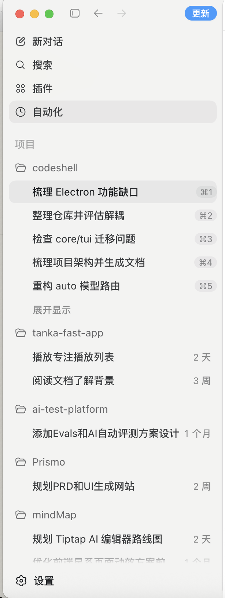
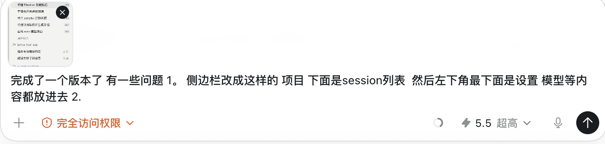
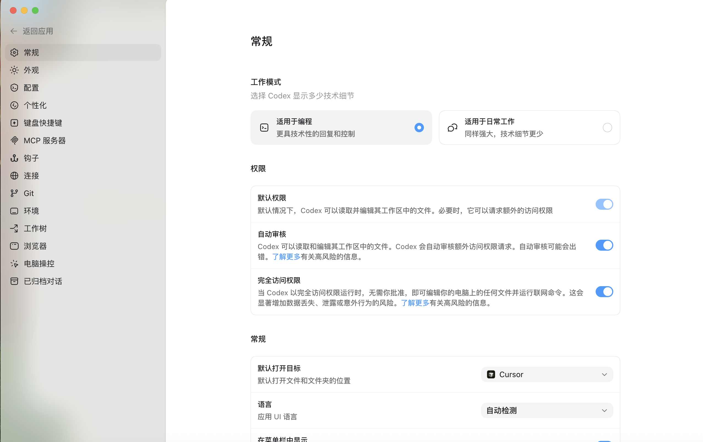
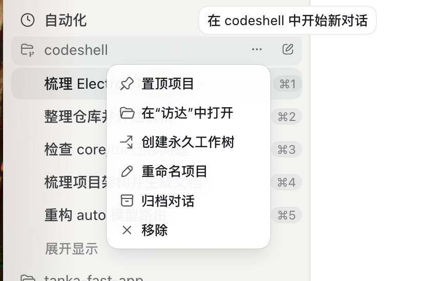
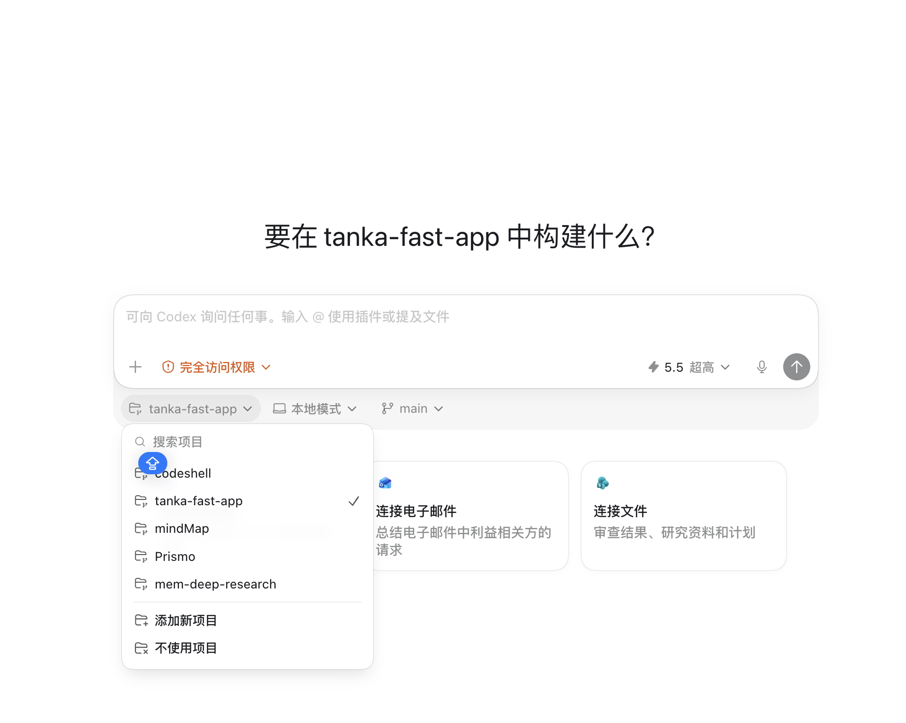
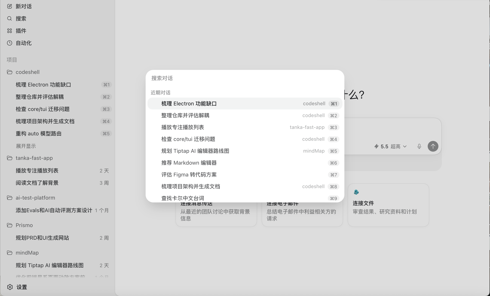
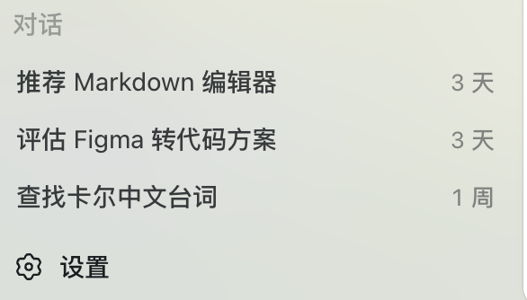

# Electron Codex UI Review Feedback

> Date: 2026-05-24
> Status: follow-up requirements after the first completed Electron Codex UI version.
> Goal: give CC a concrete UI revision brief.

## Reference Screenshots

Sidebar target:



Composer target:



Settings page target:



Project row menu target:



Project switcher / new conversation target:



Session search modal target:



No-repo dialogue section target:



## Summary

The current version is directionally complete, but several product layout decisions need to change before the UI feels right:

1. The left sidebar should be project-first. Under each project, show the session list directly.
2. Settings, model configuration, and related controls should move to the bottom-left settings area instead of occupying primary sidebar space.
3. Permission mode, context progress, and model switching should be placed near the input composer, matching the second screenshot's interaction pattern.
4. Settings should not be only a popover/modal. The bottom settings control can open a small upward menu, but clicking Settings must navigate to a real Settings page.
5. New conversation needs a better start surface with project switching and a "no project" option.
6. Search should open a modal for searching sessions.
7. Plugins and Skills should live together in one management surface, with installed-skill viewing and enable/disable controls.

This is mainly an information architecture and layout revision. Do not treat it as a pure color/style pass.

## 1. Sidebar Revision

### Required Structure

The sidebar should follow this hierarchy:

```text
Top section
  New conversation
  Search
  Plugins
  Automations

Projects
  codeshell
    Session 1
    Session 2
    Session 3
    Session 4
    Session 5
    Expand / show more

  tanka-fast-app
    Session 1
    Session 2

  ai-test-platform
    Session 1

  Prismo
    Session 1

  mindMap
    Session 1

Bottom section
  Settings
```

### Concrete Requirements

- Keep `项目` as the main sidebar section label.
- Under each project row, render its sessions directly.
- Project rows should use a folder icon and project name.
- Session rows should be visually nested under the project.
- The active session should have a rounded selected background like the first screenshot.
- Session rows can show shortcut hints on the right for the first few sessions, for example `⌘1`, `⌘2`, `⌘3`.
- Older sessions can show relative time on the right, for example `2 天`, `3 周`, `1 个月`.
- Add an `展开显示` row when a project has more sessions than the compact limit.
- Keep the sidebar dense and calm. It should read like a productivity app, not a card dashboard.
- Put `设置` at the very bottom-left, pinned to the bottom of the sidebar.
- Move model/settings/MCP/provider/permission setup into Settings, not top-level nav.

### Remove Or Demote

Do not keep these as primary peer views if they can live under Settings:

- model manager
- provider/API key management
- permission configuration page
- MCP configuration
- logs/perf, unless needed for developer mode

Top-level sidebar should prioritize daily workflow:

- new chat
- search
- plugins
- automation
- projects and sessions
- settings at bottom

## 2. Composer Controls Revision

### Required Layout

The input composer area should include these controls:

```text
Left side
  + / attach-context button
  Permission mode selector

Right side
  Context progress indicator
  Model selector
  Voice/input utility icon if present
  Send button
```

### Permission Mode

Move permission mode control from settings/topbar into the composer row.

Expected behavior:

- Permission mode is visible before sending a message.
- It should be clickable and configurable inline.
- It should use a compact pill/chip style.
- For high-risk modes, use a warning color.
- Example label from screenshot: `完全访问权限`.
- Add a chevron to show it opens a dropdown or popover.

Suggested modes:

- `计划模式`
- `默认权限`
- `接受编辑`
- `完全访问权限`

The exact internal value can map to existing core permission modes, but the UI label should be user-facing Chinese.

### Context Progress

Add current session context usage/progress to the composer row.

Expected behavior:

- Show current session context progress, not global app usage.
- Use `usage_update` / session state as source.
- Compact display is enough:
  - circular progress ring, or
  - thin progress pill, or
  - `ctx 42%`
- It should update during the session.
- It should be near the model selector so users understand model/context together.

### Model Selector

Move the active model switcher to the composer row.

Expected behavior:

- Show the active model in compact form, for example `5.5 超高`.
- Use an icon if available.
- Add a chevron.
- Clicking opens a popover/dropdown to switch model.
- Model choice should apply to the current/new turn clearly.
- Detailed provider/API key configuration still belongs in Settings.

### Send Button

Use a compact circular send button on the far right.

Expected behavior:

- Idle state: upward arrow icon.
- Busy state: stop/cancel icon.
- Disabled state when no active project/session or empty draft.
- Keep the button visually stronger than secondary controls.

## 3. Settings Placement

Settings should be bottom-left and should contain:

- model/provider configuration
- API keys
- permission defaults
- MCP servers
- app theme
- logs/developer controls if kept
- update settings

The sidebar bottom row should look like:

```text
[gear icon] 设置
```

Do not put model/provider/permission as always-visible large sidebar sections. Daily controls go in the composer; advanced configuration goes in Settings.

### Settings Is A Page, Not Just A Popup

Settings must not be implemented as only a floating modal/popover.

Expected behavior:

- The bottom-left settings area may open a small upward menu.
- That upward menu can include actions such as:
  - Settings
  - model/provider shortcuts
  - update status
  - help/about later
- Clicking `设置` must switch the main app into a full Settings page.
- The Settings page should have its own left-side settings module list, matching the settings-page reference screenshot.
- The main content area should show the selected settings module.
- There should be a clear `返回应用` action to return to the normal chat workspace.

Recommended Settings modules:

- `常规`
- `外观`
- `配置`
- `个性化`
- `键盘快捷键`
- `MCP 服务器`
- `钩子`
- `连接`
- `Git`
- `环境`
- `工作树`
- `浏览器`
- `电脑操控`
- `已归档对话`
- `插件与 Skills`

Module placement:

- Model/provider/API key settings belong under `配置` or `常规`.
- Permission defaults belong under `常规` or `配置`.
- Plugins and Skills belong together under `插件与 Skills`.
- MCP remains its own module or can be linked from `插件与 Skills`.

Visual target:

- Full-height settings page.
- Left module sidebar.
- Right content panel with grouped settings sections.
- Use switches, segmented cards, and select rows like the reference.
- Avoid using only a small modal for deep settings.

## 4. Session UX Details

### New Conversation

The `新对话` action should:

- create a fresh UI session entry under the active project, or prepare one immediately
- clear the composer/message area
- keep active project selected
- start a real engine session on first send

New conversation style must be revised:

- The empty/new conversation screen should clearly ask what to build in the selected project, for example:
  - `要在 tanka-fast-app 中构建什么?`
  - or no-project state text when no repo is selected.
- It should include a project selector near the composer.
- The project selector should allow:
  - switching to an existing repo
  - adding a new project
  - choosing `不使用项目`
- When `不使用项目` is selected, the conversation should still be valid.
- No-repo sessions should be grouped under a separate `对话` section at the bottom of the sidebar, not mixed under a fake project.
- The selected project/no-project choice should be visible before sending the first message.

Reference behavior from the project switcher screenshot:

- A dropdown opens from the project pill.
- It includes search.
- It lists projects.
- It marks the selected project with a check.
- It includes `添加新项目`.
- It includes `不使用项目`.

### Session Selection

Selecting a session should:

- switch the transcript
- update active session title in the main area/top bar
- update composer context progress for that session
- preserve draft per session if feasible

### Session Titles

Session titles should be concise and readable:

- Use first user prompt initially.
- Allow rename later.
- Avoid raw ids in the sidebar.
- Truncate long titles with ellipsis.

### Session Overflow

When a project has many sessions:

- Show only a compact set by default.
- Add `展开显示` to reveal more.
- Expanded state should be per project.
- Keep keyboard shortcut hints for the top visible sessions only if useful.
- For hidden older sessions, they should still be reachable through Search.

### Project Row Menu

Each project row should support a context menu like the project-menu reference screenshot.

Suggested actions:

- `置顶项目`
- `在“访达”中打开`
- `创建永久工作树`
- `重命名项目`
- `归档对话`
- `移除`

The menu should open from an ellipsis or secondary action on the project row.

Project rows can also have a small new-conversation icon, with tooltip like:

- `在 codeshell 中开始新对话`

## 5. Search Modal

Search should not just switch to an empty page. It should open a modal/command-style overlay for searching sessions.

Expected behavior:

- Clicking `搜索` opens a centered modal overlay.
- Background is dimmed.
- Search field is focused immediately.
- Recent sessions are shown before typing.
- Results include:
  - session title
  - project name or `对话`
  - shortcut hint when available
  - relative time when useful
- Selecting a result switches to that session.
- It should search across:
  - current project sessions
  - all project sessions
  - no-repo `对话` sessions
- It should be keyboard-friendly:
  - up/down to move
  - enter to open
  - esc to close

Recommended shortcut:

- `Cmd+F` for transcript search if already implemented.
- `Cmd+K` or sidebar `搜索` can open global session search.

## 6. Plugins And Skills

Plugins and Skills can live together in one surface.

Expected placement:

- Top-level sidebar can still have `插件`.
- Settings should also include `插件与 Skills`.
- Both entry points may route to the same management page.

Required Plugin/Skill page behavior:

- Show installed plugins.
- Show installed skills.
- Show whether each plugin/skill is enabled.
- Allow enabling/disabling each item.
- For Skills:
  - show skill name
  - show description
  - show source/path
  - allow opening/viewing the `SKILL.md` content
  - show install status
- For Plugins:
  - show plugin name
  - show contributed tools/skills/MCP/apps when available
  - allow enable/disable
- Add install/add actions later:
  - install skill from curated list
  - install skill from GitHub/path
  - install plugin if supported

Suggested page sections:

```text
插件与 Skills
  Installed Plugins
  Installed Skills
  Available / Add
```

Important:

- Do not hide Skills behind an unrelated advanced/debug page.
- Users should have one obvious place to answer: "What skills are installed, and which are active?"

## 7. Visual Style Notes

Match the reference screenshots:

- Light background.
- Soft selected row backgrounds.
- Dense list rows.
- Minimal borders.
- Rounded selected sidebar rows.
- Monochrome line icons.
- Bottom settings row pinned and stable.
- Composer controls should be compact and horizontally aligned.
- Avoid large cards around primary workflow controls.
- Avoid making settings/model controls compete with the chat text area.

## 8. Implementation Notes

Likely touched areas:

- `packages/desktop/src/renderer/Sidebar.tsx`
- `packages/desktop/src/renderer/ChatView.tsx`
- `packages/desktop/src/renderer/App.tsx`
- `packages/desktop/src/renderer/styles.css`
- session state helpers under `packages/desktop/src/renderer/`
- settings view components
- plugin/skill management components

If the current implementation already has separate views for Settings/Models/Permissions:

- keep those pages, but route them from the bottom Settings entry
- remove model and permission from primary sidebar navigation
- expose quick controls in the composer row

If session data is currently grouped separately from projects:

- adapt the view model so sidebar receives `projects[]` with nested `sessions[]`
- avoid flattening all sessions into a global list for the default sidebar

## 9. Acceptance Checklist

- [ ] Screenshot 1 is linked in this document and available under `docs/images/`.
- [ ] Screenshot 2 is linked in this document and available under `docs/images/`.
- [ ] Settings page screenshot is linked in this document and available under `docs/images/`.
- [ ] Project menu screenshot is linked in this document and available under `docs/images/`.
- [ ] Project switcher screenshot is linked in this document and available under `docs/images/`.
- [ ] Session search screenshot is linked in this document and available under `docs/images/`.
- [ ] No-repo dialogue screenshot is linked in this document and available under `docs/images/`.
- [ ] Sidebar has `项目` section with project rows.
- [ ] Sessions render nested below each project.
- [ ] Active session row has selected background.
- [ ] Settings is pinned to bottom-left.
- [ ] Model/provider/permission settings are not primary sidebar peers.
- [ ] Clicking Settings navigates to a real Settings page, not only a modal.
- [ ] Settings page has a left module list and main content panel.
- [ ] Settings page includes `插件与 Skills`.
- [ ] Permission mode control appears in the composer row.
- [ ] Current session context progress appears in the composer row.
- [ ] Model selector appears in the composer row.
- [ ] Send/stop button is far right and visually prominent.
- [ ] Composer layout matches the second screenshot's control grouping.
- [ ] New conversation screen can switch repo.
- [ ] New conversation screen supports `不使用项目`.
- [ ] No-repo sessions appear under `对话` at the bottom of the sidebar.
- [ ] Project sessions support `展开显示` when many sessions exist.
- [ ] Search opens a modal to search sessions.
- [ ] Project row menu includes pin/open in Finder/worktree/rename/archive/remove actions.
- [ ] Plugin and Skill management are in one page.
- [ ] Installed Skills can be viewed and enabled/disabled.
- [ ] Installed Plugins can be viewed and enabled/disabled.
