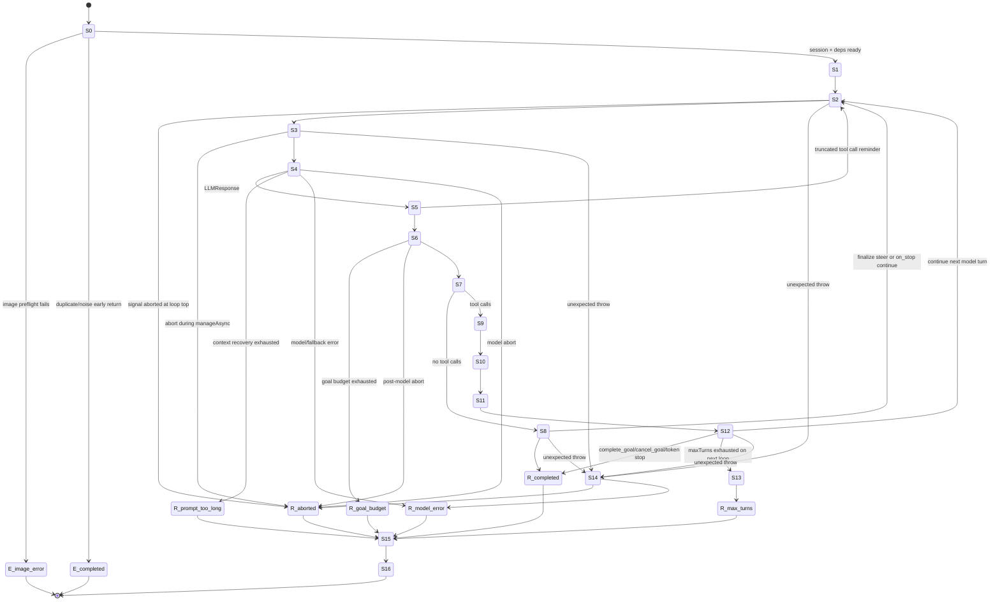

# Turn 生命周期状态机深度剖析

本文只新增状态机视角，不改源码。范围以 `packages/core/src/engine/turn-loop.ts` 为主，同时覆盖它依赖的 `engine/steer-queue.ts`、`engine/streaming-tool-queue.ts`、`engine/patch-orphaned-tools.ts`、`engine/turn-state.ts`、`engine/token-budget.ts`、`tool-system/executor.ts`，并把 Engine 外层 run 边界纳入生命周期，因为最终 `turn_complete` 和 session state 持久化发生在 `engine.ts`。

先校正一个容易误读的点：`packages/core/src/types.ts:381` 定义了 `TurnPhase = "pre_check" | "model_call" | ...`，`packages/core/src/engine/turn-state.ts:17` 也能创建 `{ phase:"pre_check" }`；但当前 `TurnLoop.run()` 只在 `packages/core/src/engine/turn-loop.ts:588` 初始化了一个 `state`，之后没有用它推进或观测 phase。因此本文描述的是“代码分支形成的实现态状态机”，不是一个显式维护 `state.phase` 的运行时对象。

## 1. 总览状态机

本文定义 17 个运行状态，编号 S0 到 S16；`TerminalReason` 是出口标签，不另计为运行状态。当前 TurnLoop 实际返回的 reason 集中在 `completed`、`model_error`、`prompt_too_long`、`aborted_streaming`、`goal_budget_exhausted`、`max_turns`，见 `packages/core/src/engine/turn-loop.ts:578`、`packages/core/src/engine/turn-loop.ts:711`、`packages/core/src/engine/turn-loop.ts:721`、`packages/core/src/engine/turn-loop.ts:873`、`packages/core/src/engine/turn-loop.ts:977`、`packages/core/src/engine/turn-loop.ts:1269`。`image_error` 是 Engine preflight 早退，不进入 TurnLoop，见 `packages/core/src/engine/engine.ts:1031`、`packages/core/src/engine/engine.ts:1038`。

## 2. 状态逐段说明

| 状态 | 名称 | 入口条件 | 出口条件 | 主要代码 |
|---|---|---|---|---|
| S0 | Engine run preflight / session 装配 | `Engine.run(task, options)` 被调用，先解析 cwd、图片、噪声和会话。 | 图片或噪声早退；否则恢复或创建 session、写入用户消息、装配 ContextManager / ToolExecutor / TurnLoop。 | `packages/core/src/engine/engine.ts:919`、`packages/core/src/engine/engine.ts:1031`、`packages/core/src/engine/engine.ts:1415`、`packages/core/src/engine/engine.ts:1457`、`packages/core/src/engine/engine.ts:1621`、`packages/core/src/engine/engine.ts:2077` |
| S1 | TurnLoop run 初始化 | `turnLoop.run(messages)` 进入，复制初始 messages，创建普通 token budget tracker 和 goal run-scoped tracker。 | 初始化完成，进入 while。 | `packages/core/src/engine/turn-loop.ts:532`、`packages/core/src/engine/turn-loop.ts:535`、`packages/core/src/engine/turn-loop.ts:541`、`packages/core/src/engine/turn-loop.ts:546` |
| S2 | turn 顶部预检 | `this.turnCount < this.config.maxTurns` 成立；递增 turnCount、清本 turn usage。 | abort 直接返回；否则消费 steer、发请求边界、跑 on_turn_start 和上限提醒。 | `packages/core/src/engine/turn-loop.ts:556`、`packages/core/src/engine/turn-loop.ts:566`、`packages/core/src/engine/turn-loop.ts:581`、`packages/core/src/engine/turn-loop.ts:596`、`packages/core/src/engine/turn-loop.ts:603`、`packages/core/src/engine/turn-loop.ts:618`、`packages/core/src/engine/turn-loop.ts:642` |
| S3 | 上下文准备与压缩 | turn 顶部完成，messages 可被送入模型前。 | `manageAsync()` 完成；若压缩期间 abort 则返回；若有非 micro compact 则允许 `post_compact` hook 注入。 | `packages/core/src/engine/turn-loop.ts:646`、`packages/core/src/engine/turn-loop.ts:651`、`packages/core/src/engine/turn-loop.ts:658`、`packages/core/src/engine/turn-loop.ts:675`、`packages/core/src/context/manager.ts:489`、`packages/core/src/context/manager.ts:567`、`packages/core/src/context/manager.ts:599` |
| S4 | 模型请求 / 流式接收 / fallback | messages 已准备好，`streamedToolIds` 清空，创建 `StreamingToolQueue`，调用 `callModelWithFallback()`。 | 得到 `LLMResponse`；或 ContextLimit recovery 失败；或 abort / model error。 | `packages/core/src/engine/turn-loop.ts:688`、`packages/core/src/engine/turn-loop.ts:690`、`packages/core/src/engine/turn-loop.ts:692`、`packages/core/src/engine/turn-loop.ts:695`、`packages/core/src/engine/turn-loop.ts:697`、`packages/core/src/engine/turn-loop.ts:723`、`packages/core/src/engine/turn-loop.ts:1276`、`packages/core/src/engine/turn-loop.ts:1334` |
| S5 | 响应用量 / 图片消费 / 截断续写 | 模型返回成功。 | 工具调用被截断时注入 reminder 并进入下一 turn；纯文本截断最多内部续写 3 次；否则进入 post-model gate。 | `packages/core/src/engine/turn-loop.ts:741`、`packages/core/src/engine/turn-loop.ts:747`、`packages/core/src/engine/turn-loop.ts:759`、`packages/core/src/engine/turn-loop.ts:767`、`packages/core/src/engine/turn-loop.ts:783`、`packages/core/src/engine/turn-loop.ts:810` |
| S6 | post-model gate | 截断处理完成，已有本轮 response。 | goal budget 耗尽则停；abort 则停；否则按 toolCalls 分流。 | `packages/core/src/engine/turn-loop.ts:836`、`packages/core/src/engine/turn-loop.ts:844`、`packages/core/src/engine/turn-loop.ts:850`、`packages/core/src/engine/turn-loop.ts:855`、`packages/core/src/engine/turn-loop.ts:876` |
| S7 | 分支判定 | 这是 S6 里的概念分叉：`response.toolCalls.length === 0`。 | 无工具进 S8；有工具进 S9。 | `packages/core/src/engine/turn-loop.ts:876`、`packages/core/src/engine/turn-loop.ts:877`、`packages/core/src/engine/turn-loop.ts:980` |
| S8 | 无工具终止候选 / on_stop | 模型没有工具调用，先发 `assistant_message`，写入 assistant message，跑 `on_stop`。 | finalize steer 或 stop hook `continueSession` 让循环继续；否则返回 `completed`。 | `packages/core/src/engine/turn-loop.ts:879`、`packages/core/src/engine/turn-loop.ts:883`、`packages/core/src/engine/turn-loop.ts:887`、`packages/core/src/engine/turn-loop.ts:888`、`packages/core/src/engine/turn-loop.ts:897`、`packages/core/src/engine/turn-loop.ts:909`、`packages/core/src/engine/turn-loop.ts:944`、`packages/core/src/engine/turn-loop.ts:977` |
| S9 | tool_use 物化 | 模型返回工具调用。 | 截断到 `maxToolCallsPerTurn`，构造 assistant tool_use blocks，补发未流式发过的 `tool_use_start`，写 transcript。 | `packages/core/src/engine/turn-loop.ts:980`、`packages/core/src/engine/turn-loop.ts:985`、`packages/core/src/engine/turn-loop.ts:993`、`packages/core/src/engine/turn-loop.ts:998`、`packages/core/src/engine/turn-loop.ts:1005`、`packages/core/src/engine/turn-loop.ts:1010`、`packages/core/src/engine/turn-loop.ts:1012` |
| S10 | 工具执行 | assistant tool_use message 已加入 messages。 | 通过 `StreamingToolQueue` enqueue/drain 得到一一对应的 ToolResult[]。 | `packages/core/src/engine/turn-loop.ts:1014`、`packages/core/src/engine/turn-loop.ts:1019`、`packages/core/src/engine/streaming-tool-queue.ts:33`、`packages/core/src/engine/streaming-tool-queue.ts:62`、`packages/core/src/tool-system/executor.ts:119`、`packages/core/src/tool-system/executor.ts:456` |
| S11 | tool_result 回填 | 工具执行完成。 | 结果转成 `tool_result` blocks，写 transcript，发 `tool_result`，异步发 `tool_summary`，追加 user tool_result message。 | `packages/core/src/engine/turn-loop.ts:1021`、`packages/core/src/engine/turn-loop.ts:1024`、`packages/core/src/engine/turn-loop.ts:1026`、`packages/core/src/engine/turn-loop.ts:1034`、`packages/core/src/engine/turn-loop.ts:1037`、`packages/core/src/engine/turn-loop.ts:1061` |
| S12 | 工具后续跑判定 | tool_result 已进入 messages。 | `complete_goal` / `cancel_goal` / token budget stop 可返回；nudge、guard reminder、task reminder、turn_end hook 后记录边界并继续。 | `packages/core/src/engine/turn-loop.ts:1065`、`packages/core/src/engine/turn-loop.ts:1089`、`packages/core/src/engine/turn-loop.ts:1093`、`packages/core/src/engine/turn-loop.ts:1112`、`packages/core/src/engine/turn-loop.ts:1130`、`packages/core/src/engine/turn-loop.ts:1161`、`packages/core/src/engine/turn-loop.ts:1187`、`packages/core/src/engine/turn-loop.ts:1194` |
| S13 | maxTurns 收口 summary | while 条件失败，说明 `turnCount >= maxTurns`。 | 消费 finalize steer、同步压缩、追加“不得用工具”的 summary reminder，调用无工具模型，总结后返回 `max_turns`。 | `packages/core/src/engine/turn-loop.ts:1227`、`packages/core/src/engine/turn-loop.ts:1234`、`packages/core/src/engine/turn-loop.ts:1235`、`packages/core/src/engine/turn-loop.ts:1244`、`packages/core/src/engine/turn-loop.ts:1248`、`packages/core/src/engine/turn-loop.ts:1261`、`packages/core/src/engine/turn-loop.ts:1268` |
| S14 | outer catch / 异常收束 | S2 到 S12 的 scaffolding 抛出未被局部 catch 处理的异常。 | 先补 orphan tool_use；abort 类异常返回 `aborted_streaming`，其它发 `error` 并返回 `model_error`。 | `packages/core/src/engine/turn-loop.ts:1204`、`packages/core/src/engine/turn-loop.ts:1210`、`packages/core/src/engine/turn-loop.ts:1214`、`packages/core/src/engine/turn-loop.ts:1223` |
| S15 | Engine headless 背景 drain | TurnLoop 已返回，Engine 还没最终 resolve。只对 top-level headless 等待自己的 background sub-agent。 | 无 pending background sub-agent；或 abort 后完成 bounded drain。可能重新调用同一个 `turnLoop.run([...result.messages, injected])`。 | `packages/core/src/engine/engine.ts:2197`、`packages/core/src/engine/engine.ts:2201`、`packages/core/src/engine/engine.ts:2223`、`packages/core/src/engine/engine.ts:2247`、`packages/core/src/engine/engine.ts:2258` |
| S16 | Engine epilogue / 最终事件 | TurnLoop 和可选 headless drain 都结束。 | 注销 hooks、保存 state、跑 session end / agent end hook，最后发 `turn_complete` 并返回 `EngineResult`。 | `packages/core/src/engine/engine.ts:2261`、`packages/core/src/engine/engine.ts:2294`、`packages/core/src/engine/engine.ts:2340`、`packages/core/src/engine/engine.ts:2353`、`packages/core/src/engine/engine.ts:2355`、`packages/core/src/engine/engine.ts:2362` |

## 3. 并发与注入点

### 3.1 Steer：步间注入，不打断当前请求

介入点有两个层次。

第一层在 Engine。只有当前有 top-level `activeTurnLoop`，且 `activeRunSession.state.sessionId` 等于传入 sid，`enqueueSteer()` 才接受消息；否则返回 rejected，让 host 降级为普通 run，见 `packages/core/src/engine/engine.ts:820`、`packages/core/src/engine/engine.ts:829`、`packages/core/src/engine/engine.ts:830`、`packages/core/src/engine/engine.ts:841`。队列本身是 per-session in-memory map，见 `packages/core/src/engine/engine.ts:384`、`packages/core/src/engine/engine.ts:391`。

第二层在 TurnLoop。正常步间隙在 S2 顶部消费，见 `packages/core/src/engine/turn-loop.ts:581`、`packages/core/src/engine/turn-loop.ts:586`；终止边界还会做 finalize backfill：无工具终止候选见 `packages/core/src/engine/turn-loop.ts:888`、stop hook 之后见 `packages/core/src/engine/turn-loop.ts:974`、`complete_goal` / `cancel_goal` 见 `packages/core/src/engine/turn-loop.ts:1106`、`packages/core/src/engine/turn-loop.ts:1124`、token budget stop 见 `packages/core/src/engine/turn-loop.ts:1148`、maxTurns summary 前见 `packages/core/src/engine/turn-loop.ts:1234`。

不变量：

- steer 只能把状态推向“下一次模型请求”，不能插入当前流式响应中间。实现上 `consumeQueuedSteer()` 只在上述边界调用，且入队纯函数只 append，消费纯函数一次性 drain，见 `packages/core/src/engine/steer-queue.ts:16`、`packages/core/src/engine/steer-queue.ts:32`。
- 已消费 steer 立刻进入 messages、transcript，并发 `steer_injected`，见 `packages/core/src/engine/turn-loop.ts:1373`、`packages/core/src/engine/turn-loop.ts:1374`、`packages/core/src/engine/turn-loop.ts:1375`。如果 `clientMessageId` 已被本 run 或 transcript claim，重复 steer 被丢弃，见 `packages/core/src/engine/turn-loop.ts:1363`、`packages/core/src/engine/engine.ts:1393`、`packages/core/src/engine/engine.ts:1401`。
- finalize backfill 的语义是“本来要结束，但刚好有新用户意图进来，所以继续下一 turn”，不是把 steer 塞进已完成的 assistant 消息之后再结束。对应状态转移是 S8/S12/S13 → S2。

### 3.2 Abort：多个昂贵边界的清洁刹车

abort 源头通常来自 `ChatSession.cancel()`，它 abort 当前 controller 并拒绝队列中尚未运行的 turn，见 `packages/core/src/protocol/chat-session.ts:118`、`packages/core/src/protocol/chat-session.ts:124`、`packages/core/src/protocol/chat-session.ts:126`。Engine 把同一个 signal 注入 ToolExecutor 和 TurnLoop，见 `packages/core/src/engine/engine.ts:1683`、`packages/core/src/engine/engine.ts:1684`、`packages/core/src/engine/engine.ts:2140`、`packages/core/src/engine/engine.ts:2141`。

TurnLoop 有四个显式刹车点：

- S2 顶部：不进入 context management / model call，见 `packages/core/src/engine/turn-loop.ts:566`、`packages/core/src/engine/turn-loop.ts:576`。
- S3 context management 后：防止压缩期间 abort 后继续调主模型，见 `packages/core/src/engine/turn-loop.ts:654`、`packages/core/src/engine/turn-loop.ts:658`。
- S4 model catch：abort 不 fallback 到 non-streaming，见 `packages/core/src/engine/turn-loop.ts:723`、`packages/core/src/engine/turn-loop.ts:731`、`packages/core/src/engine/turn-loop.ts:1320`、`packages/core/src/engine/turn-loop.ts:1332`。
- S6 post-model：防止截断续写或模型返回后继续工具阶段，见 `packages/core/src/engine/turn-loop.ts:844`、`packages/core/src/engine/turn-loop.ts:847`。

工具层也有 abort fast-path：`ToolExecutor.executeSingle()` 在任何 hook、permission 或 handler 前返回 synthetic error ToolResult，见 `packages/core/src/tool-system/executor.ts:123`、`packages/core/src/tool-system/executor.ts:131`。这让 S10 即便已经拿到一批 tool calls，也不会在用户 Stop 后继续跑实际副作用工具。

不变量：

- 用户 Stop 的终止 reason 是 `aborted_streaming`，不是 `model_error`，且不发红色 error event；`markStopped()` 还会持久化 `turn_stopped` marker 以便 resume 重建 UI，见 `packages/core/src/engine/turn-loop.ts:376`、`packages/core/src/engine/turn-loop.ts:577`、`packages/core/src/engine/turn-loop.ts:724`、`packages/core/src/engine/turn-loop.ts:1214`。
- abort 后不得重新发送被取消的同一模型请求。`callModelWithFallback()` 在 `signal.aborted` 时直接 throw，不走 tombstone + non-streaming retry，见 `packages/core/src/engine/turn-loop.ts:1320`、`packages/core/src/engine/turn-loop.ts:1332`。
- abort / error 收束前必须 patch dangling tool_use，见 `packages/core/src/engine/turn-loop.ts:731`、`packages/core/src/engine/turn-loop.ts:735`、`packages/core/src/engine/turn-loop.ts:1210`。

### 3.3 StreamingToolQueue：工具批并发 / 串行边界

当前源码里 `StreamingToolQueue` 在 S4 前创建，但没有在流式 chunk 到达时 enqueue；`wrappedStream` 只记录已发过的 `tool_use_start` id，见 `packages/core/src/engine/turn-loop.ts:690`、`packages/core/src/engine/turn-loop.ts:692`、`packages/core/src/engine/turn-loop.ts:1280`、`packages/core/src/engine/turn-loop.ts:1282`。实际 enqueue 发生在模型完整返回后的 S10，见 `packages/core/src/engine/turn-loop.ts:1014`、`packages/core/src/engine/turn-loop.ts:1016`、`packages/core/src/engine/turn-loop.ts:1019`。

队列内部不变量：

- concurrency-safe 工具立即开始执行，unsafe 工具等 drain 时串行执行，见 `packages/core/src/engine/streaming-tool-queue.ts:37`、`packages/core/src/engine/streaming-tool-queue.ts:44`、`packages/core/src/engine/streaming-tool-queue.ts:68`。
- 所有 rejected promise 都被转成 error ToolResult，不能让一个工具失败导致其它工具结果丢失，见 `packages/core/src/engine/streaming-tool-queue.ts:53`、`packages/core/src/engine/streaming-tool-queue.ts:76`、`packages/core/src/engine/streaming-tool-queue.ts:96`。
- 返回结果按原 tool call 顺序排列，而不是按完成时间排列，见 `packages/core/src/engine/streaming-tool-queue.ts:34`、`packages/core/src/engine/streaming-tool-queue.ts:83`。

### 3.4 孤儿工具补丁：恢复与异常收束两条线

恢复侧在 S0：Engine 从 transcript 生成 messages 后立即调用 `patchOrphanedToolUses(messages)`，避免下一次 API call 因 dangling tool_use 直接 400，见 `packages/core/src/engine/engine.ts:1415`、`packages/core/src/engine/engine.ts:1419`、`packages/core/src/engine/engine.ts:1425`。独立模块扫全历史、就地插入 synthetic error tool_result，并声明幂等，见 `packages/core/src/engine/patch-orphaned-tools.ts:49`、`packages/core/src/engine/patch-orphaned-tools.ts:56`、`packages/core/src/engine/patch-orphaned-tools.ts:59`、`packages/core/src/engine/patch-orphaned-tools.ts:91`、`packages/core/src/engine/patch-orphaned-tools.ts:99`。

运行侧在 S4/S14：ContextLimit recovery 失败、model abort/error、outer catch 都先补当前内存 messages，见 `packages/core/src/engine/turn-loop.ts:716`、`packages/core/src/engine/turn-loop.ts:731`、`packages/core/src/engine/turn-loop.ts:735`、`packages/core/src/engine/turn-loop.ts:1210`。TurnLoop 内部版本同样先收集全数组 answered ids，再把 orphan 的 synthetic results 插到 assistant message 后面，并设置 `is_error: true`，见 `packages/core/src/engine/turn-loop.ts:1385`、`packages/core/src/engine/turn-loop.ts:1392`、`packages/core/src/engine/turn-loop.ts:1402`、`packages/core/src/engine/turn-loop.ts:1415`、`packages/core/src/engine/turn-loop.ts:1420`。

不变量：补丁只能把状态推向“可恢复的 error/abort/下一次模型请求”，不能伪装工具成功。`is_error: true` 是关键，否则模型会把 synthetic text 当成功输出，见 `packages/core/src/engine/patch-orphaned-tools.ts:95`、`packages/core/src/engine/turn-loop.ts:1417`。

## 4. 关键不变量清单

1. `TurnLoop.run()` 不能 reject。  
   维护代码：外层 try/catch 和注释见 `packages/core/src/engine/turn-loop.ts:548`、`packages/core/src/engine/turn-loop.ts:555`、`packages/core/src/engine/turn-loop.ts:1204`、`packages/core/src/engine/turn-loop.ts:1224`。  
   破坏表现：Engine 的 `saveState`、`on_session_end`、最终 `turn_complete` 可能不执行，session 留在 active 或 UI 长时间 busy。

2. 每个 `tool_use` 必须有对应 `tool_result`。  
   维护代码：tool_use blocks 生成见 `packages/core/src/engine/turn-loop.ts:998`，result blocks 回填见 `packages/core/src/engine/turn-loop.ts:1021`、`packages/core/src/engine/turn-loop.ts:1061`，恢复补丁见 `packages/core/src/engine/patch-orphaned-tools.ts:59`，运行补丁见 `packages/core/src/engine/turn-loop.ts:1385`。  
   破坏表现：OpenAI/Anthropic 下一次请求 400；context compaction 若切断 pair 也会复现同类 API validation error。

3. 工具结果必须按 tool call 顺序回填。  
   维护代码：`callOrder` 记录 enqueue 顺序，drain 最后按 `callOrder.map` 返回，见 `packages/core/src/engine/streaming-tool-queue.ts:34`、`packages/core/src/engine/streaming-tool-queue.ts:83`。  
   破坏表现：UI 工具卡、transcript 和模型下一轮上下文会把输出关联到错误调用，尤其并发 Read/Grep 时很难排查。

4. 流式 `tool_use_start` 不得重复补发。  
   维护代码：`wrappedStream` 记录 streamed id，S9 只给未出现过的 id 补 start，见 `packages/core/src/engine/turn-loop.ts:1282`、`packages/core/src/engine/turn-loop.ts:1005`。  
   破坏表现：desktop/TUI 出现重复 tool card；后续 `tool_result` 只能完成其中一张，另一张悬空。

5. steer 注入不得破坏 turn 边界。  
   维护代码：Engine 只接受 active sid，见 `packages/core/src/engine/engine.ts:829`；TurnLoop 只在 S2 和 finalize backfill 边界消费，见 `packages/core/src/engine/turn-loop.ts:581`、`packages/core/src/engine/turn-loop.ts:888`、`packages/core/src/engine/turn-loop.ts:974`。  
   破坏表现：用户补充可能插进 assistant/tool_use/tool_result 中间，形成非法消息序列或 UI 双气泡。

6. abort 不能触发 fallback 重发。  
   维护代码：`callModelWithFallback()` 对 abort 直接 throw，见 `packages/core/src/engine/turn-loop.ts:1320`、`packages/core/src/engine/turn-loop.ts:1332`。  
   破坏表现：用户 Stop 后模型请求被 non-streaming 重新发出，出现“已停止但仍在输出/执行工具”的时序 bug。

7. `onStream` handler 抛错不能杀死引擎流。  
   维护代码：TurnLoop constructor 包装 `config.onStream`，见 `packages/core/src/engine/turn-loop.ts:329`、`packages/core/src/engine/turn-loop.ts:340`、`packages/core/src/engine/turn-loop.ts:344`。  
   破坏表现：引擎还在执行，但 UI 事件通道中断，用户看到冻结。

8. 上下文压缩不能切断 tool_use/tool_result pair。  
   维护代码：切片函数统一使用 `adjustIndexToPreserveAPIInvariants()`，见 `packages/core/src/context/compaction.ts:10`、`packages/core/src/context/compaction.ts:256`、`packages/core/src/context/compaction.ts:263`、`packages/core/src/context/compaction.ts:321`。  
   破坏表现：压缩后的 messages 中保留 result 但丢失 use，下一次 API validation error。

9. provider 真实 usage 必须回灌 ContextManager。  
   维护代码：`recordResponseUsage()`、`emitCtxFromUsage()` 和 `recordActualUsage()`，见 `packages/core/src/engine/turn-loop.ts:741`、`packages/core/src/engine/turn-loop.ts:747`、`packages/core/src/context/manager.ts:160`。  
   破坏表现：后续 compaction 只靠 char/4 估算，ctx bar 和自动压缩时机漂移。

10. 被 tool cap 丢弃的工具调用必须显式告知模型。  
    维护代码：只执行前 N 个，记录 dropped，并追加 system-reminder，见 `packages/core/src/engine/turn-loop.ts:985`、`packages/core/src/engine/turn-loop.ts:991`、`packages/core/src/engine/turn-loop.ts:1065`、`packages/core/src/engine/turn-loop.ts:1079`。  
    破坏表现：模型误以为所有 tool calls 都运行过，基于不存在的结果继续推理。

11. goal 的续跑必须受 run-scoped 预算和 stop-block cap 约束。  
    维护代码：goal tracker 是 run-scoped，见 `packages/core/src/engine/turn-loop.ts:537`；预算在工具前检查，见 `packages/core/src/engine/turn-loop.ts:855`；stop-block cap 检查见 `packages/core/src/engine/turn-loop.ts:897`、`packages/core/src/engine/turn-loop.ts:909`、`packages/core/src/engine/turn-loop.ts:944`；默认 cap 解析见 `packages/core/src/engine/goal.ts:79`。  
    破坏表现：goal judge 一直 `not_met` 时无限循环烧 token 或时间。

12. 可见工具集合与执行期 gate 必须同源或收紧。  
    维护代码：Engine 每 turn 过滤 toolDefs，见 `packages/core/src/engine/engine.ts:1808`、`packages/core/src/engine/engine.ts:1833`；Executor 再做 disabled builtin、MCP、plan mode 执行期 gate，见 `packages/core/src/tool-system/executor.ts:139`、`packages/core/src/tool-system/executor.ts:176`、`packages/core/src/tool-system/executor.ts:219`。  
    破坏表现：模型看不到但能直接调用，或模型看得到但执行期无解释拒绝。

13. turn boundary 持久化只在“工具后继续”时做 heartbeat，terminal 由 Engine final save 收口。  
    维护代码：工具路径追加 `turn_boundary` 并调用 `onTurnBoundary`，见 `packages/core/src/engine/turn-loop.ts:1194`、`packages/core/src/engine/turn-loop.ts:1196`；Engine boundary flush 保存 running tokenUsage，见 `packages/core/src/engine/engine.ts:2150`、`packages/core/src/engine/engine.ts:2184`；terminal save 见 `packages/core/src/engine/engine.ts:2340`、`packages/core/src/engine/engine.ts:2353`。  
    破坏表现：长工具链中途崩溃后 state.json 的 turnCount/tokenUsage 落后；或者 terminal 前 UI/外部观察者误读 session 状态。

14. `turn_complete` 应代表 Engine epilogue 已经完成。  
    维护代码：正常路径在保存 session state、`on_agent_end` 后发，见 `packages/core/src/engine/engine.ts:2340`、`packages/core/src/engine/engine.ts:2355`、`packages/core/src/engine/engine.ts:2362`。  
    破坏表现：UI 先折叠/清 busy，但磁盘状态或 hook side effects 还没完成，刷新后状态短暂不一致。maxTurns 分支另有一个新观察，见脆弱点 N-03。

## 5. 续跑、压缩、max-turns 边界

### 5.1 续跑边界

正常工具续跑：S12 在 tool_result、guard、task reminder、on_turn_end 后写 `turn_boundary`，调用 Engine 的 `onTurnBoundary` heartbeat，然后 `while` 进入下一 turn，见 `packages/core/src/engine/turn-loop.ts:1187`、`packages/core/src/engine/turn-loop.ts:1194`、`packages/core/src/engine/turn-loop.ts:1198`、`packages/core/src/engine/turn-loop.ts:1203`。

stop hook 续跑：S8 里模型本来想停，如果 `on_stop` 返回 `continueSession` 且 `stopBlockCount < maxStopBlocks`，TurnLoop 发 `goal_progress:not_met`，注入 hook guidance 或 generic reminder，然后 `continue`，见 `packages/core/src/engine/turn-loop.ts:892`、`packages/core/src/engine/turn-loop.ts:909`、`packages/core/src/engine/turn-loop.ts:913`、`packages/core/src/engine/turn-loop.ts:923`、`packages/core/src/engine/turn-loop.ts:942`。如果 cap 命中，发 `goal_progress:exhausted` 和 assistant message 后继续走 completed 收口，见 `packages/core/src/engine/turn-loop.ts:944`、`packages/core/src/engine/turn-loop.ts:952`。

finalize steer 续跑：如果 run 正在收尾时 host 已排入 steer，TurnLoop 会把“收尾”改成“下一 turn 输入已就绪”，对应 S8/S12/S13 → S2，见 `packages/core/src/engine/turn-loop.ts:888`、`packages/core/src/engine/turn-loop.ts:974`、`packages/core/src/engine/turn-loop.ts:1106`、`packages/core/src/engine/turn-loop.ts:1124`、`packages/core/src/engine/turn-loop.ts:1148`、`packages/core/src/engine/turn-loop.ts:1234`。

截断续跑有两种：工具调用被 max output 截断时，TurnLoop 不执行半截工具，追加 reminder 后开下一 turn，见 `packages/core/src/engine/turn-loop.ts:767`、`packages/core/src/engine/turn-loop.ts:775`、`packages/core/src/engine/turn-loop.ts:780`；纯文本截断则在同一 turn 内最多额外调用模型 3 次拼接输出，见 `packages/core/src/engine/turn-loop.ts:783`、`packages/core/src/engine/turn-loop.ts:794`、`packages/core/src/engine/turn-loop.ts:810`、`packages/core/src/engine/turn-loop.ts:830`。

### 5.2 压缩边界

自动压缩只在模型前发生。S3 先降级历史图片 payload，再调用 `contextManager.manageAsync(messages)`，见 `packages/core/src/engine/turn-loop.ts:646`、`packages/core/src/engine/turn-loop.ts:649`、`packages/core/src/engine/turn-loop.ts:651`。`manageAsync()` 的 tier 顺序是：持久化大 tool_result、硬截断、聚合预算、dedupe/mask、microcompact、summary、snip、window、emergency，见 `packages/core/src/context/manager.ts:489`、`packages/core/src/context/manager.ts:492`、`packages/core/src/context/manager.ts:515`、`packages/core/src/context/manager.ts:567`、`packages/core/src/context/manager.ts:599`、`packages/core/src/context/manager.ts:607`、`packages/core/src/context/manager.ts:616`。

压缩事件由 Engine 的 `contextManager.setOnCompact()` 转成 `context_compact` stream event，并暂存在 `pendingCompactInfo`，见 `packages/core/src/engine/engine.ts:2066`、`packages/core/src/engine/engine.ts:2071`。TurnLoop 在同一 turn 的模型请求前 drain 这个 buffer；非 micro compact 才发 `post_compact` hook 并允许 hook 注入 reminder，见 `packages/core/src/engine/turn-loop.ts:668`、`packages/core/src/engine/turn-loop.ts:675`、`packages/core/src/engine/turn-loop.ts:676`、`packages/core/src/engine/turn-loop.ts:682`。

流式期间只有 reactive warning，不做真正压缩。`wrappedStream` 累计 text delta 估算 token，每跨桶调用 `shouldReactiveCompact()`，命中只记录 warning；真正 messages 改写仍等下一 turn 的 S3，见 `packages/core/src/engine/turn-loop.ts:1286`、`packages/core/src/engine/turn-loop.ts:1293`、`packages/core/src/engine/turn-loop.ts:1296`、`packages/core/src/context/manager.ts:742`。

maxTurns final summary 用的是同步 `contextManager.manage(messages)`，不会走 `manageAsync()` 的 LLM summary，也不会触发 TurnLoop 的 `post_compact` hook seam，见 `packages/core/src/engine/turn-loop.ts:1235`、`packages/core/src/engine/turn-loop.ts:1236`。

### 5.3 max-turns 收口

TurnLoop 的硬上限是 while 条件 `this.turnCount < this.config.maxTurns`，见 `packages/core/src/engine/turn-loop.ts:556`。Engine 在构造 TurnLoop 时用 `resolveMaxTurns()` 解析 goal / interactive 默认值，见 `packages/core/src/engine/engine.ts:2130`、`packages/core/src/engine/goal.ts:159`、`packages/core/src/engine/goal.ts:163`。

临近 maxTurns 的模型可见提醒在 S2 顶部注入：剩 2 turn、剩 1 turn、最后一 turn 三档，见 `packages/core/src/engine/turn-loop.ts:618`、`packages/core/src/engine/turn-loop.ts:626`、`packages/core/src/engine/turn-loop.ts:633`。goal UI 的 approaching marker 还会同时看 maxTurns 和 maxStopBlocks，见 `packages/core/src/engine/turn-loop.ts:302`、`packages/core/src/engine/turn-loop.ts:642`。

如果 while 退出，S13 追加“Turn limit reached, Do NOT call any tools” reminder，并调用模型时传空工具列表，见 `packages/core/src/engine/turn-loop.ts:1237`、`packages/core/src/engine/turn-loop.ts:1244`、`packages/core/src/engine/turn-loop.ts:1248`。这条 summary call 成功后返回 `max_turns`，见 `packages/core/src/engine/turn-loop.ts:1261`、`packages/core/src/engine/turn-loop.ts:1269`。

## 6. 已知脆弱点索引

| 编号 | 状态/边界 | 对应 finding | 源码锚点 | 说明 |
|---|---|---|---|---|
| V-01 | S4 streaming fallback / S8 assistant_message | F-01，见 `docs/review-2026-07-09/03-optimization-findings.md:20`、`docs/review-2026-07-09/04-p1-deep-dive-and-fix-design.md:7` | `packages/core/src/engine/turn-loop.ts:605`、`packages/core/src/engine/turn-loop.ts:1335`、`packages/core/src/engine/turn-loop.ts:879` | tombstone 使用 `turn_${turnCount}`，而 request start 没有同一 message id，desktop fallback 补偿契约不闭合。 |
| V-02 | S2 `stream_request_start` 事件归属 | F-02，见 `docs/review-2026-07-09/03-optimization-findings.md:29`、`docs/review-2026-07-09/04-p1-deep-dive-and-fix-design.md:73` | `packages/core/src/types.ts:444`、`packages/core/src/engine/turn-loop.ts:605`、`packages/core/src/engine/engine.ts:1246` | core 顶层 request start 不带 agentId，子代理 wrapper 会 spread agentId；consumer 若不用事件字段而依赖 activeAgents，容易压掉主回复槽。 |
| V-03 | S16 `turn_complete` 与下一 run 的紧邻边界 | F-03，见 `docs/review-2026-07-09/03-optimization-findings.md:38`、`docs/review-2026-07-09/04-p1-deep-dive-and-fix-design.md:137` | `packages/core/src/engine/engine.ts:2363`、`packages/core/src/protocol/chat-session.ts:251`、`packages/core/src/engine/turn-loop.ts:605` | Engine 完成后 ChatSession 可立即 pump 下一 turn；desktop coalescer 若不按 hard boundary 切段，会把两轮 delta 合并错序。 |
| V-04 | S10 ToolExecutor permission 链 | F-06，见 `docs/review-2026-07-09/03-optimization-findings.md:65`、`docs/review-2026-07-09/04-p1-deep-dive-and-fix-design.md:287` | `packages/core/src/tool-system/executor.ts:334`、`packages/core/src/tool-system/executor.ts:366`、`packages/core/src/tool-system/executor.ts:369` | `pre_tool_use: ask` 用户批准后跳过 classifier，是工具执行状态的权限不变量风险。 |
| V-05 | S0/S16 protocol pre-run resource | F-05，见 `docs/review-2026-07-09/03-optimization-findings.md:56`、`docs/review-2026-07-09/05-p2-deep-dive-and-fix-design.md:7` | `packages/core/src/engine/engine.ts:912`、`docs/review-2026-07-09/05-p2-deep-dive-and-fix-design.md:13` | 不属于 TurnLoop 内部，但属于 run 生命周期入口：`requireExisting` 的 live session 创建顺序会影响 S0 前置资源。 |
| V-06 | S0 toolDefs 生成 / S10 executor gate | F-07，见 `docs/review-2026-07-09/03-optimization-findings.md:74`、`docs/review-2026-07-09/05-p2-deep-dive-and-fix-design.md:69` | `packages/core/src/engine/engine.ts:267`、`packages/core/src/engine/engine.ts:569`、`packages/core/src/engine/engine.ts:1754`、`packages/core/src/tool-system/executor.ts:139` | builtin `off` 能热隐藏并执行期拒绝，`on` 不能把构造期 registry 里没有的工具加回。 |
| V-07 | S11 `tool_summary` fire-and-forget | F-08，见 `docs/review-2026-07-09/03-optimization-findings.md:83`、`docs/review-2026-07-09/05-p2-deep-dive-and-fix-design.md:138` | `packages/core/src/types.ts:534`、`packages/core/src/engine/turn-loop.ts:1037`、`packages/core/src/engine/turn-loop.ts:1048`、`packages/core/src/engine/engine.ts:1246` | summary 没有 toolCallIds/agentId 类型契约，且异步晚到，consumer 只能猜挂载目标。 |
| N-01 | 状态机可观测性 | 新观察 | `packages/core/src/types.ts:381`、`packages/core/src/engine/turn-state.ts:17`、`packages/core/src/engine/turn-loop.ts:588` | 当前 `TurnPhase` / `TurnState` 是概念遗留，`state` 初始化后不推进。推测风险：后续维护者可能以为有显式 phase 状态而漏看实际 early return/continue。 |
| N-02 | S4/S10 StreamingToolQueue 命名与实现 | 新观察 | `packages/core/src/engine/turn-loop.ts:691`、`packages/core/src/engine/turn-loop.ts:1014`、`packages/core/src/engine/model-facade.ts:82`、`packages/core/src/engine/streaming-tool-queue.ts:2` | 当前工具执行不是“边流式边 enqueue”，而是在完整 `LLMResponse` 后 enqueue。推测风险：注释/文件名让人误判工具已提前执行，优化或 bugfix 时容易放错并发边界。 |
| N-03 | S13/S16 max_turns completion event | 新观察（07 已确证） | `packages/core/src/engine/turn-loop.ts:1268`、`packages/core/src/engine/engine.ts:2363` | TurnLoop maxTurns summary 分支内部发一次 `turn_complete(max_turns)`，Engine epilogue 又统一发一次。07 已确证普通 Engine.run maxTurns live path 会出现重复 `turn_complete`；headless drain 复入下是否产生额外 summary call / `assistant_message` 仍需运行时验证。 |

## 7. 自查

1. 生命周期覆盖：S0 到 S16 覆盖 Engine preflight、TurnLoop 初始化、每个 turn 顶部、模型流、工具批、结果回填、续跑判定、maxTurns summary、outer catch、headless drain 和 Engine epilogue。
2. 注入点覆盖：steer、abort、StreamingToolQueue、orphan patch 均注明了介入状态、代码行和不变量。
3. 不变量覆盖：列出 14 条关键不变量，每条都有源码锚点和破坏后的可见现象。
4. 边界覆盖：续跑、压缩、maxTurns 三类边界均用当前源码行号说明。
5. 脆弱点覆盖：已交叉引用 F-01 到 F-08 中与 turn 生命周期相关的项；新增观察 N-01、N-02、N-03 均有 file:line；N-03 的普通 Engine.run 路径已由 07 进一步确证。
