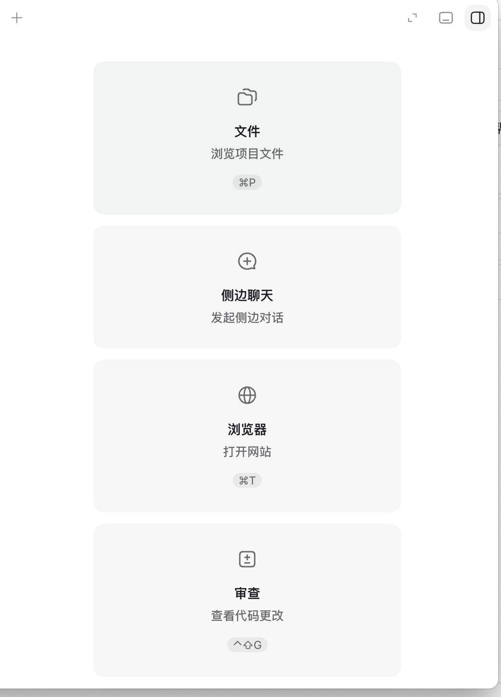
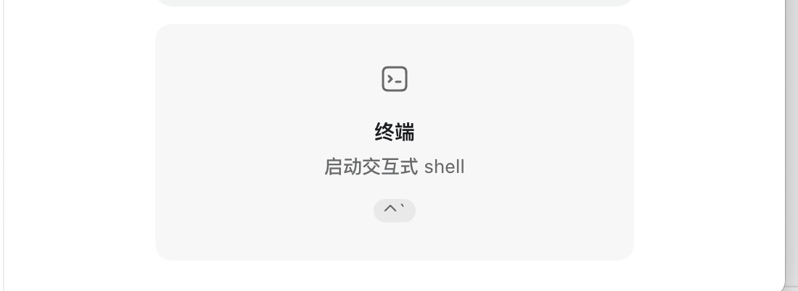
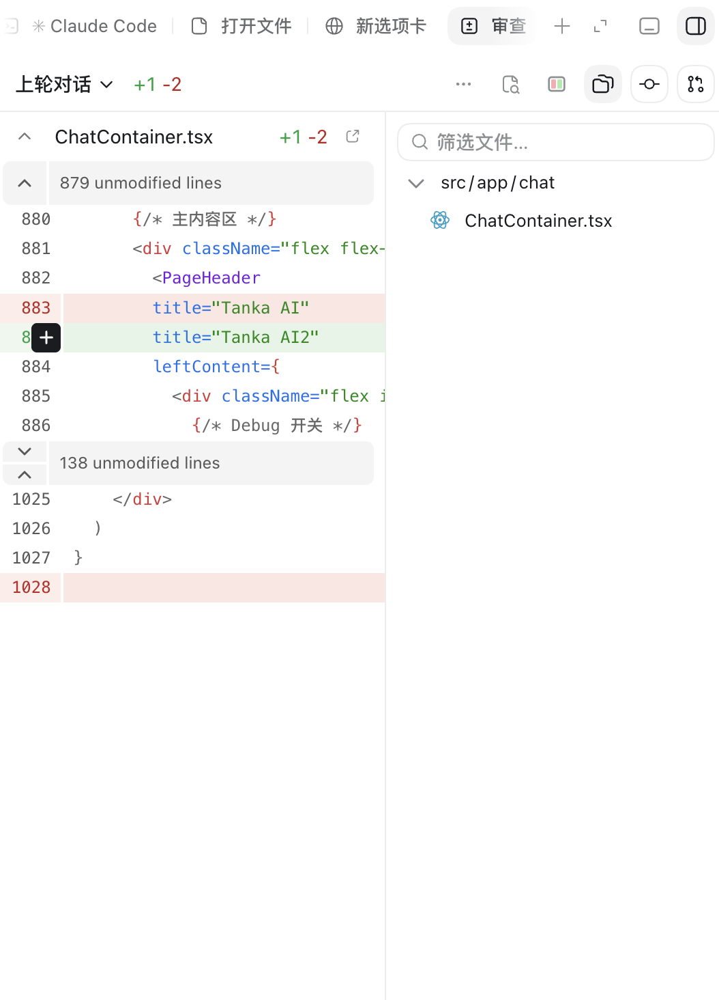
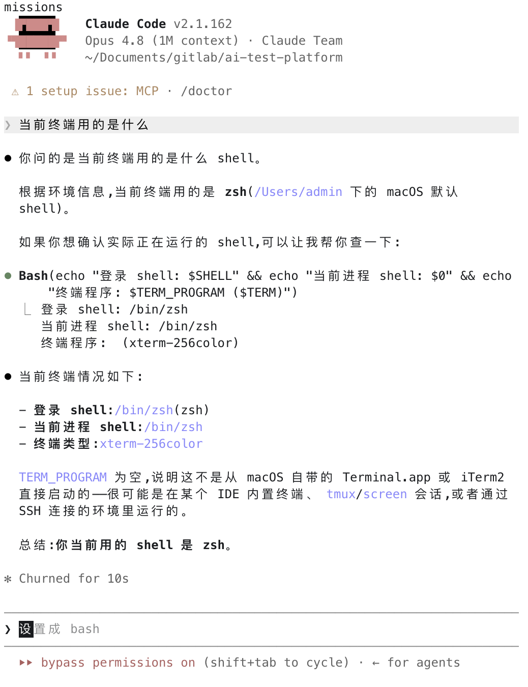

# 文件 / 浏览器 / 审查 / 终端 四面板 — 进度记录

> **⚠️ 历史开发记录（2026-06-05 研究快照,2026-06-25 标注）**:本文档是这 4 个面板**开发期间**的进度记录 + Codex 逆向研究稿。**4 个面板均已实现**（关联记忆 `project_desktop_four_panels`),且面板机制后来已从单一 `ViewMode` 全屏切换**演进为 dock 标签 `PanelTab`**（`renderer/view.ts` 的 `PanelTab = "files"|"browser"|"review"|"terminal"|"shells"|"ccRoom"`;见 `App.tsx` 的常驻挂载 + display 隐藏,commit `722b3642`)。**下文「架构事实」「现状/方案」均为开发当时快照,行号/`ViewMode` 接入描述已过时;现行 desktop 面板架构以实际代码 + `feature-inventory.md` 为准。** 留作设计 rationale 与逆向研究参考。

> 分支:`worktree-feat+terminal-browser`(从 `main` @ `63a1943` 切出)
> 范围:在 Electron desktop 端为用户新增 4 个可见面板。入口卡片共 5 个功能,**「侧边聊天」已有,其余 4 个全部要做**。

## 目标功能(入口卡片)

| 功能 | 说明 | 快捷键 | 状态 |
| --- | --- | --- | --- |
| 文件 | 浏览项目文件 | ⌘P | 要做 |
| 侧边聊天 | 发起侧边对话 | — | ✅ 已有,不动 |
| 浏览器 | 打开网站 | ⌘T | 要做 |
| 审查 | 查看代码更改 | ⌃⇧G | 要做 |
| 终端 | 启动交互式 shell | ⌃` | 要做 |

入口卡片参考:

## 各面板目标样式

### 1. 文件面板(⌘P)

左侧"打开文件"空态(从工作区目录树选择文件)+ 右侧可筛选文件树(带文件类型图标),顶部路径栏。

### 2. 浏览器面板(⌘T)

顶部标签页(Claude Code / 打开文件 / 新选项卡)+ 地址栏(后退/前进/刷新/输入 URL/在外部打开)+ "本地"书签区(localhost 站点卡片,带在线状态点 + "此聊天"按钮)。

### 3. 审查面板(⌃⇧G)

diff 查看器:左侧带行号的代码 diff(+/- 高亮、可折叠未改动行)、右侧文件树,顶部"上轮对话 +N -M"统计 + 工具栏。

### 4. 终端面板(⌃`)

真正的交互式终端,可跑 shell / Claude Code 会话,带状态行(如 bypass permissions 切换)。

## 方案研究结论(参考 Codex.app 逆向 + 本仓库现状)

> 研究于 2026-06-05。Codex.app = Electron + React,已解包逆向;本仓库 desktop = Electron 33 + React + Tailwind v4 + shadcn。

### 架构事实
- **主布局**:`renderer/App.tsx`,面板机制 = 单一 `ViewMode` 状态驱动**全屏视图切换**(非标签/分栏)。定义在 `renderer/view.ts`。新面板接入 = ① `view.ts` 加 `ViewMode` 成员 ② `App.tsx` if 链加分支 ③ 命令面板/快捷键触发 `setViewMode`。
- **IPC 模板**:请求响应型照抄 `git:diff`(`main/index.ts:695` + preload `getGitDiff`);流式事件型照抄 `onUpdaterStatus`(`webContents.send` + preload 返回 unsubscribe)。preload 经 `window.codeshell.*` 暴露,类型在 `preload/types.d.ts`。
- **快捷键**:集中在 `App.tsx` 的 keydown handler。⌘T / ⌃⇧G / ⌃` **空闲可用**;**⌘P 已被 session 搜索占用** → 文件面板改用命令面板入口 + 另选键(如 ⌘⇧E)。
- **构建/检查**(在 `packages/desktop` 下):`bunx tsc --noEmit`、`bun run build:renderer`、改 main 用 `bun run build:main`、改 preload 用 `bun run build:preload`。root 检查不覆盖 desktop。

### 各功能方案

| 功能 | Codex 方案 | 本仓库现状 | 落地策略 |
|---|---|---|---|
| **终端** | node-pty(`createRequire` 动态加载)+ xterm.js(FitAddon/WebLinks/Clipboard);`TERM=xterm-256color`;shell=`$SHELL`/`/bin/zsh`;`process-start/write/resize/terminate` RPC,onData 回灌 buffer | **零基础**(无 pty/xterm),但 main 有 child_process spawn 先例 | 装 `node-pty` + `@xterm/xterm`;main 起 pty 服务 + IPC(`pty:start/write/resize/kill` + `pty:data` 事件);renderer xterm 面板。node-pty 原生模块需处理打包(extraResources / external) |
| **浏览器** | Electron `<webview webviewTag>`,attach 时强化 webPreferences(sandbox+contextIsolation+持久 partition "app");自绘地址栏/tab;localhost = 端口表[3000-3020,4000-4010,5000-5010,5173-5180,6006-,8000-8010,8080-8090,…] + 正则抓 URL + 去重 | **零基础**,CSP 锁死 `frame-ancestors none`,webviewTag 未开,windowOpenHandler 把外链转 openExternal | 开 `webviewTag:true` + 放宽 CSP(或独立 webview partition);renderer 自绘地址栏 + `<webview>`(goBack/Forward/reload/loadURL);localhost 端口探测做书签 |
| **文件** | fs RPC（`fs-read-directory/read-file/watch` + `fs-watch-changed` 事件，node `fs.readdir/stat/watch`）+ shiki 高亮 + React 自绘树 | 后端 `searchFiles`(`file-search-service.ts`,git ls-files + walk)有，**无树 UI** | 新增 `fs:readdir`/`fs:readFile` IPC;renderer 文件树面板(可筛选)+ 内容查看(用现有高亮/或简单 pre) |
| **审查** | jsdiff `parsePatch` + unified/split 视图 + undo/reapply;数据来自 agent turn patch（非 git） | **diff 组件三件套已现成**:`diff/{UnifiedDiffViewer,ChangedFilesList,parseUnifiedDiff}`,`git:diff` IPC 已通 | **最省**:把现成组件组装进新 ViewMode 面板,数据走已有 `getGitDiff(cwd, file)` + 变更文件列表 |

### 隐患 / 决策
- ⌘P 冲突 → 文件面板入口走命令面板 + ⌘⇧E(VS Code 习惯)。
- ViewMode 全屏切换不能与 chat 并存;先按全屏视图做(与现有 6 视图一致),并存布局以后再说。
- node-pty 原生模块打包是终端最大风险点,优先验证能在 `bun run start` 起来。

## 进度

| 日期 | 内容 | 状态 |
| --- | --- | --- |
| 2026-06-05 | 建 worktree 分支、记录需求、归档全部 UI 参考图 | ✅ |
| 2026-06-05 | 逆向 Codex.app + 摸清 desktop 现状 → 方案钉死 | ✅ |
| 2026-06-05 | 终端面板(node-pty + xterm) | ✅ |
| 2026-06-05 | 文件面板(fs RPC + 懒加载树 + 预览) | ✅ |
| 2026-06-05 | 审查面板(复用现成 diff 三件套) | ✅ |
| 2026-06-05 | 浏览器面板(`<webview>` + 地址栏/tab + localhost 探测) | ✅ |
| 2026-06-05 | 快捷键 + 命令面板 + ViewMode 接线 | ✅ |
| 2026-06-05 | typecheck + 三层 build + Playwright 四面板烟雾测试全过 | ✅ |

**全部 4 个面板已实现并验证。** 烟雾测试结果(真实项目下):
- 终端:xterm 挂载,node-pty 在项目 cwd 起真实 shell,输出端到端流通
- 文件:真实目录树渲染 + 文件预览
- 审查:真实 git status/diff(变更文件列表 + unified diff)
- 浏览器:`<webview>` 成功 attach 并加载 https://example.com/

## 实现清单(文件)

**main**:
- `src/main/pty-service.ts` — node-pty 后端(createRequire 动态加载,`TERM=xterm-256color`,`$SHELL`/zsh `-il`,每 sessionId 一个 pty,buffer 回灌、退出清理)
- `src/main/fs-service.ts` — `readDirectory`(单层、目录优先、跳过 node_modules/.git 等)+ `readFile`(2MB 上限、二进制嗅探、防 `..` 越界)
- `src/main/index.ts` — IPC handlers `pty:start/write/resize/kill`(+ `pty:data`/`pty:exit` 事件)、`fs:readDir`/`fs:readFile`;开 `webviewTag:true` + `will-attach-webview` 硬化 guest;`before-quit` 调 `ptyKillAll`;`CODE_SHELL_NO_DEVTOOLS` 环境变量(给 e2e 用)

**preload**:`src/preload/index.ts` 暴露 `ptyStart/Write/Resize/Kill`、`onPtyData/onPtyExit`、`readDir/readFileContent`;`types.d.ts` 加 `FsEntry`/`FileContent` 类型

**renderer**:`src/renderer/panels/{TerminalPanel,FilesPanel,ReviewPanel,BrowserPanel}.tsx`;`view.ts` 加 4 个 ViewMode;`App.tsx` if 链 + 4 个快捷键;`CommandPalette.tsx` 加 4 条命令

**deps/打包**:`node-pty` + `@xterm/xterm` + `@xterm/addon-fit`;node-pty 用 `@electron/rebuild` 按 Electron 33 ABI 重编;`package.json` build 加 `node_modules/node-pty/**` 到 `files` + `asarUnpack`

**测试**:`scripts/smoke-panels.mjs`(Playwright-Electron,驱动 4 面板 + 浏览器导航)

## 快捷键

| 面板 | 键 | 备注 |
| --- | --- | --- |
| 浏览器 | ⌘T | 空闲 |
| 审查 | ⌃⇧G | 空闲 |
| 终端 | ⌃` | 空闲 |
| 文件 | ⌘⇧E | ⌘P 已被 session 搜索占用,改用 VS Code 习惯键 |

## 代码审查 + 修复(2026-06-05,二轮)

对 4 面板做了对抗性代码审查(main + renderer 两路),修复了以下真问题:

**高危(已修):**
- **符号链接逃逸**(fs-service):`ensureWithin` 原为纯字符串前缀判断,仓库内符号链接可指向 `~/.ssh` 等被读取。改为 `resolveWithin`(realpath 双向校验)+ 目录列举时丢弃逃逸的符号链接。**已加 6 项单测验证(全过)。**
- **生产 CSP 阻断 localhost 探测**(main CSP):prod `connect-src 'self'` 把浏览器面板的 localhost 探测全挡了,打包版功能失效。加 `http://localhost:* http://127.0.0.1:*`。
- **webview guest 未充分限制**(main):`will-attach-webview` 补 `webSecurity`/`nodeIntegrationInSubFrames=false`/删 allowpopups;`did-attach-webview` 加 `setWindowOpenHandler`(deny + 外部打开)+ `will-navigate` 拒非 http(s) scheme。
- **快捷键吞字符**(App.tsx):新面板快捷键(⌃`/⌘⇧E/⌘T/⌃⇧G)未判 `e.target`,在输入框/xterm 内打字会误触发并吞字符。加 typing 守卫(input/textarea/contenteditable/.xterm);⌃` 改用 `e.code==="Backquote"`(键盘布局安全)。

**正确性(已修):**
- **终端 cwd 进依赖致重建丢 buffer**(TerminalPanel):cwd 移出 effect 依赖(用 ref),只 `[sessionId]`。
- **终端切走再回来空白**(pty-service):main 端加 256KB 滚动 buffer,re-attach 时回灌,xterm 重挂不再空屏。
- **跨窗口 pty 串台**(pty-service + preload):sessionId 加 `@windowToken`(renderer 进程 pid)做窗口唯一化,同 repo 多窗口不再互相劫持 shell。
- **mac 关窗 pty 泄漏**(index.ts):window `closed` → `ptyReapDestroyed` 回收 webContents 已销毁的 pty。
- **ptyWrite 无类型校验**:非 string 直接 return,防 native addon 崩溃。
- **文件筛选目录恒显示**(FilesPanel):筛选时目录也按名字匹配,不再无脑全显。
- **多 tab webview 历史串台**(BrowserPanel):`<webview key={activeId}>` 每 tab 独立 guest。
- **地址栏协议注入**(BrowserPanel):normalizeUrl 显式只放行 http(s),其余 scheme(javascript:/data:/file:)降级为搜索。
- **快捷键 deps 漏 sessionSearchOpen**(App.tsx):补进依赖数组,Escape 不再用陈旧值。

二轮后:typecheck 干净、三层 build 过、Playwright 四面板烟雾测试 PASSED(且浏览器面板现能真实列出 localhost:3000/5000)。

## 遗留 / 后续

- **打包验证**:dev (`bun run start`) 已验证;`bun run dist`(electron-builder 打 dmg)尚未实跑验证 node-pty 的 asarUnpack 是否完全正确,首次正式打包时需确认终端在打包产物里能起。
- ViewMode 仍是全屏切换(不能与 chat 并存),与现有 6 视图一致;并存分栏布局是后续可选增强。
- 文件预览目前是纯文本 `<pre>`,未接语法高亮(Codex 用 shiki;本仓库有 highlight.js 可后续接)。
- 浏览器 localhost 探测用 renderer fetch(no-cors)探活,非 main 端 TCP 探测;够用但不如 Codex 精确。
- 终端单 session 单 pty(按 repoId);多 tab 终端是后续增强。
