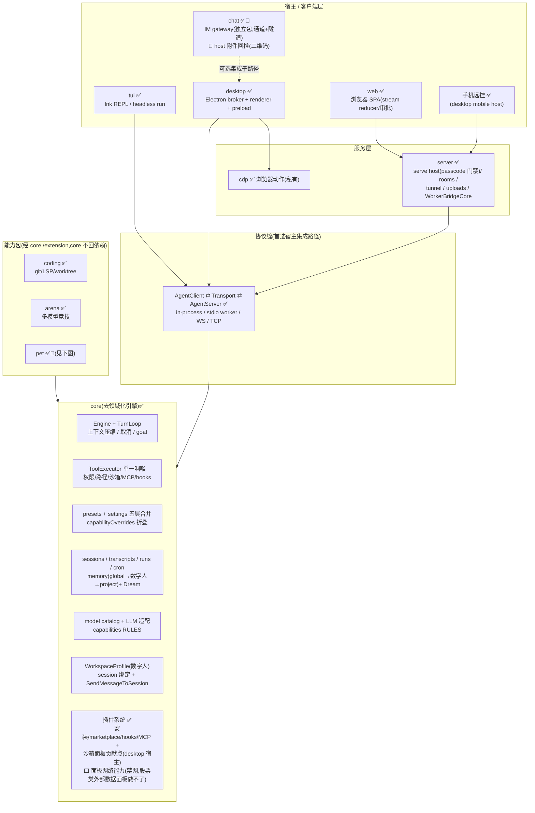
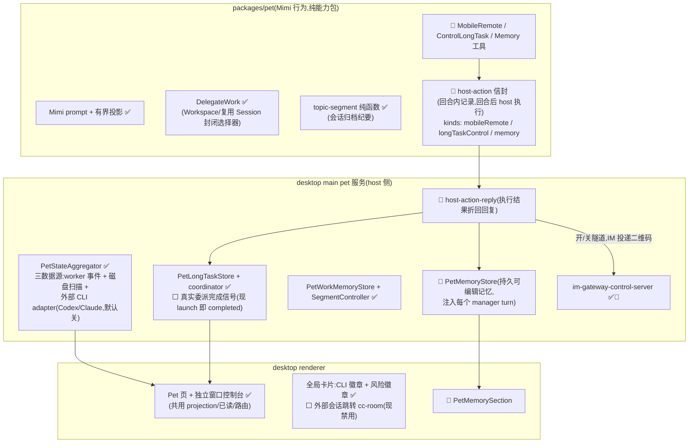

# 全局架构图与分步路线图

> 2026-07-22。目的:一张整体架构图 + 由它拆解出的分阶段执行计划(Pet 能力优先)。
> 现状事实以 `docs/architecture/00-overview.md`(as-built)与 `TODO.md`(在途/待办)为准;
> 本文只做「全局对齐 + 排序」,不重复各章细节。
> 图例:✅ 已稳定 · 🚧 工作树在途(未 commit)· ⬜ 缺口(未开工)

## 一、整体架构图

## 二、各块状态一览

| 块 | 状态 | 主要缺口 |
| --- | --- | --- |
| core 引擎/协议/工具/设置 | ✅ 稳定(优化冲刺 2 已收口) | 无阻塞项 |
| coding / arena | ✅ 稳定 | — |
| **pet 包 + desktop pet 服务** | 🚧 **工作树在途** | host-action 三件套未落地;委派完成信号缺失 |
| Pet 全局态势/独立窗口 | ✅ 主体完成 | cc-room 跳转、per-project scope、审批感知(已接受) |
| 数字人(WorkspaceProfile) | ✅ MVP + Session-first 更正已落地 | 经验层运营、Memory Studio、导入导出、marketplace |
| chat(IM gateway) | ✅ 通道稳定 | 🚧 host 附件回推在途;约束:只做通道 |
| server + web(无账号部署) | ✅ Phase 1' 闭环 | 公网入口、配对层接门禁、attachment/多 workspace |
| 数据源绑定 | ✅ 只读 MVP | OAuth adapter、Profile 求交、写操作 |
| 插件贡献点(沙箱面板/全屏页注册表) | ✅ 工作流 D 完成 | ⬜ 面板网络能力(`connect-src 'none'`,外部数据面板如股票行情做不了) |
| 架构文档 14 章 | ⚠️ 与工作树脱节 | 缺 host-action / Pet 记忆层 / 状态聚合三节 |

## 三、分阶段执行计划(Pet 优先)

依赖关系:**Phase 0 是一切 Pet 后续工作的前置**(工作树不落地,后面全被挡);
Phase 1 内部各项相互独立,可并行;Phase 2–4 与 Pet 线无硬依赖,按价值插队即可。

### Phase 0 — 收口当前工作树(在途 973 行改动落地)

1. **host-action 信封纵切收口**:`packages/pet/src/host-actions.ts` 信封 + MobileRemote / ControlLongTask / Memory 三工具 + desktop `host-action-reply.ts` 执行折回 + `PetMemoryStore`/`PetMemorySection` + chat 包附件回推(IM 投递配对二维码)。补齐测试、全仓测试绿、commit。
2. **同步 14 号架构文档**:补 host-action 信封、Pet 记忆层(记忆表加第四行)、PetStateAggregator/外部会话三节;修正「Pet runtime 只接受 Workspace/复用 Session 选择器」的过时表述(现另有 hostActionKinds、runtimeContext)。

### Phase 1 — Pet 能力补强(核心目标:Mimi 成为可信的全局管家)

1. **委派完成信号真实化**(最高优先):现在 DelegateWork 刚 launch 即记 completed,「携带纪要的未完成任务」路径为空。需要目标 Session 的真实终态回传到 `PetLongTaskStore`。锚点:`pet-long-task-coordinator.ts`、`pet-work-delegation-host.ts`、PetStateAggregator 的 worker 事件源(终态事件已在 projection 里,长任务账本消费它即可,不需要新协议)。
2. **外部会话卡片跳转 cc-room**:外部 Codex/Claude 会话卡片现禁用点击;接到 cc-room 后 Mimi 控制台对外部 CLI 会话形成「看见→进入」闭环。
3. **外部会话可见性 per-project scope**:现仅全局双开关;沿用 capabilityOverrides 的项目层模式。
4. **Memory 工具行为打磨**:Mimi 主动写记忆的去重/上限策略(store 已限 200 条/2000 字,需要 prompt 侧引导与 UI 呈现核对)。
5. (低优先,已接受可不做)外部会话等待审批感知——外部 transcript 不记录该类事件,维持诚实呈现 running/idle/dormant。

### Phase 2 — 数字人后续(TODO ②→⑤ 原序)

经验层运营(项目经验提升为数字人经验、MemoryWrite 写数字人层、Dream 按数字人分桶)→ Profile Builder / Memory Studio UI → 本地导入导出 → marketplace 远程分发。

### Phase 3 — 服务端部署剩余(无账号边界不变)

公网入口(tunnel/反代 TLS,或复用 TunnelManager)→ TrustedDeviceStore 接到 serve 门禁后面 → web UI 打磨(attachment、多 workspace 切换)。

### Phase 4 — 数据源绑定后续

真实 OAuth provider adapter → Profile 求交接线(resolver `profile?` 参数已留)→ 写操作 → 上传文件解析/索引。

### Phase 5 — 插件面板网络贡献点(外部数据面板,如股票行情)

现状:沙箱面板 v1 已支持(manifest `panels`、`csplugin://` 独立 partition、7 种权限、bridge RPC:
storage / external.open / agent.submitPrompt / workspace.info / notifications.send),但 CSP
`connect-src 'none'` + `supportFetchAPI: false` 从源头禁网,面板内拿不到外部数据。

- **推荐路线:`network.fetch` 权限 + manifest 域名白名单**——面板经现有 `plugin-panel:call`
  bridge 调 host 代理请求,host 校验白名单域名后代发并限流/限大小。锚点:
  `packages/desktop/src/main/plugin-panel-bridge.ts`(dispatch 加 case)、
  `packages/core/src/plugins/installer/types.ts`(权限枚举 + 白名单 schema)。
- 备选路线:行情做成 SourceDefinition adapter,面板经 bridge 读 source(复用审批/provenance/
  脱敏,但依赖 Phase 4 进度,适合需要凭据的数据源)。
- 验证载体:一个股票自选股参考插件(面板 UI + storage 自选股 + 代理 fetch 行情 +
  external.open 跳详情),对齐 video-editor 参考插件的角色。

## 四、约束边界(不做,来自 TODO.md,防止路线图漂移)

- quick-chat 不做树状 session;
- IM gateway 只做通道/隧道/入口回推,不做编排大脑、IM 内富审批、多租户;
- 同一 workspace 只有一个 active Profile;
- 服务端部署不做账号体系(passcode + pairing token 即全部访问控制);
- Pet 不接收数字人/team 路由字段(2026-07-18 Session-first 更正,是边界不是缺口)。
