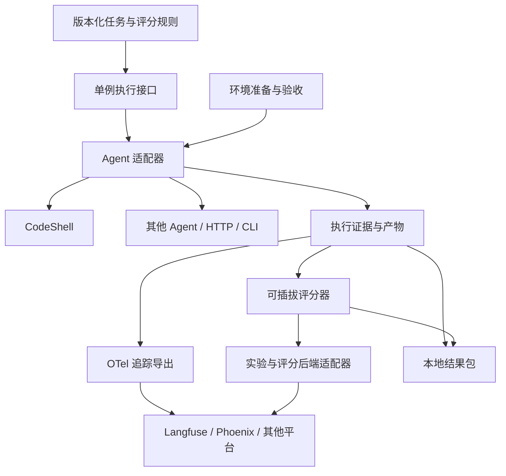

# 通用 Agent 评测层：平台调研与适配方案

调研日期：2026-09-06。状态：设计，未安装平台、连接账号、上传会话或运行真实模型评测。

目标是让 CodeShell 和其他 Agent 共用任务格式、执行接口与评分规则，并能把结果交给现有平台分析。CodeShell 的多目录、跨会话等故障作为一个专项任务集，延续 [CodeShell harness 评测方案](codeshell-harness-evals.md)。

持续自动优化的进一步设计见 [专属优化 Agent](agent-optimization-agent.md)：在本方案的评测基础上增加候选生成、独立验证、配置版本、按模型采用与使用反馈回流。这里的分析后端选择不等同于优化算法选择。

## 已有平台

下表中的用途建议是基于官方能力与本仓库 TypeScript/本地执行特点的判断，不是平台性能排名。部署和授权描述仅反映调研时文档。

| 平台              | 已核对的能力                                                                     | 对本项目的用途与边界                                                                                                                                                                                                                                 |
| ----------------- | -------------------------------------------------------------------------------- | ---------------------------------------------------------------------------------------------------------------------------------------------------------------------------------------------------------------------------------------------------- |
| **Langfuse**      | 调用追踪、数据集、SDK 实验、自定义评分、实验对比；支持本地或平台数据集；可自托管 | 首个接入候选。TS 接口可把完整 Agent 作为 task；本地数据集运行与平台 Dataset Run 的 UI 组织并不完全相同。[实验文档](https://langfuse.com/docs/evaluation/experiments/experiments-via-sdk)、[部署](https://langfuse.com/self-hosting)                  |
| **Arize Phoenix** | 基于 OTel 的追踪、版本化数据集与实验；提供 TS 实验 API                           | 适合验证平台可替换性及追踪语义。可自行部署，仓库许可证为 ELv2，不能直接当作 MIT/Apache 许可。[仓库](https://github.com/Arize-ai/phoenix)、[TS 实验](https://arize.com/docs/phoenix/sdk-api-reference/typescript/packages/phoenix-client/experiments) |
| **Braintrust**    | dataset/task/scorer 评测、实验分析、自定义及模型评分器，TS 支持                  | 值得在重视实验工作流时比较。官方 self-host 方案部署数据平面，控制平面仍由 Braintrust 托管。[评测](https://www.braintrust.dev/docs/evaluation-quickstart)、[部署边界](https://www.braintrust.dev/docs/admin/self-hosting)                             |
| **LangSmith**     | 支持独立于 LangChain 的应用追踪、数据集评测及 OTel 实验关联                      | 可接自定义 CodeShell，无需迁移 Agent 框架；self-host 是 Enterprise 附加项。[OTel 评测](https://docs.langchain.com/langsmith/evaluate-with-opentelemetry)、[部署](https://docs.langchain.com/langsmith/self-hosted)                                   |
| **Opik**          | 追踪、数据集、实验、评分，支持通过 TS/REST 上传已有实验结果                      | 另一个可自托管候选；官方说明自托管不含用户管理功能。[实验导入](https://www.comet.com/docs/opik/evaluation/advanced/log_experiments_with_rest_api)、[部署](https://www.comet.com/docs/opik/self-host/overview)                                        |
| **W&B Weave**     | dataset/scorer 评测、调用评分和实验比较；支持 TS 评分器                          | 已使用 W&B 的团队可重点考虑；SDK 不同语言的能力需要逐项核对。[评分文档](https://docs.wandb.ai/weave/guides/evaluation/scorers)、[评测说明](https://site.wandb.ai/evaluations/)                                                                       |
| **Promptfoo**     | JS/TS 自定义 provider、脚本/API 接入、断言与 CI 评测                             | 适合作为本地/CI 的批量测试入口，把完整 Agent 包装成被测对象。与追踪分析平台可以配合使用。[自定义 provider](https://www.promptfoo.dev/docs/providers/custom-api/)、[CI](https://www.promptfoo.dev/docs/integrations/ci-cd/)                           |

Langfuse 自托管涉及 Web、Worker、Postgres、ClickHouse、Redis/Valkey 与对象存储。个人先试用时应把维护这些组件的成本计入选择；部分附加功能需要许可。[官方架构](https://langfuse.com/self-hosting)

## 通用化应放在哪里



通用层只定义任务、执行结果、证据和评分。它不依赖 CodeShell Engine、Electron、某个模型或平台 SDK。工作区根、Git worktree、跨会话队列等语义属于 CodeShell adapter、环境驱动与专项 grader。

平台负责追踪展示、人工标注、数据集管理和实验对比。文件系统/浏览器环境如何还原、真正执行了哪个目录、取消后有没有产生副作用，由被测系统与环境适配器提供证据。平台不会自动知道这些产品语义。

### 五个边界

| 边界                 | 契约责任                                                                                           |
| -------------------- | -------------------------------------------------------------------------------------------------- |
| `AgentAdapter`       | 将一个任务交给被测 Agent，返回回答、终态、用量、trace 和 artifact 引用；支持取消并声明能提供的证据 |
| `EnvironmentAdapter` | 为每次样本准备环境、收集前后差异、清理；文件系统、浏览器或假服务分别实现                           |
| `Grader`             | 根据 task、execution、evidence 评分；声明必需证据、评分版本、数值方向/范围及理由                   |
| `TelemetryExporter`  | 将追踪导出为 OTel，并按目标平台映射 GenAI/OpenInference 字段；可以关闭远端导出                     |
| `EvalBackend`        | 关联数据集版本、实验、单例结果和评分；处理平台 ID、幂等、上传状态与 flush                          |

任务的基础字段：`id`、`version`、`input`、可选 `expected`、`environment`、`requirements`、`metadata`。不同任务的文件路径等结构置于版本化扩展中，不强制所有 Agent 都有目录或会话。

执行结果包含 `output`、`executionStatus`、`usage`、`duration`、`evidenceRefs`、`traceIds`。评分独立为 `criterion`、`graderVersion`、`verdict`、可选 `value`、`reason`、`evidenceRefs`。执行 completed 不自动等于评测 passed。

支持的状态至少区分通过、失败、证据不足与不适用。只有 HTTP 最终回答的黑盒 Agent 也能做答案评测；它无法证明内部请求注入正确，对这种白盒检查应标记证据不足。报告同时显示证据覆盖率，避免靠少采集拿高分。

## OTel 能统一什么

OTel/OpenInference 可以统一执行链路的传输与不少 AI 字段。它们已经能表达评分：OpenInference 明确提供 span/trace/session 的评估结果，OTel GenAI 也定义了评分事件。[OpenInference 评分规范](https://github.com/Arize-ai/openinference/blob/main/spec/annotations.md)、[OTel GenAI 事件](https://github.com/open-telemetry/semantic-conventions-genai/blob/main/docs/gen-ai/gen-ai-events.md)

数据集版本管理、实验运行与 grader 管理仍不能假定由一次 OTLP 上传自动完成。实际平台要求额外关联信息：Langfuse 使用实验属性；LangSmith 使用实验及样本 ID；Phoenix 提供自己的数据集/实验接口。[Langfuse 实验属性](https://langfuse.com/integrations/native/opentelemetry/experiments)、[LangSmith 关联](https://docs.langchain.com/langsmith/evaluate-with-opentelemetry)、[Phoenix 实验接口](https://arize.com/docs/phoenix/sdk-api-reference/typescript/packages/phoenix-client/experiments)

因此同时保留 `TelemetryExporter` 与 `EvalBackend`。传输格式通用，并不保证所有平台的 UI、筛选字段和实验分组完全等价。

实现时还要保留以下约束：

- 每次样本执行使用独立 trace；整场实验通过 experiment ID 分组。跨进程传递 trace context，异步子会话按实际因果关系使用 parent 或 span link。Langfuse 的实验接入明确要求每个样本独立 trace。[文档](https://langfuse.com/integrations/native/opentelemetry/experiments)
- 约定与映射带版本。Phoenix 对原始 `gen_ai.*` 的 UI 支持和 OpenInference 不完全一样，官方提供转换路径。[语义转换](https://arize.com/docs/phoenix/tracing/concepts-tracing/translating-conventions)
- CodeShell 自定义信息使用独立命名空间；`langfuse.*` 等厂商字段由适配器补充，不写入核心执行契约。
- 完整请求、大型工具结果和文件差异进入本地 artifact 存储；trace 携带摘要和引用。平台截断属性或缺少文件时，不把展示内容当作完整原始证据。
- 原生 Agent 的手工埋点和 SDK 自动埋点应选定归属，避免一次模型调用被重复计数。导出失败单独报告，不能冒充 Agent 执行失败；诊断导出器也不能阻塞正常对话。

## 实验如何运行，避免重复建设

第一版提供 `runCase` 单例函数与 CodeShell adapter，优先让 Langfuse SDK 或 Promptfoo 承担批量运行、并发与实验组织。一次实验只能有一个调度方，避免平台重复次数与本地重复次数相乘。离线契约检查继续使用 Bun 测试。

同一契约提供两种接法：

1. **平台发起**：平台/评测框架的 task/provider 调用 `runCase`，结果和评分回到该平台。
2. **本地发起**：本地执行同一个 `runCase`，先保存结果包，再通过 backend 上传；不依赖远端可用性完成离线验收。

后端切换时仍使用同一份固定的数据集、fixture 和 grader 版本。平台中可编辑的数据集应导出或拉取为本次运行的不可变快照，记录内容摘要与样本 ID 映射；不要只记一个数据集名称。

合成 fixture 可以跨后端重用。生产日志转任务时，需要单独确认可重现输入和预期结果，不能直接把一条成功结束的 trace 当作正确答案。

## 建议的首期选择

**Langfuse 作为首个分析后端，通用单例执行与 grader 留在本地。** 原因是它已有 TS 实验接口、Agent task、追踪和自托管路径，能够复用已有能力。Promptfoo 可以在需要 CI 配置化测试时调用同一个 adapter；它不必成为第一阶段的第二个调度系统。

第二个验证目标选择 Phoenix，用来检验数据契约是否真正可迁移。先验证同一份小型合成结果包能正确关联样本、trace 和评分，再扩展平台数量。以上是工程取舍建议，尚未做真实接入基准测试。

首期任务仍用三题：列出挂载根、列出主根子目录、读取副根标记。随后增加一个通用 HTTP 假 Agent，证明执行接口没有依赖 CodeShell 私有类型；白盒检查按能力声明跳过并显示覆盖率。

第一阶段验收：

1. 同一任务可以交给 CodeShell adapter 和通用 HTTP adapter，且结果格式一致。
2. 本地结果包能独立判分；平台不可用时仍能保留完整执行证据。
3. Langfuse 能将每次执行关联到正确样本与评分；没有重复模型调用计数。
4. 多目录错误能区分为宿主上下文、模型请求、工具执行、模型回答四类。
5. 用相同结果包验证 Phoenix 映射，明确报告不支持的字段或能力。

## 代码布局建议

先放在评测开发目录验证抽象，确认第二种 Agent 和第二种后端可复用后再考虑拆成独立包。不要为了通用化立即新增多个生产 package。

```text
evals/
  shared/             # task、execution、evidence、score 契约
  adapters/
    codeshell/        # Engine/协议与请求采集
    http/             # 通用 HTTP 被测对象
  environments/       # 临时目录、浏览器、假服务
  graders/            # 通用评分器
  backends/           # local、langfuse，随后 phoenix
  suites/
    codeshell-harness/ # 多目录、会话、工具参数等专项任务
```

原方案中的 `evals/harness/runner.ts` 应收敛为单例执行与必要的环境控制，批量实验优先复用平台或 Promptfoo。模型可切换、Agent 可切换、评分器可切换、平台可切换，是四个独立的扩展方向。
