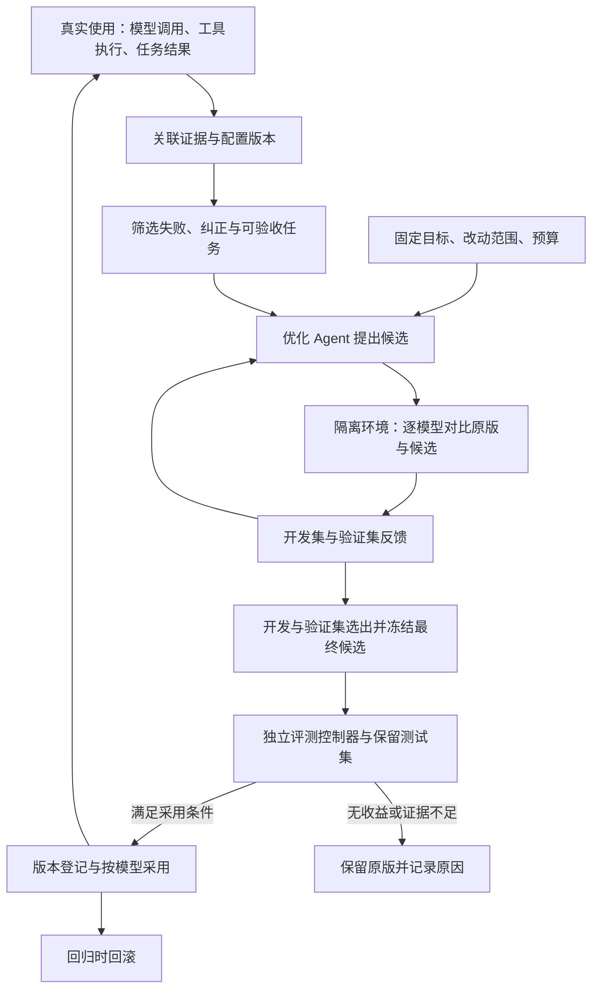

# 专属优化 Agent：从真实使用到可验证改进

日期：2026-09-06。状态：设计稿，未接入采集服务、运行优化实验或修改线上 Agent 配置。本文补充 [通用评测与平台适配方案](agent-evals-platforms-and-adapters.md)。

## 产品目标

用户选定 Agent、适用模型、任务目标、可修改范围和实验预算。专属优化 Agent 从执行证据中发现问题，生成候选改动，通过独立评测比较，按预设规则采用有效版本并保留回滚能力。

核心产物是能够解释“哪个 Agent 版本，在什么模型和任务上，提升多少、花费多少”的实验记录与配置版本。真实使用不断补充有来源的评测样本，为下一轮优化提供输入。

这里的自我优化首先指 prompt、工具描述、上下文策略和工作流的改进；普通 API 调用不会更新基础模型权重。优化 Agent 自己的策略也可以成为后续被测对象，但需要另一个固定的外层评测控制器。

## 业界基础与选型

| 能力                 | 已有实现                                                                            | 本项目如何复用                                                                                                                                                                     |
| -------------------- | ----------------------------------------------------------------------------------- | ---------------------------------------------------------------------------------------------------------------------------------------------------------------------------------- |
| 根据执行反馈提出候选 | GEPA 使用模型反思与候选搜索，提供通用适配接口，也支持文本形式的代码和配置优化       | 作为可插拔搜索策略；通过适配器执行完整 CodeShell 任务，无需把 Engine 改写为 DSPy。[官方仓库](https://github.com/gepa-ai/gepa)                                                      |
| 自动优化与实验管理   | Opik Agent Optimizer 提供多种优化算法，围绕数据集、指标、执行记录比较候选           | 若希望整合优化与实验界面，可优先验证 Opik；具体算法支持的任务结构需要逐项核对。[官方概览](https://www.comet.com/docs/opik/development/optimization-runs/overview)                  |
| 工具文案优化         | Opik 的工具优化可修改工具及参数描述，保留工具名称和 schema 结构；各算法支持范围不同 | 首期可采用这一受限改动面；不能把它理解为自动修改任意工具实现或参数契约。[工具优化文档](https://www.comet.com/docs/opik/development/optimization-runs/algorithms/tool_optimization) |
| 观测和实验对比       | Langfuse 已有 SDK 实验与评分接口                                                    | 可继续作为分析后端，优化算法通过独立接口接入。[实验文档](https://langfuse.com/docs/evaluation/experiments/experiments-via-sdk)                                                     |

此前推荐 Langfuse 针对的是观测与评测层。增加自动优化后，需要补充 `OptimizerStrategy`。建议验证两条组合：本地控制器 + GEPA + Langfuse，或本地控制器 + Opik Agent Optimizer/Opik。先用同一套小型任务比较集成成本和实际候选质量，再决定默认组合。上述用途是工程判断，未对 CodeShell 做性能实测。

## 优化闭环

优化 Agent 负责分析、提出假设和调用实验工具。控制器负责执行预算、样本隔离、评分和版本采用。评分器可以使用模型，但可程序验证的工具参数、文件差异、工作区归属、投递回执等优先用确定性检查。

控制器冻结本轮目标、评分器和保留测试集。优化 Agent 可以看到开发集、验证集的失败反馈；先据此选出并冻结最终候选，再进行保留集验收，详细答案不回流到候选生成。重复试探最终验收时，应使用新的独立保留集或预先指定序贯/多重比较方法，不能在反复择优后用普通置信区间宣称提升。

如果要改进优化 Agent 本身，应单独版本化其提示词、候选策略和搜索参数，以固定任务族上的改进收益、实验成本和泛化表现评价。被优化的策略不能同时修改用于验收自己的规则。

## 用户设定什么

`OptimizationGoal` 应包含以下信息，支持先用自然语言填写，再形成可检查的配置：

| 项目       | 含义                                                               |
| ---------- | ------------------------------------------------------------------ |
| 对象与范围 | Agent 适配器、任务类型、目标模型及配置；全局或特定项目的配置作用域 |
| 主目标     | 例如提高有证据支持的任务成功率，或在成功率满足门槛时降低成本       |
| 约束       | 可接受的延迟、成本、回归幅度，以及必须通过的操作正确性检查         |
| 可修改内容 | 指定提示词段落、工具描述、上下文策略或工作流参数                   |
| 固定内容   | 本轮评分器、测试集、权限策略、工具执行契约等                       |
| 搜索预算   | 总调用、token、费用、候选数、耗时上限和连续无改进停止条件          |
| 采用规则   | 只报告候选，或在目标范围内达到预设门槛后自动采用；指定回滚条件     |

第一版先优化提示词段落、工具与参数描述、示例选择、上下文组织及其预算。每个候选记录假设、改动及父版本，尽量控制单次改动的变量数量。

工具 schema 结构、执行代码和调度逻辑属于另一个改动范围，需要可复现环境、代码检查及专项回归测试。此前“主目录已删除”的状态竞态属于代码问题，不能用提示词评分上涨来证明已经修复。

## CodeShell 接入点

仅在 `llm.call` 入口接入适合建立调用级追踪。要验证完整 Agent 的改进，还需要关联宿主上下文、最终工具结果和任务产物。

| 边界               | 采集内容                                                         | 当前代码位置                                                 |
| ------------------ | ---------------------------------------------------------------- | ------------------------------------------------------------ |
| 宿主运行上下文     | cwd、挂载根、会话关系、权限与环境快照引用                        | desktop 项目/运行参数构造与 core prompt composer             |
| 统一模型调用       | 最终 system/messages/tools、主调用与辅助调用身份、开始结束及取消 | `packages/core/src/engine/model-facade.ts`                   |
| Provider 调用      | SDK 生效参数、实际模型标识、请求尝试、重试/fallback、返回用量    | `packages/core/src/llm/providers/openai.ts` 等 provider 边界 |
| 工具结果进入上下文 | 参数、执行结果、hook 后的最终结果、下一轮实际可见内容            | `packages/core/src/engine/turn-loop.ts` 与工具执行器         |
| 任务验收           | 回答、可验证产物、环境差异、用户纠正与执行状态                   | 宿主与 `EnvironmentAdapter`；完成状态不能代替正确性          |

事件携带 `runId`、`requestId`、`attemptId`、`toolCallId` 等关联标识，以及 `agentConfigVersion` 和模型身份。跨进程延续 trace 关系；用量归属需避免 ModelFacade 与 provider 重复计费。

正常对话中采集器异步写入有界队列，记录丢弃和截断情况，优化任务在会话结束后或累计足够样本后批量运行。完整合成请求、工具结果与文件差异进入本地 artifact；真实使用的内容按配置脱敏和保留，密钥及认证头不进入数据集。导出器不可用时保持正常对话，证据缺失的评测标记为不足。

现有普通日志不是完整请求记录；开发模式的 session recorder 能保留更多输入，但它仍不能自动重建历史工具环境。回放需要冻结输入、工具响应或环境快照，并明确是记录回放还是新执行。

不可变配置清单需包括 prompt、工具 schema、插件/hook 与上下文策略版本、代码 commit/未提交差异及构建摘要、依赖锁定摘要和生效配置。每次运行另附动态上下文与环境摘要。现有 `CompositionSnapshot` 不含完整 prompt，prompt-cache 指纹使用进程内随机 HMAC，均不能单独作为跨实验的配置版本。

## 怎样回答“在什么模型下提升多少”

为每个目标模型分别建立原版基线。记录用户选择的模型名、provider 实际生效模型及可获得的版本标识、reasoning/采样参数、token 上限和缓存条件。目标模型、优化/反思模型、摘要等辅助模型、评分模型分别记录。

同一模型内比较原版与候选：使用相同任务和环境快照、固定评分器和预算，交错执行并记录重复次数。模型、路由与 harness 同时变化时，只能报告整套系统的收益；要归因于 harness，增加固定模型的对照实验。供应商只提供可变模型别名时，应说明复现限制。

| 指标       | 报告方式                                                           |
| ---------- | ------------------------------------------------------------------ |
| 任务成功率 | 原版、候选、变化百分点、独立样本数、重复次数及置信区间             |
| 工具使用   | 首次参数有效率、最终成功率、重试次数、错误工具/目录/会话比例       |
| 完成质量   | 验收结果、虚报成功、用户纠正；按任务类别列出收益和回归             |
| 延迟       | 完整任务耗时 p50/p95，包含工具与重试；失败和超时单独显示           |
| 执行用量   | 输入/输出/cache token、辅助调用及工具服务用量，覆盖失败执行        |
| 使用成本   | 所有执行总成本，以及总成本除以已验证成功任务数；无成功则不定义后者 |
| 优化成本   | 候选生成、所有试验、评分与环境成本；单列一次性搜索投入             |
| 证据与泛化 | 证据覆盖率、未知结果数、保留集及后续新样本表现                     |

成功率同时给出已判定样本的通过率和全体样本的验证成功占比，列明分母。证据不足不算成功，不能通过减少采集来提高成绩。成本价格表需要带日期与来源，无法确认费用时报告用量并标记估算状态。

仪表板每行对应 `目标模型 × Agent配置版本 × 数据集版本 × 评分器版本`，显示原版/候选、质量变化、成本变化、延迟变化、回归、样本量与采用决定。没有实测数据时显示“未测”，不填示意提升值作为结果。

区间估计以独立任务为单位，重复运行和同源变体不能冒充更多独立样本。小样本只用于发现方向；采用门槛应覆盖效果大小、不确定性与关键类别回归。优化可以产生“没有值得采用的改动”这一有效结果。

如果每次任务能节省费用，可以估算搜索成本需要多少后续任务收回；若收益主要是正确率，则单独展示质量提升及投入，不强行折算成金额。

## 从使用中学习

1. 收集有来源的信号：用户明确纠正、任务验收、工具失败、重试、真实文件或服务状态。未反馈和普通 `completed` 不能自动标成成功。
2. 去重并形成任务族，保存原始证据引用和预期依据；把真实目录/账号替换成可验证的合成环境。不能复现的 trace 用于排查，不直接作为评分题。
3. 按任务族或来源会话分组切分开发、验证、保留数据，防止同一案例的轻微改写跨集合泄漏；保留部分较新案例检验使用分布变化。
4. 在原版上确认问题，候选在隔离环境执行。涉及 GitHub Star、飞书写入等动作时用假服务或专用测试环境验收，避免重复影响真实用户数据。
5. 通过独立验收后，把版本用于设定范围内的新任务。运行中的任务固定版本；失败候选也保留实验记录，防止重复搜索。
6. 后续使用持续观察回归，必要时回到上一可用版本。按模型采用，不能把某模型的成功自动扩展到所有模型。

失败与纠正样本会偏向问题案例，需要同时保留覆盖普通成功任务的代表性回归集。分别报告目标故障集和代表性任务集的收益及回归；修复故障集的效果不能直接外推为线上总成功率提升。

## 通用化与实施顺序

在前述方案设计的 `AgentAdapter`、`EnvironmentAdapter`、`Grader`、`TelemetryExporter`、`EvalBackend` 上增加三个职责：

- `OptimizerStrategy`：根据目标、允许读取的反馈和当前版本提出候选；可适配 GEPA、Opik 或专属推理 Agent。
- `ExperimentController`：冻结实验条件、执行预算与独立验收；协调一次实验的唯一调度方。
- `VersionRegistry`：保存候选内容、父版本、实验依据、按模型采用关系与回滚历史。

Python 优化库可以通过本地进程/HTTP 调用 TypeScript 的同一个 `runCase`。优化器驱动候选搜索时，其 evaluator 调用该接口；平台承担结果存储和分析，避免平台与本地双重调度使执行次数相乘。

Core 提供通用观察与扩展接口。优化工具可通过 `AgentModule`/`RunBehaviorProfile` 组合，控制器与版本服务放在宿主或独立能力层，Engine 不内置某个专属优化角色或平台 SDK。

建议依次验证：

1. 用“挂载根、主根子目录、副根读取”三题验证采集、环境与独立判分；这是工程接入验收，不能证明整体 Agent 能力提升。
2. 扩展独立任务族并冻结数据集，在两个指定模型配置上比较一个受限提示词候选；显示真实逐模型差异及实验成本。
3. 接入一个候选生成策略，在固定预算内自动搜索，保留最优版本和未采用原因。
4. 接入真实使用反馈形成下一轮样本；达到预设验证门槛后才开启范围明确的自动采用与回滚。
5. 用另一种 Agent adapter 和另一种优化策略复用同一闭环，验证通用性；再考虑单独优化优化器策略。

首期交付应证明“证据关联 → 候选生成 → 对照实验 → 按模型报告 → 可追溯采用”能够闭合。模型质量、用户反馈稀疏和任务环境漂移都可能限制改进，系统应如实保留这些结果。
