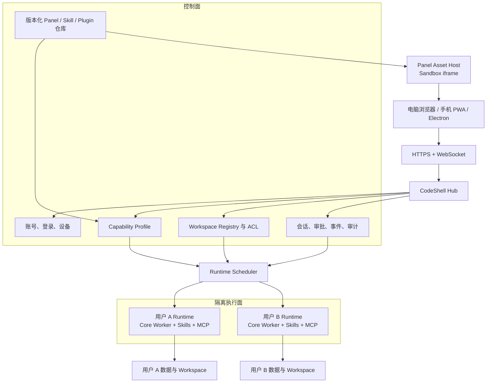

# CodeShell Hub：一键部署、多用户能力分配与远程使用架构

> 状态：方向设计稿，非实现承诺  
> 日期：2026-08-28  
> 适用范围：CodeShell Core、Server、Web、Desktop、Panel Apps、Skills、Plugins 与 MCP  
> 修订：v2（2026-08-28，按源码核验补齐：Phase 顺序与 RPC 直通的关系 §7.1/§10、
> workspace 内配置发现的钳制 §4.4、会话索引对账 §4.3、命名与在途方案对齐 §6.4）

## 0. 结论

CodeShell 可以演进成一个可一键部署的个人或团队 AI 工作台：管理员部署一个
**CodeShell Hub**，用户通过电脑浏览器、手机 PWA 或 Electron 客户端登录，并根据自己的
账号与 Workspace 获得不同的 Panel Apps、Skills、Plugins、MCP、模型和权限策略。

推荐架构不是远程控制 Electron，而是拆成三部分：

1. **CodeShell Hub（控制面）**：负责账号、Workspace、Capability Profile、授权、会话索引、
   实时事件、审计和运行时调度。
2. **CodeShell Runtime（执行面）**：按用户隔离运行 Core Worker、Agent、Skills、MCP、进程、
   浏览器 Profile 和 Workspace 操作。
3. **CodeShell Web/PWA（体验面）**：作为桌面和手机的标准体验；Electron 后续成为可选外壳，
   而不是唯一宿主。

现有 `packages/server`、`packages/web`、Core stdio worker、Panel App Manifest 和权限系统可继续
复用。主要新增能力是：多用户身份、Capability Profile、用户级 Runtime 隔离、Web Panel Host
以及部署产品化。

## 1. 目标与边界

### 1.1 产品目标

- 一条命令在 VPS、NAS、Mac mini 或私有服务器部署 CodeShell。
- 管理员可以创建或邀请用户，并为用户分配不同的能力组合。
- 用户在手机或电脑登录后，只看到自己有权使用的 Workspace、Panel、Skills 和历史会话。
- Agent、文件、进程、MCP、下载和浏览器自动化在服务器端运行，手机只承担交互和审批。
- Desktop、Web 和手机共享会话、流式输出、审批、Panel SDK 和权限语义。
- 服务或 Worker 重启后，会话、配置、Panel 数据和任务状态可以恢复。

### 1.2 MVP 不做

- 不做公开注册、复杂组织层级、SCIM、计费和 Marketplace 分成。
- 不做多节点高可用、跨地域调度和数据库读写分离。
- 不允许浏览器直接调用完整 Core RPC、提交任意服务器路径或绕过权限审批。
- 不追求第一阶段把所有 Desktop 能力一次性搬到 Web。
- 不把多个不可信用户放进同一个共享 Core Runtime。

## 2. 当前基础与主要缺口

| 领域           | 当前基础                                                                          | 主要缺口                                                                                                                                                                                                                                                                       |
| -------------- | --------------------------------------------------------------------------------- | ------------------------------------------------------------------------------------------------------------------------------------------------------------------------------------------------------------------------------------------------------------------------------ |
| Headless 服务  | `packages/server` 已有 `code-shell-serve`、HTTP/WS、passcode 和 stdio worker      | 单 Workspace、共享口令、无正式账号和多租户；WS 帧原样注入 worker（`headless-server.ts:307`），即浏览器持有完整 Core RPC 直通与任意 `cwd` 提交能力                                                                                                                              |
| Web 客户端     | `packages/web` 已有会话、流式输出、审批、停止和重连能力                           | 尚未成为完整 Desktop Shell，也没有 Web Panel Host                                                                                                                                                                                                                              |
| Core Runtime   | Core 已有 transport-agnostic 协议、多 Session、durable session 和 permission gate | `sessionId`、设置、凭据、Memory 和部分 singleton 没有产品用户维度；`codeShellHome()` 是进程级 env 解析（`session-manager.ts:401`），Hub 控制面要跨 N 个用户数据根读索引，必须把路径入口参数化（`sessionsRoot(home?)` 已支持，credentials、settings、panel storage 等入口尚未） |
| Panel Apps     | Manifest v2 已支持权限、Agent Tools 和 bundled Skills                             | 当前宿主主要依赖 Electron bridge、用户 HOME 和本地进程                                                                                                                                                                                                                         |
| Skills/Plugins | 已支持项目、用户、Plugin 和 Panel App 来源                                        | “user”仍表示操作系统 HOME，不是 CodeShell 账号                                                                                                                                                                                                                                 |
| 远程移动端     | 已有 Browser UI、WebSocket、上传、重连和审批经验                                  | 当前更接近单用户桌面遥控，不是多用户服务                                                                                                                                                                                                                                       |

因此最短路径是扩展现有 Server/Web，而不是重写 Core 或把 Electron 整体搬到服务器。

## 3. 总体架构



### 3.1 控制面

控制面不执行任意 Agent 工具，主要负责：

- 登录、邀请、设备 Session 和撤销。
- Workspace 登记、成员关系、角色和服务端路径解析。
- Capability Package Catalog 和 Profile 分配。
- Session ownership、历史索引和 Runtime 路由。
- WebSocket 事件分发、审批 lease、上传和通知。
- 审计、配额、健康检查和管理员操作。

### 3.2 执行面

执行面负责所有可能接触用户代码、秘密或宿主资源的操作：

- Core Worker、Agent Session 和长任务。
- Skills、Plugins、Capability Modules 和 MCP 子进程。
- Workspace 文件、Git、LSP、shell 和其他进程。
- 用户凭据、服务端浏览器 Profile 和自动化。
- Panel App 的后端工具、长期进程和 Agent Tool handler。

MVP 使用“一用户一 Worker 进程”；正式多租户服务使用“一用户或一用户 Workspace 一容器”，
并允许空闲休眠与恢复。

### 3.3 体验面

Web/PWA 成为产品体验的标准实现：

- Desktop：聊天区、会话导航和右侧 Panel Dock。
- Tablet：可折叠双栏。
- Mobile：聊天、会话和 Panel 使用全屏页面切换。
- Electron：复用同一套 Web Shell 和服务协议，按需补充本机能力适配器。

## 4. Capability Profile

### 4.1 为什么需要 Profile

不能靠给每个用户复制一份目录来管理能力。系统需要一个可版本化、可审计的能力组合：

```text
Capability Profile
  basePreset
  panels[]
  skills[]
  plugins[]
  capabilityModules[]
  mcpServers[]
  modelPolicy
  permissionPolicy
  resourceLimits
```

典型 Profile：

- **开发者套装**：Design Studio、Coding、Git、Browser 和代码审查 Skills。
- **求职套装**：Job Hunt HQ、文档处理、调研和面试 Skills。
- **投资研究套装**：Quant Lab、金融数据连接和只读分析策略。

### 4.2 生效规则

```text
Effective Capability
  = System Default
  + User Profile
  + Workspace Overlay
  - User Disabled Items
  - Administrator Policy Clamp
```

命名说明：按 Workspace 叠加的能力配置叫 **Workspace Overlay**，不叫 Workspace Profile——
core 中已存在 `WorkspaceProfile`（数字人 persona 类型），沿用会撞名（多目录方案 §4.3 已为
`WorkspaceContext` 做过同样的避让）。

规则要求：

- 系统拒绝项始终优先，用户不能通过 Workspace 配置重新打开。
- 所有包引用具体版本和内容摘要，不引用可变目录。
- Session 创建时记录 `profileVersionId`，保证恢复和审计可重复。
- Profile 更新默认只影响新 Session；旧 Session 是否升级必须显式决定。

### 4.3 建议数据模型

```text
User
Workspace
WorkspaceMember
CapabilityPackage
CapabilityPackageVersion
CapabilityProfile
CapabilityProfileVersion
ProfileBinding(userId, workspaceId, profileVersionId)
Session(userId, workspaceId, profileVersionId, runtimeId)
Connection(userId, providerId, credentialRef)
PanelData(userId, workspaceId, panelAppId, key)
AuditEvent(userId, workspaceId, sessionId, action, decision)
```

`CapabilityPackageVersion` 统一表达 Panel、Skill 和 Plugin 的不可变安装快照；Profile 只保存引用，
不重复保存包内容。

`Session` 行是**索引，不是权威**。会话真身始终是用户数据根内 SessionManager 的 `state.json`；
Hub 的 Session 表只服务路由、列表与审计。对账规则固定为：**磁盘为准、索引可重建**——
Hub 重启或索引损坏时从各用户数据根重扫重建；索引中存在但磁盘缺失的行标记失效，
不得据此创建或复活会话（Desktop 侧 rebuildFromDisk 自动建项目的教训同样适用于这里）。

### 4.4 钳制必须覆盖 workspace 内配置发现

§4.2 的"不可变版本 + 内容摘要"只约束了**分发侧**的 CapabilityPackage。执行面今天还会从
Workspace 目录自动发现能力，这条路径同样必须被 Effective Profile 钳制，否则规则形同虚设：

- 项目层 `.code-shell/settings.json` 可声明 `hooks` 与 `mcpServers`
  （`packages/core/src/settings/manager.ts:54-55`），仅在 `projectTrusted=false` 时剥离；
- `.code-shell/skills` / `.agents/skills` 是随 repo 可写的可变目录（`skills/scanner.ts:55-56`）。

即：一个对 Workspace 有写权限的用户，往 repo 写这些文件就能绕过 Profile 白名单启动任意
MCP、hook 或 Skill。因此：

1. **远程模式重定义 trust 语义**：`projectTrusted` 不再来自本地用户"我信任这个目录"的
   一次性确认，而由管理员策略决定（默认 untrusted，即危险字段一律剥离；管理员可按
   Workspace 显式授予 trusted）。用户自己不能给自己的 Workspace 提升 trust。
2. **执行面按 Profile 过滤发现结果**：即使 Workspace 是 trusted，从项目目录发现的
   skills/hooks/MCP 也要经 Effective Profile 与系统拒绝项过滤后才能生效；
   系统拒绝项对 workspace 内发现与分发包同等生效。
3. 被过滤掉的发现项要在审计中留痕（谁、哪个 Workspace、哪个配置项、为何被拒）。

## 5. Panel App 远程运行模型

现有 Panel App 权限包含 `workspace.read/write`、`process`、`credentials.cookies`、
`agent.submitPrompt`、`automations.manage` 等高权限操作。这些能力在远程模式下不能直接暴露给
iframe。

```text
Sandbox Panel iframe
        ↓ postMessage
Web Panel SDK
        ↓ HTTPS / WSS
Panel Gateway
        ↓ Manifest + Profile + ACL + Approval
User Runtime / Agent / Workspace
```

### 5.1 Panel Asset Host

- Panel 前端包按内容摘要保存并从只读地址加载。
- 每次安装进行 Manifest、入口 containment、资源路径和权限校验。
- iframe 使用独立 origin 或严格 sandbox、CSP 和资源白名单。
- Panel 不能直接读取 Hub Cookie、服务器文件、环境变量或其他 Panel 数据。
- 包版本更新生成新摘要，不原地覆盖正在运行的版本。

### 5.2 Web Panel SDK

Web 和 Electron 对 Panel 暴露同一套稳定接口，例如：

```text
panel.context.get
panel.storage.get/set
panel.workspace.info/read/write
panel.agent.submitPrompt
panel.agent.invokeTool
panel.process.start/stop
panel.credentials.requestUse
panel.automations.create/update
```

调用必须同时通过四层检查：

1. Panel Manifest 是否声明该权限。
2. 用户的 Effective Profile 是否启用该 Panel 和能力。
3. 用户是否有目标 Workspace、Session 或 Connection 的权限。
4. 当前操作是否需要一次性或持续审批。

审批链路复用现有 mobile `approval.respond` 的语义作为基础；**审批 lease 是新增语义**：
同一条审批在多设备（手机 + 桌面 Web + Electron）同时在线时由 lease 决定谁可响应，
lease 的抢占、超时与撤销规则必须与 Phase 1 的审批闭环一起定义——手机与电脑同时登录
在 Phase 1 就会发生，不能推迟到多用户阶段。

### 5.3 Panel 数据隔离

Panel Storage 至少使用以下命名空间：

```text
userId / workspaceId / panelAppId / storageKey
```

Panel 进程、下载任务和 Agent Tool handler 运行在对应用户 Runtime，不能运行在 Hub 控制面。
例如手机点击开始下载，`yt-dlp` 实际在远程 Runtime 内运行。

### 5.4 服务端安装后在手机打开 Panel

目标体验是：管理员或用户在服务端安装一个带 Panel App 的能力包后，手机端刷新能力目录，
自动出现对应的 Panel 入口；用户点击后直接在 CodeShell Web/PWA 中打开，无需运行 Electron。

当前版本尚未形成这条完整链路：

- `code-shell-serve` 的 Web App 目前主要覆盖 Session、聊天、流式输出、审批和停止；
- Panel App 的发现、资源加载、权限校验和 host bridge 主要由 Electron Desktop 承担；
- Server 尚未提供面向 Web 的 Panel Catalog、Panel Asset Host 和 Remote Panel Bridge；
- 因此，仅在服务端安装现有 Plugin 或 Panel App，不会自动让手机网页出现可用 Panel。

还必须区分 **Plugin** 与 **Panel App**：

- 普通 Plugin 可能只包含 Skills、MCP、Hooks、Agents 或命令，不一定有可视页面；
- 只有声明合法 Panel Manifest 的 Panel App，或明确携带 Panel App contribution 的能力包，
  才进入 Panel Catalog 并在客户端显示；
- 安装成功不等于对所有用户启用。Panel 仍需通过 Capability Profile、用户授权和
  Workspace Binding 才能对具体用户可见。

完整运行链路：

```text
服务端安装并校验能力包
        ↓
Capability Package Catalog（不可变版本 + digest）
        ↓
Capability Profile / Workspace Binding
        ↓
手机 Web/PWA 获取当前用户的 Panel Catalog
        ↓
Web Panel Host 在 sandbox iframe 中加载 Panel Asset
        ↓ postMessage / Panel SDK
Panel Gateway 执行 Manifest + Profile + ACL + Approval 校验
        ↓
用户 Runtime / Agent / Workspace / Panel Storage
```

服务端需要补齐以下接口与宿主能力：

1. **Panel Catalog API**：按 `userId + workspaceId + profileVersionId` 返回用户当前可见的
   Panel descriptor、版本、图标、入口和已授予权限。
2. **Panel Asset Host**：通过类似
   `/api/v1/panel-assets/<packageDigest>/<assetPath>` 的只读、不可变地址提供 Panel 文件，
   并执行路径 containment、CSP、缓存和 MIME 校验。
3. **Web Panel Host**：在桌面浏览器和手机 PWA 中提供统一 Panel 容器；手机使用全屏页面，
   桌面使用右侧 Dock，但运行同一 Panel bundle 和 SDK。
4. **Remote Panel Bridge**：把 `storage`、Workspace、Agent、process、credentials 和 automation
   等调用经 HTTPS/WSS 转发到对应用户 Runtime；Panel iframe 永远不能直接接触文件、进程或凭据。
5. **生命周期同步**：安装、升级、禁用、解绑或撤销权限后主动推送 catalog revision，
   客户端关闭失效实例或显示明确占位，不能继续使用旧授权。

单用户远程 Panel MVP 先支持：

- `context.session`
- `context.workspace`
- `storage`
- `workspace.info`
- `workspace.read`
- `workspace.write`（继续经过路径策略与审批）
- `agent.submitPrompt`

以下高风险或宿主相关能力后置，并逐项定义服务端语义：

- `agent.task`（以 Panel 名义发起 Agent 任务，需先定义远程模式下的归属与审批）
- `process`
- `credentials.cookies`
- `automations.manage`
- `notifications.send`
- `audio.transcribe`
- `external.open`

其中 `credentials.cookies` 使用服务器端该用户的隔离浏览器 Profile，不读取手机浏览器 Cookie；
`process` 在用户 Runtime 内运行；`external.open` 默认只请求手机浏览器打开经过校验的 URL。

最小验收场景：服务端安装一个带 Panel Manifest 的包，将其绑定给指定用户和 Workspace；
用户在手机登录后看到 Panel 入口，能够打开页面、读取隔离 Storage、提交 Agent Prompt，并在权限
允许时访问目标 Workspace；其他用户、未绑定 Workspace 和已撤销设备均无法加载资源或调用 Bridge。

## 6. 用户、Workspace 与存储隔离

### 6.1 Workspace

- 浏览器只提交 opaque `workspaceId`，不能提交绝对 `cwd`。
- Hub 使用 `WorkspaceRegistry` 将 `workspaceId` 解析为 canonical server path。
- 登记路径时执行 `realpath`、allowed-root 和 symlink escape 检查。
- Session、上传、历史、审批、Panel 调用和自动化统一经过 Workspace ACL。
- MVP 默认一个 Workspace 一个 owner；共享写入和 worktree 冲突后续单独设计。
- MVP 一个 `workspaceId` 对应一个服务端目录。多目录本地项目方案（§6.4）落地后，
  "一个项目多 roots"映射为单 `workspaceId` 多 roots 还是多 `workspaceId`，
  在 Phase 2 设计时与该方案统一决定，不各自演进。

### 6.2 用户数据根

每个用户拥有独立数据根，例如：

```text
data/users/<userId>/
  home/.code-shell/
  sessions/
  memory/
  credentials/
  browser-profiles/
  panel-storage/
  uploads/
  runtime/
```

启动 Worker 时显式注入用户级 `HOME`、`CODE_SHELL_HOME` 和数据路径。不能在多个并发用户之间
共享或动态修改进程全局 HOME。

### 6.3 凭据与浏览器 Profile

- Provider secret 属于用户，不属于共享仓库。
- Workspace scope 表示用户凭据与 Workspace 的授权绑定，不表示把 secret 写进 repo。
- `credentials.cookies` 指服务器端该用户的隔离浏览器 Profile，不是手机浏览器 Cookie。
- Hub 数据库只保存 credential reference；敏感材料进入用户 secret store。

### 6.4 命名与在途方案对齐

本方案与 `docs/todo/multi-folder-local-project-plan.md`（多目录本地项目，实施中）共享
大量底层概念，必须先对齐术语，否则"Workspace"一词在仓库里已是三义：

| 词                              | 含义                                                          | 归属       |
| ------------------------------- | ------------------------------------------------------------- | ---------- |
| Hub Workspace（本方案）         | 服务端登记的一个工作目录，`workspaceId` 解析为 canonical path | Hub 控制面 |
| `SessionWorkspace`（core 现有） | Session 的 main/worktree 执行指针                             | Core       |
| `WorkspaceProfile`（core 现有） | 数字人 persona 类型                                           | Core       |

对齐约束：

- 两个方案的权威不混用：本地 Desktop 形态下项目/roots/授权的唯一事实源是 Desktop Main；
  Hub 部署形态下是 Hub。同一份 Core 代码两种宿主，Core 保持宿主无关（§12.2）。
- 路径比较统一复用多目录方案的 `canonicalKey`（`packages/core/src/workspace/`），
  Workspace 登记的 realpath/symlink 校验（§6.1）不得另写一套 normalize。
- 多目录方案已声明 `code-shell-serve` 与 Remote Project 本期保持单目录（其 §3.2 非目标），
  与本方案 Phase 1 的单 Workspace 假设一致；两边任何一方要放开这条，先更新对方文档。

## 7. 外部与内部协议

### 7.1 对浏览器开放

建议公开版本化 Application API：

```text
/api/v1/auth/*
/api/v1/me
/api/v1/workspaces
/api/v1/profiles
/api/v1/panels
/api/v1/panel-assets/<packageDigest>/<assetPath>
/api/v1/skills
/api/v1/sessions
/api/v1/uploads
/api/v1/realtime        WebSocket
```

浏览器不能直接访问完整 Core RPC。Gateway 只投影明确允许的会话、审批、Panel 和管理操作。

**现状与迁移**：今天 `code-shell-serve` 的 WS 把浏览器帧原样注入 worker
（`headless-server.ts:307`），即完整 Core RPC 直通。这个直通只允许存在于 Phase 1 的
单用户形态（浏览器 = 部署者本人，见 §10 的显式风险接受）；Application API Gateway 是
**Phase 2 开启多用户的硬前置**——任何第二个账号出现之前，直通必须已被 Gateway 取代。

### 7.2 Hub 到 Runtime

第一阶段继续复用 stdio line JSON-RPC 和现有 Core Worker：

- Hub 生成内部 request ID 并维护请求归属。
- Runtime 返回的流式事件绑定 `userId/sessionId/runtimeId` 后再进入 Event Hub。
- Worker 崩溃只影响所属用户，并由 Supervisor 记录、重启或恢复。
- 将来需要跨机器调度时，再替换为受认证的内部 RPC，不要求修改浏览器协议。

## 8. 一键部署形态

### 8.1 Personal/Lite

适合个人 VPS、NAS 和家庭服务器：

- 单节点、一个管理员或少量受信任用户。
- Hub、Web 和 Runtime Manager 可在同一发行镜像中。
- SQLite 或嵌入式 metadata store。
- 本地持久卷保存 Session、Package 和 Panel 数据。
- Caddy 或等价组件终结 HTTPS。

目标交互：

```bash
codeshell deploy
```

或：

```bash
docker compose up -d
```

部署结束后输出访问地址和一次性管理员初始化链接。

### 8.2 Team/Managed

适合正式团队或 SaaS：

```text
codeshell-hub       Web、API、WebSocket、账号与授权
runtime-scheduler   Worker/container 生命周期与调度
postgres            用户、Profile、Workspace、Session 索引
redis               短期事件、lease、限流和调度状态
object-storage      Package、附件和大体积产物
runtime-containers  隔离的用户执行环境
edge-proxy          TLS、域名、请求大小与安全头
```

Runtime 支持空闲休眠、按需恢复、资源限额和节点调度。只有在单机模型稳定后再进入该阶段。

## 9. 安全基线

- 默认只监听 loopback；公网部署必须使用 HTTPS 和受信反向代理配置。
- 登录使用可撤销的 opaque Session Cookie，设置 `HttpOnly`、`Secure` 和 `SameSite`。
- 登录、上传、WS 消息、Panel 调用和 Runtime 创建均有限流与配额。
- WS upgrade 校验 Session 和 Origin；每条消息仍重新做对象级授权。
- 浏览器不能提供任意 `cwd`、Runtime ID、内部 Session ID 或 credential path。
- Session、Workspace、PanelData、上传和事件 fanout 全部按用户授权过滤，防止 IDOR。
- Core permission/path policy 继续作为执行前最后一道门；通过账号授权不等于自动批准工具。
- Workspace 内发现的 skills、hooks 和 MCP 配置受 Effective Profile 与系统拒绝项钳制（§4.4）；
  `projectTrusted` 由管理员策略决定，用户不能给自己的 Workspace 提升 trust。
- 撤销用户或设备必须**主动**断开其 WebSocket 并使 Runtime 侧凭据失效，
  而不是只拒绝新请求（对应验收场景 10）。
- Panel 包、Skill 和 Plugin 使用不可变版本、内容摘要、严格解包和路径 containment。
- 审计记录用户、Workspace、Session、动作、审批决定、时间和 request ID。
- Prompt、tool args、日志和审计字段必须脱敏、截断，禁止写入明文 secret。
- 每用户限制活跃 Session、并发 Run、子进程、MCP、上传和流式缓冲。

## 10. 实施阶段

### Phase 1：个人远程闭环

- 将现有 `code-shell-serve` 打包为可部署镜像。
- 增加正式管理员初始化和登录 Session，替换共享 passcode 作为主身份。
- 提供 HTTPS、健康检查、持久卷和手机 PWA。
- 保持单 Workspace、单用户 Worker。
- 定义审批 lease 的多设备语义（§5.2）并随审批闭环一起验收。
- 验证会话、流式输出、审批、停止和重启恢复。
- **显式风险接受**：本阶段浏览器经登录后仍是完整 Core RPC 直通（含任意 `cwd`）。
  单用户下浏览器等同部署者本人，可以接受；该风险由 Phase 2 的 Application API 关闭。

### Phase 2：多用户与 Capability Profile

- **前置**：落地 §7.1 Application API Gateway，关闭浏览器直连 Core RPC 与任意 `cwd` 提交。
  此项完成前不得创建第二个账号。
- 增加 User、Workspace Registry、ACL、Profile 和 ProfileBinding。
- 落地 §4.4：管理员 trust 策略与 workspace 内配置发现的 Profile 钳制。
- Hub 控制面以参数化数据根访问用户数据（补齐 core 路径入口的 `home` 参数，见 §2）。
- 实现一用户一 Worker、用户数据根和 credential isolation。
- Web 根据 Effective Profile 动态展示 Panel、Skills 和功能入口。
- 所有 Session 和事件加入 ownership 校验与审计。

### Phase 3：远程 Panel Apps

- 建立用户与 Workspace 维度的 Panel Catalog API，并明确 Plugin 与 Panel App contribution 的区别。
- 建立不可变 Panel Asset Host、sandbox iframe 和统一 Web Panel SDK。
- 在手机 PWA 中增加 Panel 入口和全屏 Panel Host；安装或授权变化通过 catalog revision 主动同步。
- 将 Desktop Panel Bridge 抽象为可由 Electron 或 Hub 实现的 host contract。
- Panel Agent Tools、Skills、process 和 storage 绑定用户 Runtime。
- 先交付 `context`、`storage`、Workspace 和 `agent.submitPrompt`，再逐项开放 process、Cookie、
  automation、notification、transcription 和 external-open 能力。
- 验证安装、绑定、打开、调用、升级、禁用、解绑和撤销的完整生命周期。

### Phase 4：团队与托管服务

- Runtime 容器调度、休眠恢复、资源配额和多节点运行。
- 团队 Workspace、角色、共享 Profile、管理员后台和完整审计。
- PostgreSQL、Redis、对象存储、备份恢复和可观测性。
- 最后再考虑计费、Marketplace 和公开注册。

## 11. MVP 验收场景

部署者在一台空白服务器执行一次部署命令后：

1. 通过一次性链接创建管理员。
2. 登记两个服务端 Workspace。
3. 创建用户 A 和用户 B。
4. 为 A 分配“求职套装”，为 B 分配“投资研究套装”。
5. A 在手机登录，只能看到 Job Hunt HQ、相关 Skills 和被授权 Workspace。
6. B 登录后只能看到 Quant Lab、相关 Skills 和自己的 Workspace；且 B 无法通过向自己的
   Workspace 写入 `.code-shell/skills` 或 `settings.json`（hooks/MCP）获得 Profile 之外的能力。
7. 两人可以并发启动会话、查看流式结果并在手机完成高风险审批。
8. A 无法枚举或访问 B 的 Session、PanelData、上传、凭据、事件和 Runtime。
9. Hub 或 Worker 重启后，两人的会话和数据能够恢复。
10. 管理员撤销用户或设备后，现有 HTTP Session、WebSocket 和 Runtime 访问及时失效。

满足以上十项，才说明“一键部署、多用户能力分配、手机直接使用”的最小产品闭环成立。

## 12. 关键架构决策

1. **Web-first，而不是 Electron remote desktop。**
2. **账号与网络留在 Server，Core 保持 UI 和租户无关。**
3. **浏览器使用受限 Application API，不直连完整 Core RPC。**
4. **Capability Profile 是用户能力分配的唯一来源，含对 workspace 内配置发现的钳制（§4.4）。**
5. **Panel、Skill、Plugin 以不可变 Package Version 分发。**
6. **Session 固定 Profile Version，保证恢复和审计可重复。**
7. **MVP 一用户一 Worker，正式多租户一用户或一 Workspace 一容器。**
8. **Panel UI 在浏览器运行，Panel 高权限能力在用户 Runtime 运行。**
9. **Workspace 由服务端 ID 解析，客户端永远不决定真实路径。**
10. **先完成个人和小团队单机闭环，再扩展成托管集群。**
