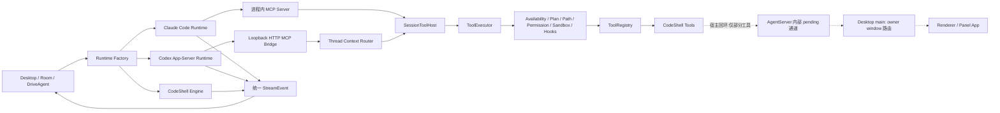

# 外部 Agent Runtime 与 CodeShell 工具桥技术方案

> 状态：设计稿 v2，已完成一轮针对当前源码的架构评审并据此修订  
> 日期：2026-07-29（v2 修订同日）  
> 第一阶段范围：Claude Code、Codex，本地桌面端，增强模式  
> 参考实现：[`makecindy/cindy`](https://github.com/makecindy/cindy)，核对版本
> `2f409937`

## 0. v2 修订说明

v1 的信任分层（Runtime → MCP → `SessionToolHost` → `ToolExecutor`）经评审确认方向正确，
予以保留。本次修订针对评审发现的、与当前源码不一致或建模不足之处做了实质性调整：

1. **新增第 9.3 节「宿主回环工具（Host-Loopback Tool）」**。v1 的架构图把调用链画到
   `ToolRegistry → CodeShell Tools` 就结束了，但 `Panel`、`Browser`、`SwitchSessionWorkspace`、
   `InjectCredential` 这四类工具会**从 builtin 内部反向回到 Desktop renderer 的具体窗口**。
   这类工具的可用性不由 `ToolExecutor` 决定，而由宿主侧的 owner 归属决定。v1 缺这一层建模，
   直接导致下面第 2、3 条。
2. **`Panel.invoke` 从第一阶段 allowlist 移出**（第 9.4 节）。当前源码下外部 Runtime 会话
   拿不到 owner window，`invoke` 必然 fail closed。第一阶段只放 `list / open / tools`。
3. **重写 `bypassPermissions` 不变量**（第 12.1 节）。v1 的表述"外部 Runtime 的 bypass 只影响
   它自己"虽然结论对，但论证遗漏了真正的风险面：CodeShell **自己**的 `PermissionClassifier`
   一旦被设成 `bypassPermissions` 就会短路全部规则。现改为可测的硬约束。
4. **新增第 13.5 节「internal pending 与审批的分离」**。`Panel` 复用 approval 通道，而
   `cancelSessionApprovals()` 会无差别 drain，Stop 会把飞行中的宿主请求误结算成"用户拒绝"。
5. **`CreateSessionToolHostOptions` 补齐 `toolVisibility` 输入**（第 8.2 节）——
   这是 v1 第 23 节问题 2 的答案。
6. **7.1 节文件路径修正**：`packages/core/src/extension/` 目录不存在。
7. **Phase 0 新增两个阻塞性调研项**（第 17 节）：`run-tooling.ts` 的可复用性改造、
   Codex `_meta.threadId` 可信性验证。后者是 22.7 节能否维持"暂不采用"的前提。

评审中确认**无需修改**的结论：`SessionToolHost` 归属 `packages/core` 正确；外部 Runtime
实现归属 `packages/coding` 正确；`server -> coding` 依赖方向无环。

## 1. 结论摘要

CodeShell 可以把 Claude Code 和 Codex 接成可切换的执行后端，并允许它们调用
CodeShell 自身工具。但不应把二者塞进现有 `LLMClientBase`，也不应绕过 CodeShell 的
`ToolExecutor` 直接调用 `ToolRegistry`。

本方案采用以下结构：

1. 引入独立的 `ExternalAgentRuntime` 抽象，将 Claude Code、Codex 视为自带推理循环、
   工具系统、会话和权限协议的 **Agent Runtime**，而非普通模型 Provider。
2. 从现有工具执行链提取会话级 `SessionToolHost`。它只暴露经过筛选的工具，并统一调用
   `ToolExecutor.executeSingle()`，继续执行可见性、参数校验、Plan Mode、路径策略、权限、
   沙箱、Hooks、日志和结果脱敏。
3. Claude Code 使用官方 Agent SDK 的进程内 MCP Server；Codex 使用共享
   `codex app-server`，并通过仅监听 loopback 的 Streamable HTTP MCP bridge 接入同一
   `SessionToolHost`。
4. 第一阶段采用“增强模式”：Claude Code / Codex 原生 `Read`、`Edit`、`Bash` 等工具仍由
   各自 runtime 提供；MCP 只增加 CodeShell 独有能力。后续如有必要，再增加由 CodeShell
   接管文件、Shell 等通用工具的“受管模式”。
5. CodeShell 工具的最终授权点永远是 `ToolExecutor`，且 external session 的
   `SessionToolHost` **禁止**使用 `bypassPermissions` / `dontAsk`。外部 runtime 自身的
   bypass 模式只作用于它的 Native Tools，与 CodeShell Host Tool 权限正交（见 12.1.1 ——
   这个不变量靠类型约束成立，不是靠"两套权限互不干扰"的直觉）。
6. **`ToolExecutor` 通过 ≠ 工具可执行**。`Panel` / `Browser` /
   `SwitchSessionWorkspace` / `InjectCredential` 是宿主回环工具，执行时反向依赖 Desktop
   renderer 的具体 owner window。这条链路在 `ToolExecutor` 之外，需单独建模与验收
   （见 9.3）。就 Codex + Panel 这个目标场景而言：第一阶段 `list / open / tools` 可达，
   `invoke` 需先完成 owner claim 显式化（Phase 0-C）。

## 2. 背景与现状

CodeShell 目前已有多条调用 Claude Code / Codex 的路径：

- `packages/coding/src/cc-orchestrator/agent-adapter.ts`：面向一次性运行的 Claude/Codex
  CLI adapter。
- `packages/coding/src/cc-orchestrator/external-agent-driver.ts`：每次任务拉起一个 headless
  进程。
- `packages/server/src/mobile-remote/resident-agent.ts`：常驻 Claude Code 会话。
- `packages/server/src/mobile-remote/codex-room-agent.ts`：Room 中按 turn 调用
  `codex exec`。
- `packages/coding/src/tools/drive-agent.ts`：以编排工具的形式驱动外部 Agent。

这些实现已经证明外部 Agent 能被 CodeShell 调起，但仍有四个结构性问题：

1. **执行模型不统一**：一次性进程、常驻进程、Room Agent 各自维护解析、停止、恢复和错误
   语义。
2. **CodeShell 工具不可用**：外部 Agent 只能使用自身内置工具，无法访问 CodeShell 的
   Browser、Data Source、Panel、Memory 等宿主能力。
3. **安全边界分散**：现有外部进程普遍继承完整 `process.env`；不同入口的权限能力也不一致。
4. **概念混淆风险**：Claude Code / Codex 若被当作普通 Provider，会迫使 CodeShell 的
   Engine 去嵌套另一个完整 Agent Loop，造成双重会话、双重工具循环和双重权限状态机。

同时，CodeShell 已经具备可复用的正确工具执行主干：

- `ToolRegistry` 负责工具注册和底层执行。
- `ToolExecutor.executeSingle()` 负责工具可用性、Plan Mode、校验、Hooks、路径规则、权限、
  沙箱、执行和结果处理。
- `run-tooling.ts` 已拆出 `buildRunToolContext()`、`buildRunPermissionPipeline()`、
  `assembleRunToolDefs()` 和 `connectRunMcp()` 等组装能力。

因此本方案的核心不是“再造一套工具系统”，而是给既有执行链增加一个受控的反向 MCP
入口。

## 3. 术语

| 术语                | 含义                                                                 |
| ------------------- | -------------------------------------------------------------------- |
| Model Provider      | 只负责模型推理请求，例如 OpenAI-compatible、Anthropic API            |
| Agent Runtime       | 自带 Agent Loop、会话、工具、权限和事件协议的执行环境                |
| Native Engine       | CodeShell 当前的 `Engine`                                            |
| Business Session ID | CodeShell 业务会话 ID，是权限、UI、日志和工具上下文的主身份          |
| Runtime Session ID  | Claude session ID 或 Codex thread ID，只用于恢复和协议路由           |
| Native Tool         | Claude Code / Codex 自身提供的 Read、Edit、Bash 等工具               |
| Host Tool           | 由 CodeShell 注册并通过 MCP 暴露给外部 Runtime 的工具                |
| 增强模式            | 保留 Runtime Native Tools，只增加 CodeShell Host Tools               |
| 受管模式            | 禁用或限制重叠 Native Tools，由 CodeShell 统一提供文件、Shell 等能力 |

建议在产品和持久化模型中使用 `runtimeKind` 或 `executionBackend`，不要复用
`provider` 字段：

```ts
type RuntimeKind = "codeshell" | "claude-code" | "codex";
```

## 4. 目标与非目标

### 4.1 第一阶段目标

- Claude Code 和 Codex 都能调用经过明确筛选的 CodeShell 工具。
- 所有 Host Tool 调用都经过同一个 `ToolExecutor`，与 Native Engine 保持一致的权限和
  路径策略。
- 建立统一的外部 Runtime 会话、事件、停止、恢复和能力描述接口。
- 支持同一进程中的多个并发业务会话，不串工具上下文、不串 cwd、不串授权请求。
- 逐步复用到 DriveAgent 和 Room，减少现有重复实现。
- 不影响当前 Native Engine 默认路径，并可通过 feature flag 回退。

### 4.2 第一阶段非目标

- 不替换 CodeShell Native Engine。
- 不让 CodeShell 的模型 Provider 配置自动代理 Claude Code / Codex 的模型请求。
- 不在第一阶段接管 Claude Code / Codex 的文件、编辑、Shell 和搜索工具。
- 不把 `Goal`、`EnterPlanMode`、`ExitPlanMode` 等 Engine 状态机工具直接暴露给外部
  Runtime。
- 不支持远程 SSH 上的外部 Runtime。
- 不在本阶段解决二进制打包、自动下载、版本锁定和 CLI 登录 UI。
- 不承诺所有已注册工具都可以被外部 Runtime 使用。

## 5. 总体架构



这里有三个需要坚持的边界：

1. `ExternalAgentRuntime` 负责驱动外部 Agent，不负责实现 CodeShell 工具安全策略。
2. `SessionToolHost` 负责把某个业务会话的 CodeShell 工具安全地提供给 Runtime，不负责
   Runtime 的推理、恢复和事件翻译。
3. **`ToolExecutor` 通过不代表工具可执行**。上图虚线部分（宿主回环）是一条独立的可用性
   链路：它由 Desktop 侧的 owner 归属决定，`SessionToolHost` 无法代替它做判断，也无法
   在失败时提供降级。任何进入 allowlist 的宿主回环工具都必须**单独**论证其 owner 归属在
   外部 Runtime 会话下成立。详见第 9.3 节。

## 6. 核心设计决策

### 6.1 Claude Code / Codex 是 Runtime，不是 Provider

普通 Provider 接收 messages，返回 token/tool call；CodeShell Engine 持有 Agent Loop。
Claude Code 和 Codex 则已经持有：

- 自己的上下文压缩和会话恢复；
- 自己的原生工具和工具循环；
- 自己的权限请求；
- 自己的 steering / interrupt 语义；
- 自己的事件协议和模型选择能力。

如果把它们实现成 `LLMClientBase`，会出现 Engine Loop 嵌套 Runtime Loop。第一版应在
Engine 之上做执行后端切换，而不是在 Engine 内部伪装模型客户端。

### 6.2 `ToolExecutor` 是 Host Tool 的唯一授权执行点

反向 MCP handler 不允许直接调用：

```ts
toolRegistry.executeTool(...);
```

它必须调用会话绑定的 `SessionToolHost.execute()`，后者最终进入：

```ts
toolExecutor.executeSingle(...);
```

原因是 `ToolRegistry` 本身不是完整安全边界。直接调用会绕过或削弱：

- 当前会话可见工具集合；
- Plan Mode 写入限制；
- 参数校验；
- 工作目录和路径政策；
- 权限检查与审批 UI；
- 沙箱上下文；
- PreToolUse / PostToolUse Hooks；
- 日志、错误归一化和结果脱敏。

### 6.3 第一阶段采用增强模式

第一阶段不尝试用 CodeShell 重建 Claude Code / Codex 的所有原生工具。这样可以：

- 保留两者最成熟的 coding 能力；
- 降低命名冲突和行为差异；
- 避免同时迁移 Shell PTY、patch、搜索、文件快照等复杂能力；
- 先验证 Host Tool 桥、会话隔离和权限边界。

第一阶段 MCP 只暴露“外部 Runtime 原本没有、且值得由宿主提供”的能力。

受管模式是单独的后续里程碑。它要求明确禁用或限制重叠 Native Tools，否则“看似统一权限，
实际模型仍能绕回原生 Bash/Edit”的安全承诺不成立。

### 6.4 两种 MCP 传输，共享一个工具宿主

- Claude Agent SDK 支持进程内 MCP Server，使用闭包直接绑定 `SessionToolHost`。
- Codex app-server 不能直接持有 JavaScript 闭包，因此使用本机 HTTP MCP bridge，并以
  Codex thread ID 查找对应 `SessionToolHost`。

传输层不同，但工具定义、权限、执行结果和审计路径相同。

### 6.5 Runtime 差异通过能力矩阵表达

不要用大量 `if (kind === "codex")` 向 UI 泄漏实现差异。Runtime 应声明能力：

```ts
type CapabilitySupport =
  | { status: "supported" }
  | { status: "unsupported"; reason: string }
  | { status: "emulated"; note: string };

interface ExternalRuntimeCapabilities {
  sameTurnSteer: CapabilitySupport;
  interrupt: CapabilitySupport;
  resumeSession: CapabilitySupport;
  switchModel: CapabilitySupport;
  switchPermissionMode: CapabilitySupport;
  planMode: CapabilitySupport;
  hostTools: CapabilitySupport;
  nativeToolApproval: CapabilitySupport;
}
```

UI 只根据 capability 决定是否显示操作、是否降级和如何解释，不猜 Runtime 类型。

## 7. 建议的包边界

### 7.1 `packages/core`

新增通用的会话级工具宿主能力，建议通过
`@cjhyy/code-shell-core/extension` 暴露，因为 coding capability 按约定只能依赖该入口。

实现文件：

```text
packages/core/src/tool-system/session-tool-host.ts
```

导出方式：**追加 re-export 到现有的 `packages/core/src/index.extension.ts` 单文件入口**。

注意：v1 写的 `packages/core/src/extension/session-tool-host.ts` 是错的 ——
`packages/core/src/extension/` 目录不存在。core 的 extension 契约是单文件
`src/index.extension.ts`（`packages/core/package.json` 的
`exports["./extension"] -> dist/index.extension.js`）。

需要新增的导出符号，**严格限于**：

```ts
export { createSessionToolHost } from "./tool-system/session-tool-host.js";
export type {
  SessionToolHost,
  CreateSessionToolHostOptions,
} from "./tool-system/session-tool-host.js";
export type { ExternalToolExposurePolicy } from "./tool-system/session-tool-host.js";
export type { PermissionMode } from "./types.js";
```

**禁止**把 `ToolExecutor`、`ToolRegistry`、`PermissionClassifier` 裸导出到 extension 入口。
它们目前不在该入口中（`index.extension.ts` 只以 `export type` 暴露 `ToolContext`），
这个现状是资产而非疏漏：一旦裸导出，`packages/coding` 就获得了一条绕过
`SessionToolHost` 直接持有 `ToolExecutor` 的合法路径，第 6.2 节的"唯一授权点"在类型层面
即失效。`SessionToolHost` 必须是 coding 侧能拿到的**最强**工具执行句柄。

职责：

- 基于当前 Engine/Run 的工具组装能力生成可见工具快照；
- 持有会话级 `ToolContext`、`ToolExecutor` 和权限管线；
- 根据显式 allowlist 再次过滤外部 Runtime 可见工具；
- 对“已知名称但当前不可见”的直接调用 fail closed；
- 拒绝不安全的 permission mode（见第 12.1 节）；
- 管理执行 signal 和 dispose；
- 不包含 Claude、Codex、Electron 或 coding 领域字面量。

### 7.1.1 `run-tooling.ts` 需要先做一次真实重构

v1 说"提取应尽量复用 `run-tooling.ts`"。核对源码后这个措辞过于乐观：该文件的三个函数是从
`engine.ts` **机械抽取**的（注释仍保留 `engine.ts L1485-1522` 等原始行号），不是为复用设计的
接口：

| 函数                           | 参数个数 | 阻碍复用的原因                                                                                           |
| ------------------------------ | -------- | -------------------------------------------------------------------------------------------------------- |
| `buildRunToolContext()`        | 17       | 参数含 `EngineRunOptions`、`RunBehaviorProfile`、`subAgentSpawner`、`runYield` 等 Engine-only 概念       |
| `buildRunPermissionPipeline()` | 13       | 需要 `PermissionController`、`HookRegistry`、`getLatestTodos`、`onApprovalPhase`、`emitNotificationHook` |
| `assembleRunToolDefs()`        | 21       | 函数注释明说"按原逻辑**就地 mutate** toolCtx"                                                            |

直接调用它们，需要外部 Runtime 侧构造一个近乎完整的假 Engine 上下文。

因此本方案把它定性为**一次真实的重构，而非提取**，并作为 Phase 0 的阻塞项（第 17 节）：
先把三个函数改造成接受一个显式的 `ToolSurfaceInputs` 值对象，让 Engine 与
`SessionToolHost` 成为它的**两个平等调用方**。

不做这一步的后果是确定的：`SessionToolHost` 会复制一份组装逻辑，然后与 Engine 缓慢漂移 ——
恰好是本节想避免的结果。这一步也是唯一能让第 21 节验收标准"三条路径行为一致"可验证的前提。

### 7.2 `packages/coding`

外部 coding Agent Runtime 属于 coding capability，不应进入 domain-agnostic core。

建议目录：

```text
packages/coding/src/external-runtimes/
  types.ts
  runtime-factory.ts
  event-normalizer.ts
  claude-code/
    runtime.ts
    session.ts
    event-translator.ts
    mcp-server.ts
  codex/
    runtime.ts
    session.ts
    event-translator.ts
    app-server-client.ts
    app-server-host.ts
    mcp-http-bridge.ts
    thread-context-store.ts
```

职责：

- 定义并实现 `ExternalAgentRuntime`；
- Claude Agent SDK 和 Codex app-server 协议适配；
- Runtime 事件转换成 CodeShell `StreamEvent`；
- MCP 传输适配和 Codex thread context 路由；
- 导出给 server / desktop 使用的稳定 coding capability 接口。

现有 `cc-orchestrator` 不需要一次性删除。迁移期间可让 `AgentAdapter` 包装新 Runtime，待
DriveAgent 和 Room 都切换后再清理重复 parser。

### 7.3 `packages/server`

`server` 已依赖 `coding`，因此 Room 可以消费 coding 导出的 Runtime，方向上不会产生新环。

职责：

- Room 生命周期与远程连接；
- 将 Runtime events 转发给现有 mobile/web 协议；
- 将审批请求路由到 Room owner；
- 不再自行维护 Claude/Codex CLI parser。

不建议把 Codex MCP bridge 放入 `server` 后再由 `coding` 依赖它，这会形成
`server -> coding -> server`。

### 7.4 `packages/desktop`

Desktop main 是最终组合根，负责：

- 根据设置创建 Native Engine 或 External Runtime；
- 提供 `SessionToolHost` 所需的 host bridges；
- 绑定 ApprovalRouter、StreamEvent、窗口和连接生命周期；
- 解析外部 Runtime 二进制路径和授权状态；
- 只向子进程注入经过筛选的环境变量；
- 持久化业务 session 与 runtime session/thread 的映射。

**宿主回环归属（v2 展开）**。v1 的"提供 host bridges"过于笼统 —— 宿主回环工具（9.3）
在 Desktop 侧有两个必须显式建立、且当前都挂在 renderer `agent/run` 副作用上的前置条件：

| 项                | 现状                                                                                             | external runtime 需要                     |
| ----------------- | ------------------------------------------------------------------------------------------------ | ----------------------------------------- |
| panel bucket 注册 | `desktop/src/main/index.ts` 附近维护；缺失则 Panel 四个 action 全废（`agent-bridge.ts:860-866`） | 会话创建时显式注册                        |
| panel owner claim | 仅 `agent-bridge.ts:465-470` 的 renderer `agent/run` 路径写入                                    | 会话创建时显式 `claimSessionPanelOwner()` |

两者都必须在 external session 的**创建流程**中完成，并在 close 时对称注销
（`forgetSession()` / bucket 注销），窗口销毁时 `releaseWindow()`（已存在）。

Renderer 继续只走 `window.codeshell.*`，不 runtime-import monorepo package。

## 8. 接口草案

### 8.1 External Runtime

```ts
interface ExternalAgentRuntime {
  readonly kind: "claude-code" | "codex";
  readonly capabilities: ExternalRuntimeCapabilities;

  startSession(options: ExternalAgentSessionOptions): Promise<ExternalAgentSessionHandle>;

  dispose(): Promise<void>;
}

interface ExternalAgentSessionOptions {
  businessSessionId: string;
  cwd: string;
  model?: string;
  permissionMode: PermissionMode;
  planMode: boolean;
  toolMode: "none" | "augmented";
  resumeRuntimeSessionId?: string;
  toolHost?: SessionToolHost;
  signal?: AbortSignal;
}

interface ExternalAgentSessionHandle {
  readonly runtimeSessionId: string | undefined;
  readonly events: AsyncIterable<StreamEvent>;

  send(input: ExternalAgentInput): Promise<void>;
  steer?(input: ExternalAgentInput): Promise<void>;
  abort(reason?: string): Promise<void>;
  close(): Promise<void>;

  setModel?(model: string): Promise<void>;
  setPermissionMode?(mode: PermissionMode): Promise<void>;
  setPlanMode?(enabled: boolean): Promise<void>;
}
```

设计要求：

- `businessSessionId` 由 CodeShell 创建，Runtime 不得根据模型输入覆盖。
- `runtimeSessionId` 只能作为协议路由和恢复标识，不能作为业务授权主体。
- `send()` 与 event consumption 解耦，适配 Claude 长流和 Codex app-server 通知。
- `abort()` 停止当前 turn；`close()` 释放整个 session。两者不可混用。

### 8.2 SessionToolHost

```ts
interface SessionToolHost {
  readonly businessSessionId: string;

  listTools(): readonly ToolDefinition[];

  execute(
    call: {
      id: string;
      name: string;
      input: unknown;
    },
    signal?: AbortSignal,
  ): Promise<ToolResult>;

  dispose(): Promise<void>;
}

interface CreateSessionToolHostOptions {
  businessSessionId: string;
  cwd: string;
  /** 见第 12.1 节：不接受 bypassPermissions / dontAsk。 */
  permissionMode: ExternalSessionPermissionMode;
  planMode: boolean;
  exposure: ExternalToolExposurePolicy;
  approvalRouter: ApprovalRouter;
  /** 见 8.2.1：availability guard 的输入,必须显式传入。 */
  visibility: ExternalToolVisibilityInputs;
  signal?: AbortSignal;
}

interface ExternalToolExposurePolicy {
  mode: "allowlist";
  /** 工具级 allowlist。 */
  toolNames: ReadonlySet<string>;
  /**
   * 可选的 action 级收窄。单工具多 action 的宿主工具(Panel 有
   * list/open/tools/invoke)无法只用 toolNames 表达第一阶段范围。
   * 语义与 builtin exposure 的 defaultPermissionRules.argsPattern 一致,
   * 复用同一套匹配实现,不要另写一份。
   */
  argsPatterns?: ReadonlyMap<string, Readonly<Record<string, string>>>;
}
```

第一版只支持 allowlist，不支持“注册表里的所有工具”或基于命名前缀的隐式开放。

`listTools()` 与 `execute()` 必须共享同一份会话上下文和可见性规则。即使调用者知道某个隐藏
工具名称，`execute()` 也必须拒绝，而不是把“未列出”仅当作给模型的提示。

`argsPatterns` 同样是**双向**的：它既收窄 `listTools()` 给模型的描述，也在 `execute()` 里
硬性拒绝越界的 action。只在 description 里写"仅支持 list/open/tools"是不够的。

### 8.2.1 `toolVisibility` 必须显式传入（v1 遗漏）

这是 v1 第 23 节问题 2「`ToolExecutor.executeSingle()` 还依赖哪些 Engine 内状态」的答案。

`ToolExecutor` 在权限之前先跑 availability guard：读 `toolCtx.toolVisibility`，
guard 不通过就返回 `"not available in the current session context"` 并且**不执行 handler**。
在 Engine 路径里这个字段由 `assembleRunToolDefs()` 就地写入 `toolCtx`；`SessionToolHost`
没有那一步，字段就是 `undefined`。

后果是双向的，且都不可接受：

- guard 依赖的字段缺失 → 工具静默不可见，或反过来**绕过了本该生效的 guard**；
- 例如 `Panel` 的 guard 是 `ctx.host === "desktop" && ctx.isSubAgent !== true`
  （`packages/core/src/tool-system/builtin/index.ts:911`）。`host` 源自
  `config.builtinToolHost`。若不传，`Panel` 在 external 会话里既列不出也执行不了。

因此显式化为：

```ts
interface ExternalToolVisibilityInputs {
  /** 源自 config.builtinToolHost。external runtime 会话仍报 "desktop"——见下。 */
  host: string | undefined;
  isSubAgent: boolean;
  settingsScope: SettingsScope;
  hasGoal: boolean;
  behaviorProfile?: string;
}
```

**`host` 的取值决策**：external runtime 会话报 `"desktop"`，**不**引入新的 host 值。理由是
guard 语义为"宿主是否具备交互式 Desktop 能力"，而 external runtime 第一阶段只在本地桌面端
运行（第 4.2 节非目标已排除远程 SSH），这个前提成立。引入新 host 值会迫使所有现存
`ctx.host === "desktop"` 的 guard 逐个放宽，是更大且更易出错的改动面。

代价是 `host === "desktop"` 不再等价于"存在 owner window"——这正是第 9.3 节要单独处理的
问题，不应由 `host` 字段承担。

## 9. Host Tool 暴露策略

### 9.1 第一版原则

首批工具集合由 coding capability / host 显式配置，不在 core 中硬编码。候选工具应同时满足：

- 外部 Runtime 没有等价原生能力，或宿主能力明显更好；
- 已有明确 Tool schema；
- 已能通过 `ToolExecutor` 做权限、路径和 Plan Mode 判断；
- 结果适合发送给外部模型；
- 不会递归拉起另一个外部 Runtime；
- 有稳定的会话/连接归属。

适合优先评估的类别：

- Browser / CDP 宿主能力；
- Data Source 读取；
- Memory 读写；
- Panel 查询或聚焦；
- 经单独安全评审的跨会话消息能力。

第一版默认排除：

- `Agent`、`DriveAgent` 及其他可再次拉起外部 Runtime 的工具；
- `EnterPlanMode`、`ExitPlanMode`、Goal 完成/取消等 Native Engine 状态机工具；
- 与 Runtime 原生能力重叠的 Read、Write、Edit、Glob、Grep、Bash；
- 直接返回凭证或高敏感信息的工具；
- 尚无清晰 owner 的后台任务、工作树切换和远程控制工具。

具体 allowlist 应在实现前逐项完成风险评审，并作为配置或 capability module 输出，而不是散落
在 Claude/Codex adapter 中。

### 9.2 命名与冲突

MCP Server 建议使用固定逻辑名 `codeshell_tools`。每个工具仍作为独立 MCP tool 暴露，避免
再包装成一个通用 `call_tool(name, args)`：

- Claude 展示名可能为 `mcp__codeshell_tools__BrowserNavigate`；
- Codex 展示名由其 MCP 协议决定；
- event translator 统一去掉 transport 前缀，UI 展示 CodeShell 原始工具名。

若 Host Tool 与 Runtime Native Tool 同名，增强模式下默认不暴露，直到完成明确的冲突策略。

### 9.3 宿主回环工具（Host-Loopback Tool）

v1 缺失的一层建模。CodeShell 的 builtin 工具分两类：

- **自足工具**：在 worker 进程内完成（`Read`、`Grep`、`Memory` 等）。调用链止于
  `ToolRegistry`，`ToolExecutor` 通过即可执行。
- **宿主回环工具**：执行时**反向请求 Desktop renderer 的某个具体窗口**。当前有四个：
  `Panel`(`__panel_action__`)、`Browser`(`__browser_action__`)、
  `SwitchSessionWorkspace`(`__workspace_action__`)、`InjectCredential`(`__credential_action__`)。

回环机制（以 `Panel` 为例，行号对应当前源码）：

| 步骤                                                                      | 位置                                        |
| ------------------------------------------------------------------------- | ------------------------------------------- |
| 1. builtin 拿到 `ctx.panels` bridge                                       | `core/src/tool-system/builtin/panel.ts:271` |
| 2. bridge 四个 action 全部转 `requestPanelActionForSession()`             | `core/src/protocol/server.ts:3681-3729`     |
| 3. 复用 **approval 通道**发 `__panel_action__`,带 `approvalRouteEnvelope` | `core/src/protocol/server.ts:3731-3782`     |
| 4. Desktop main 拦截该行,要求 `sessionId` + `bucketForSession()`          | `desktop/src/main/agent-bridge.ts:852-881`  |
| 5. 用 `panelHostWindowRoutes.resolve()` 查 owner webContents              | `desktop/src/main/agent-bridge.ts:812`      |
| 6. 发 `panel:agent-request` 给**那个窗口**                                | `desktop/src/main/agent-bridge.ts:825-826`  |

关键约束：`ToolExecutor` 对第 3 步之后的一切**没有可见性、没有否决权、也无法降级**。

#### 9.3.1 owner 归属的两个前置条件

宿主回环工具在 external runtime 会话下能否工作，取决于两个 `ToolExecutor` 之外的条件：

**条件 A — panel bucket**。`agent-bridge.ts:860-866`：`bucketForSession(sessionId)` 为空时
**四个 action 全部失败**（比 owner window 更严格，连 `list` 都不行）。

**条件 B — owner window**。`panel-host-routing.ts:33-50` 查 `ownerBySession`；查不到时
`agent-bridge.ts:827-839` 分流：

- `list` / `open` / `tools` → 走 broadcast fallback，第一个响应的窗口应答；
- `invoke` → **直接失败**，`"Panel App tool invocation requires an owning Desktop window"`
  （`panel-host-routing.ts:60-64` 的 `allowsPanelHostBroadcastFallback` 明确 `action !== "invoke"`）。

这个 fail-closed 是**正确且必须保留**的：广播一次 mutating 的 Panel App 工具会让它在每个已挂载
窗口各执行一遍。

而 `ownerBySession` 的唯一写入点是 `agent-bridge.ts:465-470`，条件是
**renderer 通过 `ipcMain.on("agent:msg")` 发来一条 `agent/run`**：

```ts
if (parsed.method === "agent/run") {
  outLine = this.handleAgentRunMetadata(prepared);
  const owner = BrowserWindow.fromWebContents(event.sender);
  if (prepared.sessionId && owner && this.windows.has(owner)) {
    this.panelHostWindowRoutes.claim(prepared.sessionId, event.sender.id);
  }
}
```

**外部 Runtime 的 turn 由 Codex / Claude 驱动，CodeShell 侧不产生 renderer 发起的
`agent/run`，因此 `claim()` 从不执行。** 结论：当前源码下，Codex 会话调用 `Panel.invoke`
必然失败。这不是权限问题，而是 owner 路由问题。

#### 9.3.2 修正方向：owner claim 必须显式

把 owner 归属从 `agent/run` 的副作用提升为显式的宿主生命周期操作。

- Desktop main 暴露显式 API：`claimSessionPanelOwner(sessionId, webContentsId)`，
  由 external runtime 的**会话创建流程**调用，而不再依赖 `agent/run` 触发。
- `ExternalAgentSessionOptions` 增加 `hostSurfaceOwner?: { webContentsId: number }`，
  由 Desktop 组合根（第 7.4 节）在创建 session 时填充。
- 同时注册 panel bucket（条件 A）。
- session close 时 `forgetSession()`；窗口销毁时 `releaseWindow()`（两者已存在）。

命名用 `hostSurfaceOwner` 而非 `panelOwner`：`Browser` / `SwitchSessionWorkspace` /
`InjectCredential` 走同一条回环，未来纳入 allowlist 时应复用同一归属，不要每个工具一套。

#### 9.3.3 owner 归属与 ApprovalRouter owner 是两套东西

必须明确区分，否则实现时极易合并：

|              | 宿主回环 owner                                         | ApprovalRouter owner                                |
| ------------ | ------------------------------------------------------ | --------------------------------------------------- |
| 回答的问题   | 工具的**执行**落到哪个渲染窗口                         | 权限**审批**问谁                                    |
| 载体         | `panelHostWindowRoutes`（Desktop main，webContentsId） | `approvalRouter`（core，connectionId + generation） |
| 缺失后果     | 工具不可执行（`invoke` fail closed）                   | 审批 fail closed（第 15.3 节）                      |
| 可否广播降级 | 只读 action 可以，mutating 不可以                      | 一律不可以                                          |

第 15.3 节"Host Tool 的审批 owner 是 business session / Room connection"仍然成立，
但它**不覆盖**执行 owner。两者可以指向不同窗口，也可以一个存在一个不存在。

### 9.4 第一阶段 allowlist（修订）

基于 9.3，第一批 allowlist 调整为：

| 工具 / action                     | 第一阶段          | 依据                                                              |
| --------------------------------- | ----------------- | ----------------------------------------------------------------- |
| `Panel` `list` / `open` / `tools` | ✅ 纳入           | 只读或仅聚焦；有 broadcast fallback，不依赖 owner window          |
| `Panel` `invoke`                  | ❌ 推迟到 Phase 2 | 需先完成 9.3.2 的显式 owner claim                                 |
| `Browser` / CDP                   | ⚠️ 待评审         | 同属宿主回环，需按 9.3 单独论证 owner；且能力面大，需独立安全评审 |
| Data Source 读取                  | ✅ 候选           | 自足工具                                                          |
| Memory 读写                       | ✅ 候选           | 自足工具                                                          |
| `SwitchSessionWorkspace`          | ❌ 排除           | 宿主回环 + 会改变会话 cwd，与第 13 节生命周期耦合                 |
| `InjectCredential`                | ❌ 排除           | 宿主回环 + 直接触及凭证，第 12.4 节已排除                         |
| 跨会话消息                        | ⚠️ 待独立安全评审 | 维持 v1 判断                                                      |

`Panel` 的 action 级收窄通过 8.2 的 `exposure.argsPatterns` 表达：

```ts
argsPatterns: new Map([["Panel", { action: "^(list|open|tools)$" }]]);
```

注意这与 builtin 自带的 `defaultPermissionRules` 是**两层**：后者管审批决策
（`list|open|tools` → `allow`，`invoke` → `ask`，见
`core/src/tool-system/builtin/index.ts:894-908`），前者管**是否对外部 Runtime 存在**。
第一阶段两层都收窄到只读 action，即使 allowlist 写错，`invoke` 也仍会撞上 9.3.1 的
fail-closed —— 三层独立防线，这是期望的设计。

## 10. Claude Code 接入

### 10.1 运行方式

使用官方 `@anthropic-ai/claude-agent-sdk`，每个 CodeShell 业务 session 创建或恢复一个 SDK
query/session。

不再以 `claude -p --output-format stream-json` 作为新架构的主接口；CLI adapter 可暂时保留
为兼容回退。

### 10.2 进程内 MCP

每个 Claude session 创建一个进程内 MCP Server：

```ts
const mcpServer = createClaudeMcpServer({
  name: "codeshell_tools",
  toolHost,
});

sdkQuery({
  prompt,
  options: {
    cwd,
    mcpServers: {
      codeshell_tools: mcpServer,
    },
  },
});
```

MCP handler 通过闭包绑定唯一 `SessionToolHost`，因此不接受模型传入的
`businessSessionId`、`cwd` 或 permission mode。

### 10.3 权限处理

需要区分两类工具：

- Claude Native Tools：继续使用 Claude SDK 的权限回调和 CodeShell UI adapter。
- `codeshell_tools` MCP Tools：外层 Runtime 可以放行该 MCP server，真正的逐工具授权由
  `SessionToolHost -> ToolExecutor` 完成。

这样可以避免同一次 Host Tool 调用出现 Claude 一次、CodeShell 再一次的双重审批，同时仍
保证安全。若用户选择 Claude 的 `bypassPermissions`，它只影响 Claude 自身权限回调，
不会绕过 MCP handler 内的 `ToolExecutor`。

这也是本方案与直接复制 Cindy 行为的重要区别：外部 Runtime 的 bypass 模式不能成为
CodeShell Host Tools 的信任边界。

### 10.4 事件转换

Claude SDK 事件转换成已有 `StreamEvent`：

- assistant text / thinking；
- tool use start / partial input / result；
- permission request；
- usage；
- session ID；
- result / error / aborted。

Host Tool 的 UI 名称由 translator 去除 MCP 前缀。`ToolExecutor` 不重复发送一套 tool start /
result 卡片，只负责审批和执行；可见工具生命周期由 Runtime translator 统一输出，避免重复
事件。

## 11. Codex 接入

### 11.1 运行方式

从每 turn 执行 `codex exec --json` 迁移为共享的 `codex app-server`：

- 每个 runtime target 维护一个 app-server host；
- 每个 CodeShell business session 对应一个 Codex thread；
- 使用 NDJSON RPC 发送 turn、interrupt、resume 和配置请求；
- app-server 通知转换成 `StreamEvent`。

共享 app-server 能保留 thread 上下文和原生交互语义，也避免每 turn 重拉 CLI 进程。

### 11.2 Loopback HTTP MCP Bridge

Codex 无法使用进程内 JavaScript MCP Server，因此启动一个惰性、可复用的 Streamable HTTP
bridge：

- 只监听 `127.0.0.1` / `::1`，不监听 `0.0.0.0`；
- 由 OS 分配随机端口；
- 启动时生成至少 32 字节随机 bearer token；
- token 通过专用环境变量传给 Codex，不放命令行参数；
- 拒绝非 loopback 来源和未授权请求；
- 限制初始化和 JSON body 大小；
- 支持 MCP transport 生命周期和显式 shutdown；
- 日志不得记录 bearer token、敏感 tool args 或完整 tool result。

Codex 启动参数只注入类似配置：

```text
-c mcp_servers.codeshell_tools.url=http://127.0.0.1:<port>/mcp
-c mcp_servers.codeshell_tools.bearer_token_env_var=CODESHELL_CODEX_MCP_TOKEN
```

实际参数名称应以目标 Codex app-server 版本的协议为准，并做启动时 feature detection。

### 11.3 Thread Context 路由

共享 bridge 服务多个并发 Codex thread，必须维护：

```ts
Map<CodexThreadId, SessionToolHost>;
```

生命周期：

1. Codex thread 创建或恢复成功后，注册 `threadId -> toolHost`。
2. MCP 请求到达时，从 Codex 注入的可信 `_meta.threadId` 提取 thread。
3. bridge 查找唯一 tool host，并通过 `AsyncLocalStorage` 或显式 context 调用工具。
4. session 关闭时先注销映射，再关闭 thread/tool host。

以下情况必须 fail closed：

- 请求没有 thread ID；
- thread 未注册；
- 一个 batch 含多个不同 thread；
- thread 与当前 transport 绑定不一致；
- app-server 版本不能提供可信 thread metadata。

禁止使用以下降级方式：

- 采用“当前前台 session”；
- 采用最近活跃 thread；
- 让模型在 tool args 中传业务 session ID；
- 只有一个 session 时静默猜测。

如果目标 Codex 版本没有可信 `_meta.threadId`，该版本的 Host Tools capability 应标记为
unsupported，而不是牺牲隔离性。

#### 11.3.1 该前提尚未验证，是 Phase 3 的最大不确定性

必须记录清楚：**本方案对 `_meta.threadId` 的可信性没有任何已验证的依据。**

- 当前仓库没有任何 Codex app-server 协议的版本探测或 `_meta` 处理代码 ——
  `packages/coding/src/external-agents/` 目前只有 `config.ts` / `config.test.ts` / `types.ts`。
- v1 第 23 节问题 5 自己在问"哪个最低版本能稳定提供可信 thread metadata"，
  说明设计时也没有答案。

而整个共享 bridge 方案（11.2 + 11.3）**完全建立在这个未验证前提之上**。因此：

1. "验证目标 Codex 版本是否在 MCP 请求中提供可信 `_meta.threadId`"提升为
   **Phase 0 的阻塞性调研项**（第 17 节），必须在 Phase 3 排期前给出结论。
2. 结论出来前，第 22.7 节（每 session 一个 bridge）**不能维持"暂不采用"** ——
   若 `_meta.threadId` 不可信，它是唯一能同时满足隔离性的方案。已同步修改 22.7 的状态。
3. 判定标准要写死：可信 = **由 app-server 自身注入、模型无法通过 tool args 或 prompt 影响**。
   仅仅"字段存在"不算可信。若只能确认字段存在而无法确认注入方，按不可信处理。

### 11.4 Codex MCP 审批

对 `codeshell_tools` 的外层 MCP 调用不应再触发一套 Codex 审批，避免双重提示；真正审批仍
由 `ToolExecutor` 发给 CodeShell ApprovalRouter。

其他第三方 MCP Server 和 Codex Native Tools 继续走 Codex 自身的 approval / elicitation
协议，不因本桥而自动信任。

## 12. 权限与安全模型

### 12.1 信任边界

```text
外部模型 / Runtime
        │ 不可信 tool name、args、顺序和并发
        ▼
MCP transport
        │ 只负责认证、session/thread 绑定和协议校验
        ▼
SessionToolHost
        │ 工具暴露 allowlist + 会话上下文
        ▼
ToolExecutor
        │ 最终权限、路径、Plan、sandbox、hooks
        ▼
Tool implementation / host bridge
```

Runtime、模型输出和 MCP 参数都不可信；业务 session context 必须由宿主在链路外绑定。

#### 12.1.1 `bypassPermissions` 不变量（v1 论证不成立，此处重写）

v1 在第 10.3、12.1、21.3 节反复声称"`bypassPermissions` 无法绕过 `ToolExecutor`"，论证方式是
"外部 Runtime 的 bypass 只影响它自己的权限回调"。**结论侥幸正确，但论证遗漏了真正的风险面。**

真实风险不在外部 Runtime 的 mode，而在 **CodeShell 自己的 `PermissionClassifier`**：

```
core/src/tool-system/permission.ts:1458-1459
  if (this.defaultMode === "bypassPermissions") return "allow";

core/src/tool-system/permission.ts:1512-1519
  if (this.defaultMode === "bypassPermissions") { ...; return true; }
```

一旦 external session 的 CodeShell 侧 `permissionMode` 是 `bypassPermissions`，
`Panel invoke` 的 `decision: "ask"` 规则被**完全短路**。`ToolExecutor` 仍然被"经过"了 ——
但它的权限阶段是 no-op。v1 的 `CreateSessionToolHostOptions.permissionMode` 恰好把这个 mode
开放给调用方传入。

这个滑坡有明确的诱因：第 10.3 / 11.4 节要求"避免双重审批"。实现者把它落成"CodeShell 侧设
bypass，审批交给 Runtime"是**非常自然**的一步，而这恰好摧毁了整个方案的安全承诺。
必须在类型层面堵死，不能只靠文档提醒。

**硬约束：**

```ts
/** external session 的 CodeShell 侧 permission mode。不含 bypassPermissions / dontAsk。 */
type ExternalSessionPermissionMode = Exclude<PermissionMode, "bypassPermissions" | "dontAsk">;
```

- `createSessionToolHost()` 在构造时校验，收到被排除的 mode 直接 **throw**，不静默降级
  （静默降级会让"我明明设了 bypass"变成难以察觉的行为差异）。
- `dontAsk` 一并排除的原因不同但同样重要：它在 `permission.ts:1504-1510` 里是 auto-**deny**。
  外部 Runtime 会收到一连串无法解释的拒绝，把配置错误伪装成工具故障。
- 外部 Runtime 自己用什么 permission mode 不受本约束影响 —— 它管的是 Native Tools。
  两者正交，这也正是 v1 想表达但没说准的部分。

**不变量的可测形式**（替换 v1 第 21 节标准 3 与 18.1 节那条不可测的表述）：

> 对任意 external runtime 会话，其 `SessionToolHost` 所持
> `PermissionClassifier.defaultMode ∉ { bypassPermissions, dontAsk }`。

v1 写的"`bypassPermissions` 不影响 ToolExecutor"字面上就是假的，无法写成断言；上面这条可以
直接单测。

### 12.2 外部进程环境变量

现有外部 Agent 路径继承完整 `process.env`，新实现应改为 allowlist 构造：

- 保留运行必需的 `PATH`、locale、terminal 和平台变量；
- 仅按明确需求注入 Runtime 自身授权变量；
- 仅向 Codex 注入随机 MCP bearer token；
- 不默认透传其他 Provider API keys、CodeShell secrets 和无关 MCP 凭证；
- 不在 argv、错误文本和结构化日志中记录密钥。

该项建议作为 Phase 0，先于 Host Tool 开放完成。

### 12.3 Plan Mode

`SessionToolHost` 持有该 external session 当前的 `planMode` 快照。切换 Plan Mode 时：

1. 若 Runtime 原生支持，先请求 Runtime 切换；
2. Runtime 确认后再更新 `SessionToolHost`；
3. 任一步失败则保持原状态并向 UI 报错；
4. ToolExecutor 继续阻止 Plan Mode 下的写操作。

第一版不暴露 `EnterPlanMode` / `ExitPlanMode` Host Tools，避免 Runtime 和 Native Engine
状态机相互调用。

### 12.4 结果与敏感数据

- `ToolExecutor` 仍负责现有日志与展示脱敏。
- 向模型返回的结果必须遵循原工具的 model-facing result 语义。
- 可能直接产生凭证、token 或私钥的工具第一版不进入 allowlist。
- 结构化日志只记录 runtime kind、业务 session ID、runtime session/thread ID 前缀、工具名、
  决策、耗时和错误类别，不记录完整参数/结果。

### 12.5 递归与资源滥用

第一版禁止外部 Runtime 调用 `DriveAgent`、`Agent` 等编排工具，防止：

- Runtime 递归拉起自身；
- 审批和停止语义形成嵌套；
- 无上限 fan-out；
- 外部 Agent 用宿主能力绕过并发和预算限制。

后续若需要 Agent-to-Agent delegation，应单独设计深度、并发、预算和父子审批继承策略。

## 13. 会话与生命周期

### 13.1 创建

1. CodeShell 创建 business session。
2. Runtime Factory 读取 `runtimeKind` 和能力。
3. 需要 Host Tools 时创建 `SessionToolHost`。
4. 启动或连接外部 Runtime。
5. 获得 Claude session ID / Codex thread ID 后落盘映射。
6. 开始转发统一 events。

Runtime 启动失败时必须 dispose 未使用的 tool host，不保留孤立 bridge 映射。

### 13.2 Turn

- 同一 session 默认只允许一个 active turn。
- steering 是否可用由 capability 决定。
- Host Tool 调用继承该 turn 的 abort signal。
- 审批等待期间允许 abort；abort 后未决审批必须失效。

### 13.3 Abort

`abort()` 应同时：

- 通知 Runtime 中断当前 turn；
- abort 正在执行或等待审批的 Host Tool；
- 按 13.5 的分流规则结算 internal host 请求（**不要**复用"用户拒绝"语义）；
- 使旧 turn 后续到达的事件失效；
- 保留可恢复的 session/thread，以及宿主回环 owner 归属（abort 不是 close）。

对于已经产生外部副作用的工具，abort 不承诺回滚，只保证不继续发起后续步骤。

**超时预算**。宿主回环工具在 abort 之外还有三层独立超时，当前互不知情：

| 层                               | 值              | 位置                                       |
| -------------------------------- | --------------- | ------------------------------------------ |
| 外部 Runtime 的 MCP 调用超时     | 由 Runtime 决定 | Codex / Claude SDK                         |
| `__panel_action__` approval 超时 | 5 min           | `server.ts:349` `APPROVAL_TIMEOUT_MS`      |
| panel host 请求超时              | 20 s            | `desktop/src/main/agent-bridge.ts:819-822` |

内层（20s）远小于中层（5min）在这里是**对的**——内层先失败，中层的 resolver 正常拿到结果。
但必须显式保证 **Runtime 层 > approval 层 > host 请求层**；若 Runtime 的 MCP 超时短于 20s，
模型会先看到 MCP 超时、随后宿主请求仍在执行，产生"已取消但仍生效"的副作用。
实现时应把这三个值放在一处常量并加注释说明偏序关系，而不是散落三个包。

### 13.4 Close

关闭顺序：

1. 标记 session closing，拒绝新 tool call；
2. **先结算飞行中的 internal host 请求**（见 13.5），再取消 surfaceable 审批和 active tool calls；
3. Codex 先注销 thread context；
4. 关闭 Runtime session；
5. dispose `SessionToolHost`；
6. 注销宿主回环 owner 归属（`forgetSession()` + panel bucket，见 9.3.2）；
7. 无引用时关闭 MCP transport / app-server host。

### 13.5 internal pending 与真实审批必须分开处理（v2 新增）

v1 第 13.3 / 13.4 节笼统写"取消未决审批"。但宿主回环工具（9.3）**复用同一个
`session.pendingApprovals` Map**，于是一次 `Panel.invoke` 会在里面同时产生两类条目：

| 条目                                            | 来源                                              | `surfaceable`                      |
| ----------------------------------------------- | ------------------------------------------------- | ---------------------------------- |
| 真实权限审批（`Panel` `action=invoke` → `ask`） | `PermissionClassifier` → `requestApproval`        | `true`                             |
| `__panel_action__` 宿主请求                     | `server.ts:3740-3742` `internalPendingMetadata()` | `false`（`server.ts:4026` 硬编码） |

而当前的取消实现是**无差别** drain：

```
core/src/protocol/server.ts:4045-4061  cancelSessionApprovals()
  for (const [requestId, entry] of session.pendingApprovals) {
    ...
    entry.resolve({ approved: false, reason });   // 不区分 kind / surfaceable
  }
  session.pendingApprovals.clear();
```

具体故障：用户按 Stop 时，飞行中的 `__panel_action__` 被 resolve 成
`{approved: false}`，而 `requestPanelActionForSession` 的 decision 解析
（`server.ts:3746-3754`）把 `approved: false` 归一成
`"panel action declined or unavailable"`。**模型看到的是"用户拒绝了 Panel 操作"，
而用户实际做的是"停止本轮"。** session 关闭竞态下（`server.ts:3363-3366`
直接返回 `{approved:false, reason: "session closed"}`）同样如此。

反向的错误同样存在：如果为了保住宿主请求而只 drain `surfaceable: true`，
则真实审批被取消、宿主请求泄漏，只能等 `APPROVAL_TIMEOUT_MS`（5 分钟，
`server.ts:349`）超时 —— 一个挂 5 分钟的 turn。

**要求：**

1. 取消路径按 `metadata.kind` 分流：`kind === "internal"` 的条目 resolve 成**结构化的
   取消结果**（例如 `{ ok: false, cancelled: true, detail: "aborted by user" }`），
   不复用 `{approved: false}` 这个语义已被占用的形状。
2. 宿主回环 bridge 的 decision 解析（`server.ts:3746`、`3632`、以及 workspace / browser 对应处）
   必须能区分"用户拒绝"、"本轮取消"、"session 关闭"、"超时"四种，并把区别透给模型 ——
   现在四者都塌缩成同一句话。
3. 顺序：**先**结算 internal 条目（它们有确定的失败语义且不需要用户交互），**再**取消
   surfaceable 审批。反序会让宿主请求在 Map 被 `clear()` 后失去 resolver。
4. 这项修改影响 Native Engine 现有路径（`Panel` / `Browser` 今天就有这个问题），
   因此它是一个**独立的前置 bugfix**，不应埋在 external runtime 的 feature flag 之后。
   列入 Phase 0（第 17 节）。

### 13.6 Crash 与恢复

- 持久化 `runtimeKind`、runtime session/thread ID、cwd、模型和必要的 runtime 版本信息。
- 使用 generation ID 屏蔽旧进程重启后迟到的 events。
- Codex app-server 崩溃后可重启 host 并尝试 resume thread；恢复前不注册 MCP context。
- Claude SDK session 恢复失败时明确报告，不自动创建一个同名但上下文丢失的新 session。
- bridge context store 只在内存中重建，不把 `SessionToolHost` 序列化。
- **宿主回环 owner 归属同样只在内存中重建**（v2）：`webContentsId` 是进程内瞬态，
  不入库。会话恢复后由 Desktop 重新 claim（9.3.2）；未重新 claim 之前，
  `Panel.invoke` 一类工具应按 owner 缺失 fail closed，而不是沿用旧 id。

## 14. Runtime 与 Provider 配置关系

第一阶段，外部 Runtime 使用自身登录状态、原生配置和模型名称：

- `runtimeKind = "claude-code"` 使用 Claude Code 的授权与模型路由；
- `runtimeKind = "codex"` 使用 Codex 的授权与模型路由；
- CodeShell Provider 设置只服务 Native Engine。

不要在第一阶段把 CodeShell 的 OpenAI-compatible Provider 强行转译给 Codex，也不要把
Anthropic API key 自动注入 Claude Code。这样能避免：

- Provider 字段语义不一致；
- 模型名和能力映射不完整；
- 用户误以为 CodeShell 的限额、计费和审计覆盖外部 Runtime；
- 凭证无意透传。

未来若要支持“外部 Runtime 复用 CodeShell Provider”，应作为独立 ADR，逐 Runtime 明确
支持矩阵和凭证边界。

## 15. 事件与审批归属

### 15.1 统一 StreamEvent

外部 Runtime adapter 将厂商事件归一到已有 `StreamEvent`，以复用 Desktop、Room 和 Web
消费链：

- 文本、thinking 和 usage；
- tool start / delta / result；
- approval request / response；
- runtime session ID；
- turn completed / aborted / failed；
- capability 或配置变更。

若已有 `StreamEvent` 无法准确表达某个 Runtime 事件，优先增加通用事件，不在 UI 中直接暴露
Claude/Codex 原始事件。

### 15.2 Host Tool 可见事件

每个 Host Tool 在 MCP 中作为独立工具暴露，所以 Runtime 会产生对应的 tool lifecycle。
translator 负责：

- 还原 CodeShell 工具名；
- 关联 Runtime tool call ID 和 ToolExecutor call ID；
- 输出一套 UI tool card；
- 屏蔽 transport 层的重复 wrapper 事件。

`SessionToolHost` 只触发现有权限、Hooks 和审计，不额外制造第二套 start/result
`StreamEvent`。

#### 15.2.1 审批事件的归属（v1 只覆盖了 tool card）

v1 这一节只说了"不制造第二套 start/result"，**没有覆盖审批事件**。而 Host Tool 的审批
在 CodeShell 侧会产生两个独立事件源（都在 `core/src/engine/run-tooling.ts`）：

```
run-tooling.ts:128-130  setApprovalStateListener  → UI 的"等待批准"态
run-tooling.ts:134-142  setApprovalEventListener  → approval_requested / approval_resolved 通知
```

同时第 15.1 节要求 translator 也翻译 Runtime 自己的 `approval request / response`。
于是一次 `Panel.invoke` 会在 UI 上出现**两个审批状态源**，且它们的生命周期不同步
（Runtime 侧可能早已放行整个 MCP server，CodeShell 侧才刚开始问）。

**规则：**

- Host Tool（`mcp__codeshell_tools__*`）的审批事件由 CodeShell 侧
  （`PermissionClassifier`）**独占**发出。
- translator 必须**丢弃** Runtime 对 `mcp__codeshell_tools__*` 前缀工具的一切
  approval / permission / elicitation 事件 —— 不是"屏蔽重复 wrapper"，是**整类丢弃**。
- Runtime Native Tools 的审批事件反向：由 translator 独占，CodeShell 侧不介入。
- 判定依据是 MCP 工具名前缀，**不是**事件内容启发式。前缀由 CodeShell 自己注入
  （固定 `codeshell_tools`，第 9.2 节），是可信的。

### 15.3 ApprovalRouter

Host Tool 的审批 owner 是 CodeShell business session / Room connection，不是 Claude
session ID 或 Codex thread ID。

当审批 owner 断开时：

- 沿用当前 ApprovalRouter 的 fallback 策略；
- 没有明确安全默认值时 fail closed；
- 不能因为 Runtime 仍在线而自动批准。

## 16. Cindy 中值得借鉴与不应照搬的部分

本方案参考 Cindy 的以下做法：

- 用 `AgentSessionHandle` 一类接口统一 Claude Code / Codex session；
- 用能力矩阵表达 Runtime 差异；
- Claude 使用官方 Agent SDK 和进程内 MCP；
- Codex 使用共享 app-server，而不是每 turn 执行一次 `codex exec`；
- Codex 通过 loopback HTTP MCP bridge 接入 JavaScript 宿主工具；
- 以 thread ID 映射业务 session context，并对缺失/歧义上下文 fail closed；
- HTTP bridge 使用随机端口、bearer token、local-only 和显式生命周期。

CodeShell 不应直接照搬的部分：

1. Cindy 的产品工具本身按 MCP Provider 编写；CodeShell 已有成熟 `ToolRegistry` /
   `ToolExecutor`，不应把所有工具重写一遍。
2. CodeShell 的 MCP bridge 必须适配现有 ToolExecutor，而不是直接调用工具实现。
3. 外部 Runtime 的 bypass permission 不能跳过 CodeShell Host Tool 审批。
4. 第一阶段不把 Engine Goal / Plan 等内部状态机完整映射给外部 Runtime。
5. 不先复制 Cindy 的二进制下载、route proxy、产品 session store 等外围机制。

可重点复核的 Cindy 文件：

```text
packages/maker-core/src/agents/base-agent.ts
packages/maker-core/src/types/capabilities.ts
packages/maker-core/src/agents/claude-code/index.ts
packages/maker-core/src/agents/codex/index.ts
packages/maker-core/src/interfaces/mcp-provider.ts
apps/desktop/src/main/mcp-integrations/codexHttpBridge.ts
apps/desktop/src/main/mcp-integrations/codexEnvironment.ts
apps/desktop/src/main/mcp-integrations/codexMcpThreadContextStore.ts
apps/desktop/src/main/maker-host/mcp-tool-approval-policy.ts
```

## 17. 分阶段落地

### Phase 0 实施进度

| 项                               | 状态        | 落地位置                                                              |
| -------------------------------- | ----------- | --------------------------------------------------------------------- |
| D：internal pending 取消语义分离 | ✅ 已完成   | `core/src/protocol/server.ts` + `server.host-loopback-cancel.test.ts` |
| C：宿主回环 owner claim 显式化   | ✅ 已完成   | `desktop/src/main/agent-bridge.ts` + `panel-host-owner.test.ts`       |
| A：`toolVisibility` 组装可复用   | ✅ 部分完成 | `buildToolVisibility()` 已抽出;`ToolSurfaceInputs` 全量改造待续       |
| B：Codex `_meta.threadId` 可信性 | ⏳ 未开始   | 需真实 app-server 环境验证                                            |

已落地的三项都是**独立可交付**的,不依赖 `externalAgentRuntimeV2` flag：

- **D** 修的是现网缺陷：`cancelSessionApprovals()` 无差别 drain
  `session.pendingApprovals`,把飞行中的宿主回环请求结算成 `{approved:false}`
  ——与"用户点了拒绝"同形。现在 internal 条目改用携带真实原因的哨兵结算
  (`cancelled` / `session_closed` / `owner_lost` / `timed_out`),且**先于**
  surfaceable 审批结算以保证每个 resolver 可达。四个 bridge 收敛到同一个
  `parseHostLoopbackDecision()`。
  附带修掉一处同源缺陷：`makePanelBridge` 的 `open` / `invoke` 归一化会把已分类的
  失败盖成 `"malformed result"`,即把用户的 Stop 说成宿主的错。
- **C** 新增 `claimSessionPanelOwner()` / `hasSessionPanelOwner()`,renderer 路径
  也改走同一方法。fail-closed 的 detail 现在说清原因与处置方式。
- **A** 只抽了 `buildToolVisibility()`。这是 8.2.1 的直接前置:executor 在
  `toolCtx.toolVisibility` **缺失时会跳过整个 guard 检查**,所以第二个调用方漏填
  不是"少暴露工具",而是让 host-gated 工具在其 guard 本想排除的上下文里可调用。

### Phase 0：安全基线、协议钉死与前置重构

- 定义 `ExternalAgentRuntime`、capability 和 session lifecycle。
- 为外部进程实现 env allowlist，替换完整 `process.env` 继承。
- 固定并检测最低 Claude Agent SDK / Codex app-server 协议版本。
- 增加 feature flag：`externalAgentRuntimeV2`，默认关闭。

v2 新增的四项前置工作（**前两项是阻塞性调研，后两项是独立可交付的重构/修复**）：

- **A（调研，阻塞 Phase 1）**：`run-tooling.ts` 的 `ToolSurfaceInputs` 改造方案定稿。
  见 7.1.1 —— 三个函数当前是 engine.ts 的机械抽取（17/13/21 参数、就地 mutate），
  不改造就只能复制。
- **B（调研，阻塞 Phase 3）**：验证目标 Codex app-server 是否提供**可信**
  `_meta.threadId`。见 11.3.1。结论决定 22.7 的取舍，也决定 Phase 3 是否可排期。
- **C（重构，独立可交付）**：宿主回环 owner claim 显式化。见 9.3.2。
  当前 `claim()` 挂在 renderer `agent/run` 的副作用上，external runtime 会话拿不到 owner。
- **D（bugfix，独立可交付，影响现网）**：internal pending 与真实审批的取消语义分离。
  见 13.5。**这是 Native Engine 今天就存在的缺陷** —— 用户 Stop 时飞行中的 `Panel` /
  `Browser` 宿主请求被误报成"用户拒绝"。不应埋在 feature flag 之后。

验收：接口和安全测试通过；A / B 有书面结论；C / D 已合并且现有 Native Engine 行为改善
（D 可独立回归验证），其余不改变现有用户路径。

### Phase 1：SessionToolHost

- 从 `run-tooling.ts` 提取可复用的会话级工具组装。
- 建立显式 external exposure allowlist。
- 保证 `SessionToolHost.execute()` 必经 `ToolExecutor`。
- 单测可见性、权限、Plan Mode、路径、abort 和隐藏工具直调。

验收：使用 fake MCP caller 可调用一个 Host Tool，行为与 Native Engine 调用一致。

### Phase 2：Claude Code Runtime

- 引入官方 Agent SDK adapter。
- 实现进程内 MCP Server 和 StreamEvent translator。
- 接入 Desktop 的实验性 runtime selector。
- **首个试点入口：Desktop 主会话**（见下）。
- 完成 Phase 0-C 之后，把 `Panel.invoke` 加入 allowlist 并验证 owner 路由。

**试点入口选择（v1 第 23 节问题 8 的答案）：Desktop 主会话，不从 Room 起。**
理由是 owner 归属：Desktop 主会话是当前唯一天然具备 renderer owner 的入口，
能让 9.3.2 的 claim 改造在最小范围内验证。Room / mobile 注入会话**明确没有** renderer
owner —— `desktop/src/main/agent-bridge.ts:828-832` 的 broadcast fallback 注释就是为它写的；
从 Room 起会同时撞上 owner 缺失和 approval routing 两个问题。DriveAgent 排第二。

验收：Claude Code 可调用首批 Host Tools；`SessionToolHost` 的 `PermissionClassifier.defaultMode
∉ {bypassPermissions, dontAsk}`（12.1.1 的可测形式）；停止、恢复和审批无重复；
Host Tool 的审批事件只有 CodeShell 一个来源（15.2.1）。

### Phase 3：Codex Runtime

- 实现共享 app-server host 和 thread session。
- 实现 loopback HTTP MCP bridge、bearer auth 和 thread context store。
- 实现 app-server event translator 与 capability detection。
- 迁移 `codex-room-agent.ts` 或用新 adapter 包装。

验收：两个并发 Codex thread 调用同一 Host Tool 不串 context；缺失或歧义 thread metadata
稳定拒绝。

### Phase 4：统一现有入口

- DriveAgent、Room 和 Desktop 主会话复用同一 Runtime Factory。
- 清理重复 CLI parser、停止和权限代码。
- 持久化 runtime kind/session mapping。
- 默认仍为 Native Engine，外部 Runtime 处于实验选项。

验收：旧会话可继续运行；feature flag 关闭时行为不变；回退路径可用。

### Phase 5：可选受管模式

- 设计 Native Tool 禁用/限制策略。
- 将文件、搜索、编辑、Shell 等 CodeShell 工具按 MCP 暴露。
- 统一路径、沙箱、审计和审批。
- 处理长时 Shell、PTY、patch 和 artifact 生命周期。

该阶段需要单独安全设计，不属于本方案第一阶段交付承诺。

## 18. 测试计划

### 18.1 单元测试

`SessionToolHost`：

- 只列出 allowlist 与当前会话共同可见的工具；
- 知道隐藏工具名称也无法直接执行；
- Plan Mode 写操作被拒绝；
- 路径政策、权限模式和 Hooks 生效；
- abort 取消等待审批与可取消执行；
- **构造时传入 `bypassPermissions` 或 `dontAsk` 抛错**（替换 v1 那条不可测的
  "`bypassPermissions` 不影响 ToolExecutor" —— 见 12.1.1，它字面上是假的）；
- 构造出的 `PermissionClassifier.defaultMode ∉ {bypassPermissions, dontAsk}`；
- `visibility` 缺失或 `host` 不匹配时，带 availability guard 的工具（如 `Panel`）
  既不出现在 `listTools()`，直调也被 executor 拒绝（8.2.1）；
- `argsPatterns` 收窄后，越界 action（如 `Panel` `action=invoke`）在 `execute()` 被拒绝，
  而不只是从 `listTools()` 的描述里消失。

宿主回环（新增，见 9.3 / 13.5）：

- owner 缺失时 `Panel.invoke` 返回结构化失败，**不**广播执行；
- owner 缺失时 `Panel.list/open/tools` 仍可通过 fallback 工作；
- panel bucket 未注册时四个 action 全部失败；
- session close 后 owner 归属与 bucket 均已注销，旧 requestId 无法命中新 owner；
- **Stop 时飞行中的 `__panel_action__` 以取消语义结算，模型收到的不是"用户拒绝"**；
- 真实审批与 internal pending 在同一 session 并存时，取消互不误伤；
- 三层超时的偏序（Runtime > approval > host 请求）有断言保护。

Claude adapter：

- 每个 session 的闭包绑定唯一 tool host；
- MCP 工具名称和 schema 正确；
- SDK 事件 fixture 可稳定转换；
- Host Tool 不发生双重审批和重复 tool card；
- resume / abort / close 顺序正确。

Codex bridge：

- 只接受 loopback；
- token 缺失或错误时拒绝；
- body 超限和非法 JSON 被拒绝；
- missing / unknown / ambiguous thread fail closed；
- 混合 thread batch 被拒绝；
- thread close 后旧请求无法命中新 context；
- app-server 重启 generation fencing 有效；
- 日志不包含 token 和敏感 args。

环境：

- 子进程 env 只包含 allowlist；
- 不相关 Provider key 不会泄漏给 Claude/Codex；
- bearer token 不出现在 argv 和错误日志。

### 18.2 集成测试

使用 fake Claude SDK transport 和 fake Codex app-server，不要求 CI 安装真实厂商二进制：

- 两个并发 Claude sessions 调用相同工具，各自获得正确 cwd/session；
- 两个并发 Codex threads 调用相同工具，不串审批 owner；
- Runtime 调用 Browser 或 Data Source 工具后继续当前 turn；
- 用户拒绝权限后，Runtime 收到结构化失败而非 bridge 崩溃；
- 用户 Stop 时，Runtime turn、Host Tool 和未决审批全部收敛；
- Desktop/Room 重连不会重复执行 tool call。

### 18.3 可选真实 E2E

通过显式环境开关运行，不作为普通 CI 硬依赖：

- 已登录 Claude Code 的 SDK smoke；
- 已登录 Codex 的 app-server + MCP smoke；
- 记录 runtime 版本与 capability；
- 失败时区分“产品回归”和“本机未授权/版本不兼容”。

## 19. 可观测性

建议结构化字段：

```text
runtimeKind
businessSessionId
runtimeSessionIdPrefix
turnId
toolCallId
toolName
permissionDecision
durationMs
resultStatus
bridgeContextMissReason
runtimeVersion
```

建议指标：

- Runtime 启动/恢复成功率；
- Host Tool 调用数、拒绝数和超时数；
- MCP auth failure；
- Codex context miss / ambiguous thread；
- approval latency；
- abort 后迟到事件数；
- app-server 重启和恢复次数。

日志和 telemetry 都不得包含 bearer token、完整 prompt、完整 tool args/result 或用户凭证。

## 20. 发布与回退

- `externalAgentRuntimeV2` 默认关闭。
- 单独提供 `externalHostTools` 开关，允许先验证 Runtime 而不开放 Host Tools。
- 初期仅支持 `toolMode: "none" | "augmented"`。
- 现有 CLI adapter 保留一个发布周期作为 fallback。
- capability detection 失败时禁用相应功能，不猜测支持。
- Host Tool bridge 异常时仅降级该 capability，不自动切换到不受控直接调用。
- Native Engine 路径不依赖 Claude SDK / Codex app-server 初始化。

## 21. 验收标准

第一阶段完成需同时满足：

1. **至少一个自足 Host Tool**（非宿主回环）可由 Native Engine、Claude Code、Codex 三条路径
   调用，行为一致。
   _v1 原文是"同一个 Host Tool"，对宿主回环工具不成立 —— `Panel.invoke` 在完成 Phase 0-C 前
   在外部 Runtime 下必然 fail closed（9.3.1）。故此处限定为自足工具。_
2. `Panel` 的 `list / open / tools` 可由 Codex 调用并返回正确结果；`invoke` 在 owner 缺失时
   **稳定失败并给出可诊断原因**（不是崩溃、不是广播执行）。
3. 三条路径的 Host Tool 都进入 `ToolExecutor`，没有 Registry bypass。
4. external session 的 `PermissionClassifier.defaultMode ∉ {bypassPermissions, dontAsk}`，
   且 `createSessionToolHost()` 对被排除的 mode 抛错（12.1.1）。
5. Claude `bypassPermissions` 和 Codex sandbox/approval 配置都无法绕过 Host Tool 权限。
6. 两个并发 Claude sessions 和两个并发 Codex threads 不串 cwd、session、审批和结果。
7. Codex bridge 对非本机、未认证、无 thread 和歧义 thread 请求 fail closed。
8. 外部进程不再默认继承完整环境变量。
9. Host Tool 不出现双重审批和重复 UI tool card；Host Tool 的审批事件只有 CodeShell
   一个来源，Runtime 侧同类事件被整类丢弃（15.2.1）。
10. Stop / close / Runtime crash 后没有悬空审批、没有可继续调用的旧 context，
    且飞行中的 internal host 请求以**取消**语义结算而非"用户拒绝"（13.5）。
11. feature flag 关闭时现有 Native Engine、DriveAgent 和 Room 行为不变。
12. 第一批工具 allowlist 已逐项安全评审并有测试，且 allowlist 的 action 级收窄
    （`argsPatterns`）在 `listTools()` 和 `execute()` 两侧都生效。

## 22. 明确拒绝的替代方案

### 22.1 将 Claude Code / Codex 实现成 `LLMClientBase`

拒绝原因：会嵌套两个 Agent Loop，无法自然表达 Runtime 会话、steering、原生工具和审批。

### 22.2 把所有 CodeShell 工具重写成独立 MCP Provider

拒绝原因：重复 ToolRegistry、ToolExecutor、Hooks 和 host bridge，长期必然行为漂移。

### 22.3 MCP handler 直接调用 `ToolRegistry.executeTool()`

拒绝原因：绕过完整权限和策略链，不满足 Secure by Default。

### 22.4 从 tool args 读取 session ID

拒绝原因：模型可伪造身份并访问其他会话上下文。身份必须由闭包或可信 thread metadata
带入。

### 22.5 Codex 缺失 thread metadata 时使用前台 session

拒绝原因：并发和后台执行下必然串会话，属于安全漏洞而非可接受降级。

### 22.6 第一版就替换 Runtime 原生 Read/Edit/Bash

拒绝原因：范围过大，且未禁用原生工具前无法真正保证统一安全边界。先验证增强模式，再单独做
受管模式。

### 22.7 每个 Codex session 启一个 HTTP bridge

**状态：待定，取决于 11.3.1 的调研结论**（v1 写的"暂不采用"已撤回）。

它增加端口、transport 和清理成本，因此在 `_meta.threadId` 可信的前提下，共享 bridge +
严格 thread context store 更适合多 session。

但该前提尚未验证。若调研结论是不可信，本节即成为**唯一**能同时满足隔离性的方案 ——
它把 thread 路由问题从"协议是否诚实"降级为"进程/端口归属"，而后者由 CodeShell 完全掌控。
届时应直接采用本节，而不是弱化隔离或引入任何 11.3 节禁止的降级方式。

## 23. 评审问题与结论

第一轮评审（对照当前源码）已回答 1、2、7、8，部分回答 3；4、5、6、9、10 仍开放。

| #   | 问题                                                                    | 状态                                                                                                                                            |
| --- | ----------------------------------------------------------------------- | ----------------------------------------------------------------------------------------------------------------------------------------------- |
| 1   | `SessionToolHost` 的 capability 边界；能否不复制 `run-tooling.ts`       | **已答**：边界正确（放 core、经 `./extension` 单文件入口导出，且只导出工厂+类型）；但**不能**直接复用，需先做 7.1.1 的 `ToolSurfaceInputs` 重构 |
| 2   | `executeSingle()` 还依赖哪些 Engine 内状态                              | **已答**：`toolVisibility`（`host` / `isSubAgent` / `settingsScope` / `hasGoal` / `behaviorProfile`）必须显式化 —— 见 8.2.1                     |
| 3   | Host Tool lifecycle 事件归属能否稳定去重                                | **部分**：tool card 归 translator、审批事件归 CodeShell（15.2.1 已定规则）；call ID adapter 仍需在 Phase 2 具体设计                             |
| 4   | Claude Agent SDK 目标版本与进程内 MCP API 稳定性；CLI fallback 保留多久 | 开放                                                                                                                                            |
| 5   | Codex app-server 最低版本与可信 thread metadata；capability handshake   | **升级为 Phase 0-B 阻塞调研** —— 见 11.3.1，它同时决定 22.7 的取舍                                                                              |
| 6   | 共享 app-server + bridge 的清理、崩溃恢复、generation fencing           | 开放（依赖 5 的结论）                                                                                                                           |
| 7   | 第一批 allowlist 与敏感数据                                             | **已答**：见 9.4 修订表；`Panel` 只放只读 action，宿主回环工具需逐个论证 owner                                                                  |
| 8   | 迁移顺序与首个试点                                                      | **已答**：Desktop 主会话优先，Room 最后 —— 理由见 Phase 2                                                                                       |
| 9   | session 持久化需要哪些字段                                              | 开放（另见第 24 节 ADR 1；v2 新增：需持久化宿主回环 owner 归属的**重建**依据，但不持久化 webContentsId 本身）                                   |
| 10  | Native Tool 审批如何与 Host Tool 审批区分                               | 部分：15.2.1 给了前缀判定规则，UI 呈现仍需设计                                                                                                  |

### 23.1 v1 与当前源码不一致之处（已在正文修订）

留档以便复核，行号对应评审时的源码状态：

| v1 位置     | v1 描述                                            | 实际源码                                                                                                        | 修订位置                 |
| ----------- | -------------------------------------------------- | --------------------------------------------------------------------------------------------------------------- | ------------------------ |
| 7.1         | `packages/core/src/extension/session-tool-host.ts` | 该目录不存在；入口是单文件 `src/index.extension.ts`                                                             | 7.1                      |
| 7.1         | "尽量复用 `run-tooling.ts`"                        | 三函数 17/13/21 参数，注释标明从 `engine.ts` 机械抽取且"就地 mutate toolCtx"                                    | 7.1.1                    |
| 第 5 节图   | 链路止于 `Registry → Builtins`                     | `Panel` 等四个工具从 builtin **反向**回 Desktop renderer owner window                                           | 第 5 节图 + 9.3          |
| 10.3 / 21.3 | "`bypassPermissions` 无法绕过 ToolExecutor"        | CodeShell 自己的 `permission.ts:1458,1512` 在该 mode 下短路全部规则；不变量取决于 `SessionToolHost` 拒绝该 mode | 12.1.1                   |
| 15.2        | "不额外制造第二套 start/result"                    | 未覆盖审批事件双源（`run-tooling.ts:128-142`）                                                                  | 15.2.1                   |
| 13.3 / 13.4 | 笼统"取消未决审批"                                 | `cancelSessionApprovals()`（`server.ts:4045-4061`）无差别 drain，把宿主请求误结算成"用户拒绝"                   | 13.5                     |
| 21 标准 1   | Host Tool 可由三条路径调用                         | 对宿主回环工具不成立；`Panel.invoke` 因 owner 缺失 fail closed（`panel-host-routing.ts:60-64`）                 | 21.1 / 21.2              |
| 9.1         | "Panel 查询或聚焦"为候选                           | `Panel` 是单工具四 action，`toolNames` set 无法表达 action 粒度                                                 | 8.2 `argsPatterns` + 9.4 |
| 22.7        | "暂不采用"                                         | 其前提（`_meta.threadId` 可信）未经验证                                                                         | 22.7 状态改为待定        |

## 24. 评审后需要产出的后续文档

在开始实现前，建议根据评审结论补两份短 ADR：

1. **ADR：External Runtime session persistence schema**  
   明确 business session、Claude session、Codex thread、版本和恢复失败语义。
   v2 补充：需说明宿主回环 owner 归属**不入库**（webContentsId 是进程内瞬态），
   而是在会话恢复时由 Desktop 重新 claim。
2. **ADR：External Host Tool exposure policy**  
   列出第一批工具、风险等级、权限模式、敏感结果和测试要求。
   v2 补充：每个候选工具须标注它是**自足**还是**宿主回环**；后者必须额外论证
   owner 归属在目标入口下成立，否则不得进入 allowlist。
3. **ADR：宿主回环工具的 owner 归属与取消语义**（v2 新增）  
   覆盖 9.3.2 的显式 claim、9.3.3 的两套 owner 区分、13.5 的 internal pending 取消分流
   和三层超时偏序。**该 ADR 涉及 Native Engine 现网行为**（13.5 是既存缺陷），
   应独立于 external runtime 的 feature flag 落地。

本设计通过前，不应先把 Claude Code / Codex 加入主聊天的 Provider 下拉框；UI 概念应随
Runtime 抽象一起落地。
