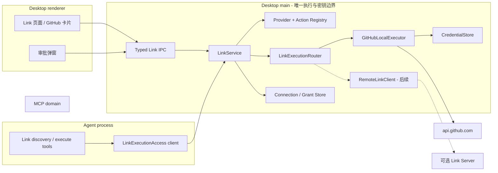

# GitHub Link 本地优先技术方案

> 状态：设计稿 v1（未动手）  
> 日期：2026-08-01  
> 第一阶段范围：Desktop + Chat、本地 Fine-grained PAT、GitHub REST API  
> 后续演进：GitHub App + 可选 Link Server

## 0. 结论摘要

CodeShell 应新增一个独立于 MCP、Data Source 和 Credential 的 **Link 领域**，用于连接
GitHub、Figma、Slack 等第三方 SaaS。GitHub 是第一个 provider。

本方案采用“本地完整、服务器可选”的双运行时结构：

1. **本地模式是完整产品路径**：用户在 Link 页面保存 Fine-grained PAT 后，GitHub 请求直接
   从本机发出，不需要 CodeShell 服务器，也不降低同步 Action 能力。
2. **服务器不是能力门槛**：GitHub App + Link Server 只增加托管授权、多设备、团队共享、
   webhook 和后台任务等“常在线”能力。相同的同步 Action 仍可在本地执行。
3. **Action 与连接方式解耦**：`github.get_file`、`github.create_issue` 等 Action ID、输入输出、
   权限等级和桌面卡片保持稳定；Router 根据 connection 的 `executionRuntime` 选择本地执行器或
   Link Server。
4. **PAT 永远不进入 renderer、模型上下文或工具参数**：GitHub HTTP 请求集中在 Desktop main
   的 `LinkService` 执行。Chat 侧只提交结构化 Action 请求。
5. **写操作逐次审批**：`github.create_issue` 每一次执行都必须弹出审批，审批内容绑定仓库、
   标题、正文摘要和本次输入，不能被一次笼统授权永久放行。
6. **断开连接先使执行失效，再删 Token**：断开时同步提升 connection revision、切换状态、
   中止在途请求并清理缓存，最后删除凭证。后续调用和旧 revision 的结果均 fail closed。

这套结构不会复用或扩展现有 MCP OAuth 模型。MCP 继续负责“连接工具服务器”；Link 负责
“连接第三方产品账户并提供产品级 Actions”。两者可以同时存在，但没有继承关系。

## 1. 背景与当前实现

### 1.1 用户目标

GitHub Link MVP 完成后，用户应当可以：

- 在 Link 页面使用 Fine-grained PAT 连接 GitHub；
- 看到 GitHub 用户名和可访问仓库；
- 在 Chat 中列出仓库；
- 读取仓库 README 或指定文件；
- 列出和查看 Issue；
- 列出和查看 Pull Request；
- 创建 Issue，并在执行前看到审批弹窗；
- 断开后所有新 GitHub Action 立即失败，且系统不再继续使用旧 Token。

后续增加 GitHub App + Link Server 时，只新增一种 `connectionMethod` 和一种 executor，不改
Action ID、Agent 工具协议和桌面 provider 卡片的主体结构。

### 1.2 当前源码中的相关能力

| 当前能力               | 位置                                                                       | 结论                                                                                  |
| ---------------------- | -------------------------------------------------------------------------- | ------------------------------------------------------------------------------------- |
| Link 页面静态目录      | `packages/desktop/src/renderer/credentials/LinkTab.tsx`、`link-catalog.ts` | 可以作为新页面入口，但目前没有真正的 provider/connection 领域模型                     |
| MCP OAuth              | `packages/desktop/src/main/mcp-oauth-service.ts`                           | 仅服务 MCP，不作为 GitHub Link 的业务抽象                                             |
| CredentialStore        | `packages/core/src/credentials/`                                           | 可保存本地 PAT，但 connection 不能等同于 credential                                   |
| CredentialAccess       | `packages/core/src/credentials/access.ts`                                  | 可复用进程间取密钥机制，但需增加 Link 专用 purpose 和暴露限制                         |
| `UseCredential`        | `packages/core/src/credentials/use-credential-tool.ts`                     | 当前可能把普通 Token 交给 Agent；必须排除 Link 管理的内部凭证                         |
| Data Sources           | `packages/core/src/sources/`                                               | 是只读上下文来源，不承载第三方账户、Actions 或写操作                                  |
| Capability module      | `packages/core/src/tool-system/capability-module.ts`                       | 适合由可选 `packages/link` 注册少量稳定的 Agent tools                                 |
| GitHub CLI             | `packages/coding/src/git/utils.ts` 等                                      | 当前 `/pr-comments`、`/autofix-pr` 等使用 `gh`；不是账户 Link，也不能提供统一桌面状态 |
| GitHub 公共 REST       | skill/panel 下载相关代码                                                   | 只用于匿名下载，不是登录后的 GitHub 连接                                              |
| 现有 `packages/server` | `packages/server/src/serve/headless-server.ts`                             | 当前是无账户的 Web host，不应直接承载多租户 Link Server                               |

因此，当前“使用 GitHub”的主要方式是本机 `git`/`gh` CLI，Agent 也可能通过 Bash 间接调用
`gh`。GitHub Link 不取代 Git 操作；它新增的是一个可被页面和 Chat 共用、具有明确授权与审批
边界的 GitHub 产品连接。

### 1.3 必须避免的概念复用

- 不把 Link 做成一种 MCP server。
- 不把 GitHub 仓库直接塞进 `SourceDefinition`。
- 不把现有 credential `type: "link"` 当成新 LinkConnection。它目前只是历史凭证类型。
- 不让 renderer 或 LLM 拿到 PAT 后自行请求 GitHub。
- 不用 `gh auth` 作为 Link 的隐式认证来源。`gh` 可以继续服务现有 coding workflow，但不参与
  GitHub Link 的连接状态。

## 2. 目标与非目标

### 2.1 MVP 目标

- 建立 provider、connection、action、grant、executor 五个独立概念。
- GitHub Fine-grained PAT 完全在本机保存和使用。
- Desktop Link 页面能连接、校验、刷新状态和断开 GitHub。
- Desktop 页面与 Chat 通过同一个 `LinkService` 执行 GitHub Action。
- Action 输入输出使用稳定 schema，不向 Agent 暴露 REST URL、headers 或 Token。
- 读操作受工作区 grant 和 CodeShell 权限系统约束；创建 Issue 必须逐次审批。
- 断开时中止本机在途读取请求、拒绝旧 revision 的返回结果并删除 PAT。
- 为未来远程 executor 保留协议，但 MVP 不依赖服务端。

### 2.2 非目标

- 不在 MVP 实现 GitHub App、OAuth Device Flow、webhook 或后台同步。
- 不在 MVP 创建/合并 Pull Request、修改文件、触发 workflow、管理 secret。
- 不提供任意 `github.request(method, url, body)` 代理。
- 不将 GitHub 内容长期同步到本地数据库；默认按请求读取，仅保留必要的账户展示快照。
- 不替换现有 `git` 和 `gh` CLI workflow。
- 不把 Link Server 塞进现有无账户 `packages/server`。
- 不复制 Open Connector 的源码或协议。可以参考其产品形态，但 CodeShell 采用自己的 MIT 兼容
  实现和领域模型。

## 3. 术语与边界

| 术语              | 含义                                                               |
| ----------------- | ------------------------------------------------------------------ |
| Link Provider     | 第三方产品定义，如 `github`、`figma`、`slack`                      |
| Link Connection   | 一个已连接账户及其执行方式，不包含明文 secret                      |
| Connection Method | 授权方式，如 `fine-grained-pat`、`github-app`                      |
| Execution Runtime | Action 实际执行位置：`local` 或 `server`                           |
| Link Action       | 稳定、结构化、可审计的业务动作                                     |
| Link Executor     | 在某个 runtime 中实现 provider Actions 的执行器                    |
| Workspace Grant   | 某个工作区可以使用哪个 connection、哪些资源和动作的授权            |
| Credential        | Secret 的安全存储记录；是 connection 的实现细节，不等于 connection |
| MCP               | 连接 MCP 工具服务器的协议和配置；与 Link 平行                      |

核心关系如下：

```text
Provider 1 ── N Connection
Provider 1 ── N ActionSpec
Workspace N ── N Connection（通过 WorkspaceGrant）
Connection 1 ── 1 ConnectionMethod
Connection 1 ── 1 ExecutionRuntime
Connection 0..1 ── 1 CredentialRef（只有需要本机 secret 时）
Executor 1 ── N ActionHandler
```

## 4. 总体架构



### 4.1 为什么本地请求放在 Desktop main

Agent 当前运行在独立进程。如果 executor 在 Agent 进程内直接解析 PAT：

- Token 生命周期会脱离桌面连接状态；
- 断开连接很难同步中止正在运行的 fetch；
- Agent 进程更容易通过日志、异常或通用 Credential 工具泄漏 Secret；
- Link 页面和 Chat 会形成两条执行链。

所以 MVP 将本地 GitHub HTTP executor 放在 Desktop main。Agent capability 只通过一个
`LinkExecutionAccess` RPC 发送 `{ actionId, input, context }`，main 侧完成 connection/grant
校验、审批状态校验、凭证解析、HTTP 请求、结果裁剪和审计。

这仍然是“完全本地”：Desktop main、CredentialStore 和 GitHub 请求都在用户机器上，没有
经过 CodeShell 服务。

### 4.2 两种 runtime，共用一个 Action contract

```ts
type LinkExecutionRuntime = "local" | "server";

interface LinkActionRequest<TInput = unknown> {
  requestId: string;
  sessionId?: string;
  workspaceId?: string;
  connectionId: string;
  connectionRevision: number;
  actionId: string;
  input: TInput;
}

interface LinkActionResult<TOutput = unknown> {
  requestId: string;
  actionId: string;
  connectionId: string;
  connectionRevision: number;
  output: TOutput;
  meta?: {
    requestCost?: number;
    rateLimitRemaining?: number;
    truncated?: boolean;
    nextCursor?: string;
  };
}
```

`LinkExecutionRouter` 只根据已验证的 connection 选择 executor：

```ts
if (connection.executionRuntime === "local") {
  return localExecutor.execute(request, context);
}
return remoteLinkClient.execute(request, context);
```

Action handler 不能根据 UI 传入的 runtime 或 URL 选择目标，防止越权和 SSRF。

## 5. 核心设计决策

### 5.1 Link 是独立领域，不是 MCP 的展示层

MCP 的配置中心是 server/transport/tool；Link 的配置中心是 provider/account/action。即使未来
某个 Link Provider 内部通过 MCP 实现，那也只是 executor 的私有实现，不能改变外部 Link
contract。

Link 页面第一步应只展示第三方产品连接。当前混在页面里的 Data Sources 应回到项目配置或
单独的 Sources 页面；Chat Gateway 也应作为独立 channel/provider 处理，避免继续扩大 Link
概念。

### 5.2 Connection 与 Credential 分离

连接需要保存账户、运行时、能力、健康状态和 revision；凭证只负责 Secret。一个 GitHub App
server connection 甚至不会在本机保存 GitHub Token，所以两者不能合并。

### 5.3 Action ID 不随认证方式变化

以下调用在本地 PAT 和未来 GitHub App 下必须相同：

```ts
executeLinkAction({
  actionId: "github.get_file",
  input: { owner: "openai", repo: "example", path: "README.md" },
});
```

不能出现 `github.local.get_file`、`github.server.get_file` 或让模型选择认证方式。

### 5.4 本地能力平权

每个同步 ActionSpec 都必须声明支持的 runtime：

```ts
supportedRuntimes: ["local", "server"];
```

如果一个同步 GitHub Action 只能在 server 运行，需要单独架构评审。允许 server 独有的是需要
常在线基础设施的能力，例如 webhook、定时同步和组织级共享，而不是普通 REST 读写 Action。

### 5.5 不提供任意 REST 代理

每个 Action 使用固定 endpoint builder、Zod 输入 schema、输出裁剪器、风险等级和权限声明。
禁止模型传入完整 URL、HTTP method、headers 或任意 body。新增 GitHub 能力的方式是增加一个
可审查的 ActionSpec。

### 5.6 全局连接，工作区授权

账户 connection 是用户级、跨项目存在；工作区是否可用由 grant 决定。这样用户不必为每个
仓库重复保存 PAT，也不会因为连接一次 GitHub 就默认让所有项目读取全部私有仓库。

MVP 可以在连接完成后引导用户为当前工作区选择仓库；在 grant UI 完成前，Chat 的每次实际
读取也必须经过权限确认，不能静默放开全部仓库。

## 6. 数据模型

以下 schema 放在 `packages/link`，持久化前统一 Zod 校验。

### 6.1 Provider manifest

```ts
interface LinkProviderManifest {
  id: "github" | string;
  displayName: string;
  description: string;
  iconId: string;
  connectionMethods: LinkConnectionMethodSpec[];
  actionIds: string[];
}

interface LinkConnectionMethodSpec {
  id: string;
  displayName: string;
  executionRuntime: LinkExecutionRuntime;
  availability: "available" | "coming-soon" | "disabled";
  secretLocation: "device" | "server";
}
```

GitHub MVP manifest：

```ts
connectionMethods: [
  {
    id: "fine-grained-pat",
    displayName: "Fine-grained PAT（保存在本机）",
    executionRuntime: "local",
    availability: "available",
    secretLocation: "device",
  },
  {
    id: "github-app",
    displayName: "GitHub App（Link Server）",
    executionRuntime: "server",
    availability: "coming-soon",
    secretLocation: "server",
  },
];
```

### 6.2 LinkConnection

使用 discriminated union，避免出现“local connection 没有 credentialRef”或“server
connection 带本地 GitHub Token”的非法状态。

```ts
interface LinkAccountIdentity {
  externalAccountId: string; // GitHub numeric user id string
  login: string;
  displayName?: string;
  avatarUrl?: string;
}

interface LinkConnectionBase {
  schemaVersion: 1;
  id: string;
  providerId: "github" | string;
  state: "connected" | "invalid" | "disconnecting" | "disconnected";
  revision: number;
  account: LinkAccountIdentity;
  capabilityIds: string[];
  createdAt: string;
  updatedAt: string;
  lastVerifiedAt?: string;
  lastError?: LinkErrorSummary;
}

interface LocalPatConnection extends LinkConnectionBase {
  connectionMethod: "fine-grained-pat";
  executionRuntime: "local";
  credentialRef: string;
}

interface ServerGithubAppConnection extends LinkConnectionBase {
  connectionMethod: "github-app";
  executionRuntime: "server";
  remoteConnectionId: string;
  linkServerProfileId: string;
}

type LinkConnection = LocalPatConnection | ServerGithubAppConnection;
```

`revision` 是执行租约的一部分。连接更新、重新授权、断开都会单调递增，旧 revision 请求或
结果不能继续使用。

### 6.3 WorkspaceLinkGrant

```ts
interface WorkspaceLinkGrant {
  schemaVersion: 1;
  id: string;
  workspaceId: string;
  providerId: "github" | string;
  connectionId: string;
  resourceSelector: {
    kind: "github-repositories";
    repositories: Array<{ owner: string; repo: string }>;
  };
  allowedActionIds: string[];
  createdAt: string;
  updatedAt: string;
}
```

规则：

- grant 只能缩小 connection 能力，不能提升 GitHub Token 权限；
- owner/repo 必须从规范化输入中比较，大小写规则统一；
- 写 Action 即使在 `allowedActionIds` 中，也仍执行 `approval: "always"`；
- connection 断开后关联 grant 保留为不可用记录，方便重新连接或由用户删除，但不能自动改绑
  另一个账户。

### 6.4 Credential 记录

沿用 CredentialStore 保存 PAT，但标记为内部 Link secret：

```ts
{
  id: "link-github-<uuid>",
  type: "token",
  label: "GitHub Link · @octocat",
  secret: "github_pat_...",
  meta: {
    secretOwner: {
      kind: "extension",
      extensionId: "link",
      resourceId: "<connection-uuid>"
    },
    agentExposable: false
  }
}
```

必须同步修改：

- `CredentialAccess.resolveValue()` 新增 `purpose: "link"`；
- Desktop resolver 仅允许 `secretOwner.extensionId: "link"` 且 `resourceId` 与 connection 匹配时
  以该 purpose 解析；
- `UseCredential`、环境变量注入和 TokenTab 的普通凭证列表过滤 `agentExposable: false`；
- 日志、遥测和错误对象不包含 secret、Authorization header 或原始响应 headers。

### 6.5 持久化位置与原子性

建议：

```text
<codeShellHome>/links/connections.json
<codeShellHome>/links/grants.json
```

- 两个文件均为版本化 JSON、权限 `0600`、临时文件写入后原子 rename；
- PAT 只进入现有加密 CredentialStore，不进入 `connections.json`；
- 创建 connection 时先在内存校验 PAT，再写 credential，最后写 connection；后一步失败必须
  回滚前一步；
- 断开时顺序相反：先使 connection 不可执行，再删除 credential；即使删除失败，孤儿 credential
  也不可通过 Link 执行，并进入下次启动的清理任务。

## 7. GitHub Provider 与 Action catalog

### 7.1 ActionSpec

```ts
type LinkActionRisk = "discovery" | "read" | "write";

interface LinkActionSpec<TInput, TOutput> {
  id: string;
  providerId: string;
  title: string;
  description: string;
  risk: LinkActionRisk;
  approval: "none" | "session" | "always";
  supportedRuntimes: LinkExecutionRuntime[];
  requiredCapabilities: string[];
  inputSchema: ZodType<TInput>;
  outputSchema: ZodType<TOutput>;
  limits: {
    maxItems?: number;
    maxOutputBytes: number;
  };
}
```

ActionSpec 是 UI 提示、Agent guide、权限分类、executor dispatch 和测试的共同事实源，不能在
每一层手写一份列表。

### 7.2 MVP Action 列表

| Action ID                   | GitHub REST endpoint                        | 风险 / 审批      | Fine-grained PAT repository permission |
| --------------------------- | ------------------------------------------- | ---------------- | -------------------------------------- |
| `github.get_current_user`   | `GET /user`                                 | discovery / none | 无 repository permission               |
| `github.list_repositories`  | `GET /user/repos`                           | read / session   | Metadata: read                         |
| `github.get_repository`     | `GET /repos/{owner}/{repo}`                 | read / session   | Metadata: read                         |
| `github.get_readme`         | `GET /repos/{owner}/{repo}/readme`          | read / session   | Contents: read                         |
| `github.get_file`           | `GET /repos/{owner}/{repo}/contents/{path}` | read / session   | Contents: read                         |
| `github.list_issues`        | `GET /repos/{owner}/{repo}/issues`          | read / session   | Issues: read                           |
| `github.get_issue`          | `GET /repos/{owner}/{repo}/issues/{number}` | read / session   | Issues: read                           |
| `github.list_pull_requests` | `GET /repos/{owner}/{repo}/pulls`           | read / session   | Pull requests: read                    |
| `github.get_pull_request`   | `GET /repos/{owner}/{repo}/pulls/{number}`  | read / session   | Pull requests: read                    |
| `github.create_issue`       | `POST /repos/{owner}/{repo}/issues`         | write / always   | Issues: write                          |

说明：

- GitHub 的 list issues endpoint 会把 Pull Request 也作为 issue 返回，本地 handler 必须过滤含
  `pull_request` 字段的项；
- MVP `create_issue` 只接受 `owner`、`repo`、`title`、`body?`，先不开放 assignee、label 和
  milestone，减少隐式权限和组织策略失败；
- README 使用专用 endpoint，返回规范化文本；指定文件使用 contents endpoint；
- 所有 list 输入都有 `pageSize` 和不透明 `cursor`，不把 GitHub 原始 URL 当 cursor 交给 Agent。

### 7.3 标准输出

不要把 GitHub 原始 REST 响应整体送入模型。输出只保留业务需要字段，例如：

```ts
interface GithubRepositorySummary {
  owner: string;
  name: string;
  fullName: string;
  description?: string;
  private: boolean;
  archived: boolean;
  defaultBranch: string;
  htmlUrl: string;
  permissions?: { pull: boolean; push: boolean; admin: boolean };
}

interface GithubFileOutput {
  owner: string;
  repo: string;
  path: string;
  ref: string;
  sha: string;
  encoding: "utf-8";
  content: string;
  htmlUrl?: string;
  truncated: boolean;
}
```

GitHub 返回的正文、评论、README 和代码都必须标记为 `untrustedExternalContent`，避免它们在
后续 prompt 组装时被误当作系统指令。

### 7.4 分页和大小限制

MVP 默认限制：

- list 每页默认 30，最大 100；
- 单次 Action 最多自动请求 3 个 GitHub page；
- 可访问仓库卡片最多预取 1,000 个仓库，超出显示 `1000+` 和 `hasMore`；
- 文件解码后最大 256 KiB；超出返回元信息和 `truncated: true`，不偷偷截一段冒充完整文件；
- Action 序列化输出最大 512 KiB；
- 二进制、submodule、symlink 和目录响应使用显式 union，不当成普通 UTF-8 文件。

## 8. 本地 Fine-grained PAT 连接流程

### 8.1 页面流程

```text
Link 页面
  → GitHub 卡片
  → 连接
  → 选择「Fine-grained PAT（本机）」
  → 展示创建 PAT 的说明和最小权限
  → 用户粘贴 PAT
  → main 在内存中验证
  → 展示 @login、仓库可见性和缺失权限诊断
  → 用户确认保存
  → 写入 CredentialStore + LinkConnection
  → 为当前工作区选择可用仓库（可跳过）
```

PAT 创建说明建议分两档：

- 只读：Metadata read、Contents read、Issues read、Pull requests read；
- 包含创建 Issue：在上述基础上将 Issues 调整为 read and write。

不要要求用户创建 classic PAT，也不要只依赖 token 前缀判断类型。PAT 是否可用以 GitHub API
验证结果为准。

### 8.2 校验步骤

1. renderer 只把 PAT 通过一次性、typed IPC 传给 main；不写 localStorage、不进入 React query
   cache、不回显完整值。
2. `GET /user` 验证认证并获取 account identity。
3. `GET /user/repos?per_page=100` 验证基础仓库访问并获取首屏快照。
4. 可选地对用户选中的一个仓库调用 read endpoint，利用响应中的
   `X-Accepted-GitHub-Permissions` 提供权限诊断。
5. 校验完成后才持久化 PAT；失败时只返回稳定错误码和可操作说明。

Fine-grained PAT 不能仅靠 scope 字符串准确推断所有仓库权限，因此 `capabilityIds` 是“已验证
能力快照”，执行时仍以 GitHub 的实时响应为准。

### 8.3 GitHub HTTP client 约束

本地 MVP 建议使用封装后的原生 `fetch`，暂不引入 Octokit。统一 client 必须：

- origin 固定为 `https://api.github.com`；
- endpoint 由代码构建，只接受经过校验的 owner/repo/path/number；
- 发送 `Authorization: Bearer <token>`、GitHub JSON Accept header、稳定 User-Agent；
- 在一个常量中固定 `X-GitHub-Api-Version: 2026-03-10`，并用 contract test 约束升级；
- 使用 `AbortSignal`；设置连接和总请求超时；
- 解析 rate limit headers，但不把完整 headers 回传给 Agent；
- 对 301/302 默认不带 Authorization 跨 origin 跟随；最简单做法是禁用自动重定向并显式处理；
- 错误 body 只提取 allowlist 字段，限制长度并脱敏。

路径参数需要分别编码。`get_file` 的 path 按 segment 编码，不能把完整用户字符串拼进 URL。

### 8.4 连接状态

```text
connected ──401/凭证失效──> invalid
connected ──用户断开──────> disconnecting ──清理完成──> disconnected
invalid ────重新授权──────> connected（revision + 1）
```

- `invalid` 保留账户展示和修复入口，但拒绝执行 Action；
- 网络超时不直接将连接标为 invalid，只更新 transient health；
- 401 标记 invalid；403 需要区分权限不足、SSO/组织策略和 rate limit；
- 404 对私有资源可能代表不可见，不向模型推断“资源一定不存在”。

## 9. Agent 工具设计

### 9.1 固定的 meta tools

不要为每个 provider/action 都常驻注册一个 Agent tool，否则接入 Slack、Figma 后会显著膨胀
tool schema。`@cjhyy/code-shell-link` capability 注册四个稳定工具：

```text
ListLinks
SearchLinkActions
GetLinkActionGuide
ExecuteLinkAction
```

- `ListLinks`：列出当前工作区可见的 provider、连接账户和健康状态，不返回 secret；
- `SearchLinkActions`：按 provider、关键词和风险搜索 ActionSpec；
- `GetLinkActionGuide`：返回某个 action 的用途、schema、限制和审批说明；
- `ExecuteLinkAction`：提交结构化请求，由 Desktop main 解析 connection 并执行。

如果当前工作区只有一个符合 grant 的 GitHub connection，Agent 可以省略 `connectionId`；main
解析成确定 connection 后再执行。存在多个候选时返回 `LINK_CONNECTION_AMBIGUOUS`，不能由
模型猜测账户。

### 9.2 权限与审批

Action 风险来自 registry，不接受 Agent 输入：

- discovery：自动允许；
- read：需要匹配 WorkspaceLinkGrant；grant UI 未落地前，走当前会话审批；
- write：`approval: "always"`，每次执行都弹窗，任何“本会话允许”或通用 tool allow rule 都
  不能跳过。

创建 Issue 的审批弹窗至少展示：

```text
GitHub · 创建 Issue
账户：@octocat
仓库：owner/repo
标题：...
正文：前 500 字（可展开）
```

审批对象绑定规范化后的 `actionId + connectionId + connectionRevision + inputHash`。审批后必须
执行完全相同的 payload；修改标题、正文或仓库需要重新审批。

为做到这一点，`PermissionClassifier`/审批请求需支持从 `ExecuteLinkAction` 的 args 读取
ActionSpec，并为 `approval: "always"` 生成不可持久化的单次许可。Desktop main 在真正执行前
再次校验 approval receipt 和 input hash。

### 9.3 Agent 结果呈现

- 结果包含清晰的 provider/action/account/resource 元信息；
- GitHub 内容作为不可信数据块返回；
- list 结果保留 `nextCursor` 和 `hasMore`；
- 错误使用稳定 code，模型可以据此建议重新授权、选择仓库或减少请求，而不是看到 Token 或
  GitHub 原始错误页。

## 10. Desktop UI 与 IPC

### 10.1 Link 页面信息架构

Link 页面只显示第三方应用：

```text
已连接
  GitHub · @octocat · 本机连接
  可访问仓库 37 · 9 分钟前验证
  [管理仓库] [检查连接] [断开]

  展开或进入「管理仓库」后：
  ✓ owner/repo-a
  ✓ owner/repo-b
  …支持搜索和分页

可连接
  GitHub  [连接]
  Figma   [即将支持]
  Slack   [即将支持]
```

GitHub 卡片状态：

| 状态     | UI                                            |
| -------- | --------------------------------------------- |
| 未连接   | 说明 + 连接按钮                               |
| 校验中   | 不可重复提交，允许取消                        |
| 已连接   | `@login`、本机/服务器 badge、仓库数、验证时间 |
| 权限受限 | 保持连接，展示缺失的具体权限与重授权入口      |
| 凭证失效 | 红色状态、重新连接；Action 全部拒绝           |
| 正在断开 | 禁用所有操作，完成后回到未连接                |

本地连接必须明确显示：“凭证只保存在此设备，请求直接从此设备发送到 GitHub。”

### 10.2 Typed IPC

Renderer 可调用的最小接口：

```ts
interface LinkDesktopApi {
  listProviders(): Promise<LinkProviderView[]>;
  listConnections(): Promise<LinkConnectionView[]>;
  connectGithubPat(input: { pat: string }): Promise<LinkConnectionView>;
  verifyConnection(connectionId: string): Promise<LinkConnectionView>;
  disconnect(connectionId: string): Promise<void>;
  listWorkspaceGrants(workspaceId: string): Promise<WorkspaceLinkGrantView[]>;
  saveWorkspaceGrant(input: SaveWorkspaceLinkGrantInput): Promise<WorkspaceLinkGrantView>;
}
```

规则：

- 所有 IPC 入参在 main 侧重新校验；
- `LinkConnectionView` 不包含 `credentialRef`、remote secret 或原始权限 headers；
- renderer 不提供通用 `execute(url, method)`；页面需要仓库预览时，也调用内部的 typed Link
  action；
- preload 只暴露上述窄接口。

### 10.3 现有页面迁移

第一期可以保留 `LinkTab.tsx` 路由和视觉布局，但数据源改为 provider registry + connection
views：

- 删除用 credential name/suffix 猜 provider 的逻辑；
- `link-catalog.ts` 改成 provider view model，长期由 main registry 提供；
- MCP OAuth credential 继续由 MCP 设置管理，不自动出现在第三方 Link 列表；
- `agentExposable: false` 的 Link-managed PAT 不出现在普通 TokenTab。

## 11. 断开连接与旧 Token 失效

### 11.1 执行租约

每次执行在 Desktop main 创建内部 lease：

```ts
interface LinkExecutionLease {
  requestId: string;
  connectionId: string;
  revision: number;
  abortController: AbortController;
  startedAt: number;
}
```

执行顺序：

1. 校验 connection 为 `connected`；
2. 校验 request revision、workspace grant、action capability 和 approval receipt；
3. 注册 lease；
4. 使用 `purpose: "link"` 解析 PAT；
5. 再次校验 connection state/revision；
6. 发起带 `AbortSignal` 的 GitHub 请求；
7. 返回结果前再次校验 revision；若已断开则丢弃结果并返回 `LINK_DISCONNECTED`；
8. 注销 lease，清除请求局部 secret 引用。

### 11.2 断开顺序

```text
1. connection.state = disconnecting
2. connection.revision += 1，并持久化
3. 从 Router 可执行索引移除 connection
4. abort 所有该 connection 的 active leases
5. 清除账户/仓库短期缓存与 server session
6. 删除 CredentialStore 中的 PAT
7. connection.state = disconnected（或删除活动记录）
8. 广播 connection-changed 给 renderer 和 Agent bridge
```

步骤 1–4 必须在同一个 main 进程串行临界区完成。凭证删除失败不能恢复可执行状态，而是记录
本地清理告警并在启动时重试。

### 11.3 能承诺与不能承诺的边界

可以保证：

- 断开开始后发起的新 Action 失败；
- 已发出的可取消 HTTP 请求收到 abort；
- 断开后的旧 revision 结果不会返回给 Agent；
- 系统不再从 CredentialStore 解析该 connection 的旧 PAT。

无法从客户端撤销一个**已经被 GitHub 接收并完成**的写副作用。例如 GitHub 已经创建 Issue
后用户再点击断开，客户端不能假装该 Issue 没有创建。审批弹窗和审计记录必须对此诚实展示。

若用户要求 Token 在 GitHub 侧也立即失效，需要用户在 GitHub 删除 PAT；Link 页面可提供直达
GitHub Token 设置页的说明，但 CodeShell 断开默认只删除本机连接和本机 Token。

## 12. 错误模型

稳定错误码：

| Code                        | 含义                    | UI/Agent 建议              |
| --------------------------- | ----------------------- | -------------------------- |
| `LINK_NOT_CONNECTED`        | 没有可用 connection     | 引导打开 Link 页面         |
| `LINK_DISCONNECTED`         | 已断开或 revision 失效  | 停止重试，重新连接         |
| `LINK_CONNECTION_INVALID`   | PAT 已失效              | 重新授权                   |
| `LINK_CONNECTION_AMBIGUOUS` | 多个账户无法自动选择    | 让用户选择账户             |
| `LINK_GRANT_REQUIRED`       | 工作区无资源授权        | 打开仓库授权 UI            |
| `LINK_RESOURCE_NOT_GRANTED` | owner/repo 不在 grant   | 申请或修改 grant           |
| `LINK_APPROVAL_REQUIRED`    | 写操作未获得单次审批    | 弹出审批                   |
| `LINK_APPROVAL_STALE`       | payload/revision 已变化 | 重新审批                   |
| `LINK_PERMISSION_DENIED`    | GitHub 权限不足         | 展示最小缺失权限           |
| `LINK_RESOURCE_UNAVAILABLE` | 404/不可见              | 不泄漏私有资源存在性       |
| `LINK_RATE_LIMITED`         | GitHub 限流             | 返回可重试时间             |
| `LINK_CONTENT_TOO_LARGE`    | 文件或输出超限          | 缩小范围或使用本地 git     |
| `LINK_UNSUPPORTED_CONTENT`  | 二进制/特殊对象         | 返回对象类型和替代建议     |
| `LINK_NETWORK_ERROR`        | 超时、DNS、TLS 等       | 可重试，不将凭证标 invalid |

底层 GitHub status、request id 和文档链接可以进入本地诊断日志；Agent 输出只返回必要字段。

## 13. 安全设计

### 13.1 Secret 边界

- PAT 只在连接提交时短暂经过 renderer → main 的一次性 IPC；
- 持久化后只由 Desktop main 的 LinkService 解析；
- Agent tool schema、ActionRequest、LinkConnection、approval、审计事件均不含 PAT；
- 禁止 Link-managed credential 被 `UseCredential`、env injection、导出或普通 Token 列表读取；
- 禁止记录 Authorization、PAT 前缀后的片段、GitHub 原始错误 body 和完整响应 headers。

### 13.2 最小权限

- 默认引导 Fine-grained PAT，而不是 classic PAT；
- 建议用户只选择需要的 repository；
- 只读和 Issue 写入权限分档展示；
- Link grant 再按 workspace/repository/action 缩小范围；
- server 阶段使用 GitHub App installation permission，不保存用户 PAT。

### 13.3 SSRF 与路径注入

- 固定 GitHub API origin；
- action-specific endpoint builder；
- owner/repo 使用保守字符校验和 segment encoding；
- 文件 path 按 segment 处理并限制长度/segment 数；
- 禁止请求 GitHub 返回的任意 download URL 时携带 Authorization；MVP 读取文件只使用 API
  contents 响应。

### 13.4 Prompt injection 与数据外泄

- README、Issue、PR 和文件内容全部视为不可信外部内容；
- 返回值显式标记来源、仓库、路径和截断状态；
- GitHub 内容中的“执行命令”“读取凭证”等文本不改变工具权限；
- 后续向 GitHub 写回内容仍必须独立审批，不能因为内容来自同一仓库就自动信任。

### 13.5 审批 TOCTOU

- 审批展示规范化后的最终输入；
- receipt 绑定 `inputHash + actionId + connectionId + revision`；
- receipt 短期、单次使用；
- executor 不接受审批后被修改的 body；
- 重试写操作需要新的幂等/重复风险提示。GitHub create issue 没有通用客户端幂等 key，网络结果
  不确定时不能自动重发。

## 14. 可选 Link Server 演进

### 14.1 包边界

新增独立 `packages/link-server`，不要直接改造当前 `packages/server`：

```text
packages/link-server/
  src/auth/
  src/connections/
  src/execution/
  src/providers/github/
  src/webhooks/
```

原因是 Link Server 需要真实的用户身份、租户隔离、加密 secret store、审计、限流和 webhook
入口，而当前 server 明确采用无账户/通行码语义。两者安全模型不同。

### 14.2 GitHub App 连接

服务器保存 GitHub App private key 和 installation mapping，按请求生成短期 installation access
token。installation token 最长约 1 小时，可进一步限制 repository 与 permission；不能把 private
key 或 installation token 下发给 Desktop。

GitHub App 相比 OAuth App 更适合 provider 集成：权限细、可选择 repository、token 短期且有
installation 身份。Link Server 的 GitHub connection 只在本地保存
`remoteConnectionId + linkServerProfileId`。

### 14.3 远程协议

RemoteLinkClient 使用与 LocalExecutor 相同的 ActionRequest/Result schema。服务器必须再次做：

- 用户/session 身份验证；
- remote connection ownership 校验；
- workspace/team grant 校验；
- ActionSpec 与输入 schema 校验；
- provider permission 校验；
- 审计与 rate limit。

Desktop 的审批不能被 server 当作永久授权。写操作请求应携带短期、签名且绑定 payload 的
approval assertion；server 验证后一次性消费。

### 14.4 server-only 能力

允许只在 server 提供：

- webhook 接收与事件订阅；
- 无需打开桌面的后台同步；
- 多设备连接状态；
- 团队共享 installation；
- 管理员统一授权与审计。

不允许以 server-only 为由拒绝实现本地同步读取/写入 Action。Action parity 应进入 provider
contract test。

## 15. 包和文件改动建议

### 15.1 新增 `packages/link`

建议包名：`@cjhyy/code-shell-link`。遵守 capability package 只依赖
`@cjhyy/code-shell-core/extension` 的边界。

```text
packages/link/
  package.json
  src/
    index.ts
    capability.ts
    domain/
      types.ts
      schemas.ts
      errors.ts
    registry/
      provider-registry.ts
      action-registry.ts
    tools/
      list-links.ts
      search-link-actions.ts
      get-link-action-guide.ts
      execute-link-action.ts
    providers/github/
      manifest.ts
      actions.ts
      input-schemas.ts
      output-schemas.ts
      http-client.ts
      local-executor.ts
```

其中 `http-client.ts`/`local-executor.ts` 由 Desktop main 实例化；Agent capability 只依赖
`LinkExecutionAccess` seam，不解析 credential。

### 15.2 `packages/core`

建议修改：

- `src/credentials/types.ts`：增加通用 `secretOwner` 和 `agentExposable` 元数据，不加入 GitHub
  字段；
- `src/credentials/access.ts`：增加 Link 专用 purpose；
- `src/credentials/use-credential-tool.ts`：过滤内部不可暴露 credential；
- `src/index.extension.ts`：导出窄的 host-action mechanism seam；
- 新增通用 `ExtensionHostActionAccess` 和默认未配置实现；`packages/link` 在其上封装 typed
  `LinkExecutionAccess`，core 不出现 provider/action/connection 业务类型；
- PermissionClassifier 增加 action-aware、non-persistable `always` approval 支持；
- 不在 core 放 GitHub、provider catalog 或 Link UI 业务逻辑。

### 15.3 `packages/desktop` main/preload

```text
packages/desktop/src/main/links/
  link-service.ts
  link-store.ts
  link-grant-store.ts
  link-ipc.ts
  link-execution-bridge.ts
  link-execution-router.ts
  link-lease-registry.ts
```

并修改：

- `agent-bridge.ts`：加载 link capability，连接 Agent 的 `LinkExecutionAccess` 到 main service；
- credential resolver：校验 `purpose: "link"` 和 connection ownership；
- preload/types：暴露 typed Link Desktop API；
- app lifecycle：退出时 abort leases，启动时清理孤儿 Link credential。

Agent bridge 应复用现有 stdio/RPC 通道，不为本地 Link 再开放 loopback HTTP 端口。

### 15.4 `packages/desktop` renderer

建议新增/修改：

```text
packages/desktop/src/renderer/credentials/
  LinkTab.tsx
  link-catalog.ts
  links/GithubLinkCard.tsx
  links/GithubPatConnectDialog.tsx
  links/LinkConnectionDetails.tsx
  links/WorkspaceRepositoryGrantDialog.tsx
```

同时让 `TokenTab.tsx` 隐藏 `agentExposable: false` 的内部凭证。

## 16. 测试方案

### 16.1 单元测试

- 所有 Action input/output schema；
- owner/repo/path 编码与恶意输入；
- Action risk/approval/runtime/capability catalog 完整性；
- Connection discriminated union 和 revision 单调性；
- grant repository/action 匹配；
- GitHub status/header → LinkError 映射；
- issue 列表过滤 PR；
- 文件类型、base64、UTF-8、大小和截断处理；
- credential 暴露过滤。

### 16.2 HTTP contract 测试

使用本地 mock GitHub server 或 fetch mock，禁止测试依赖真实 GitHub：

- headers 包含固定 API version，不泄漏到输出；
- 所有 Action 只能命中 allowlist endpoint；
- pagination 和 rate limit；
- 401/403/404/422/429/5xx/timeout；
- redirect 不跨 origin 携带 Authorization；
- create issue body 与审批 input hash 完全一致；
- GitHub 返回超大/畸形 JSON 时 fail closed。

### 16.3 断开竞态测试

必须有确定性测试覆盖：

1. credential resolve 前断开；
2. resolve 后、fetch 前断开；
3. fetch pending 时断开，signal 被 abort；
4. GitHub response 到达后、返回 Agent 前断开，结果被丢弃；
5. credential 删除失败，connection 仍不可执行；
6. 重新连接生成新 revision，旧 request/approval receipt 不能复用；
7. Desktop 重启后，断开 connection 的孤儿 credential 被清理且不能执行。

### 16.4 Desktop 集成测试

- PAT 输入不进入 renderer storage、日志和快照；
- 成功连接后显示 username/runtime/repo count；
- invalid 状态和权限不足文案；
- Chat 列仓库、读 README/文件、Issue、PR；
- `github.create_issue` 必然弹审批，拒绝后无网络请求；
- 断开后页面和 Chat 状态同时更新；
- 普通 TokenTab、UseCredential 和 env injection 看不到 GitHub Link PAT。

### 16.5 Runtime parity contract

未来 server executor 接入时，同一组 provider contract tests 分别运行：

```text
GithubLocalExecutor  → contract suite
GithubServerExecutor → contract suite
```

输出允许有 transport meta 差异，业务字段、错误 code、limits 和审批语义必须一致。

## 17. 实施顺序与 PR 拆分

### PR 1：Link 领域骨架与安全底座

- 新增 `packages/link`、provider/action registry、schemas/errors；
- 新增 connection/grant store 与 typed IPC；
- 引入 `LinkExecutionAccess`；
- CredentialAccess 增加 Link purpose；
- 隐藏 Link-managed credential；
- 暂不连真实 GitHub，用 mock provider 完成进程间调用和断开 lease 测试。

验收：renderer、Agent 都拿不到 secret；断开竞态测试通过。

### PR 2：GitHub 本地连接与桌面卡片

- Fine-grained PAT 对话框；
- GitHub HTTP client；
- `/user`、`/user/repos` 校验；
- GitHub connection card、状态、检查连接和断开；
- Connection/credential 两阶段写入与回滚。

验收：页面显示真实用户名和可访问仓库数量；Token 只在本机安全存储。

### PR 3：GitHub 只读 Actions + Chat

- 注册 repository/readme/file/issue/PR read actions；
- 注册四个 meta tools；
- 接入 Agent bridge；
- workspace grant 第一版；
- 不可信内容标记、分页和大小限制。

验收：Chat 能完成所有要求的列出与读取场景。

### PR 4：创建 Issue 与强审批

- `github.create_issue`；
- action-aware `approval: "always"`；
- input hash/receipt/revision 验证；
- 网络结果不确定时禁止自动重试；
- 完整审计与断开竞态 e2e。

验收：每次创建都弹出包含最终 payload 的审批；拒绝或 stale receipt 不发请求。

### PR 5：Link 页面整理

- Link 页面只保留第三方应用；
- 将 Data Sources 和 Chat Gateway 移到其正确设置入口；
- 补全仓库 grant 管理和权限诊断；
- 更新 feature inventory 和用户文档。

### 后续：GitHub App + Link Server

- 独立 `packages/link-server`；
- server profile 与用户认证；
- GitHub App install callback、installation token、webhook；
- RemoteLinkClient；
- 同一 contract suite 验证本地/服务器 Action parity。

## 18. MVP 验收标准

### 18.1 功能

- [ ] Link 页面可选择“Fine-grained PAT（本机）”连接 GitHub。
- [ ] 连接成功显示 GitHub `@login`、本机 badge、可访问仓库列表及仓库数或有界的 `N+`。
- [ ] Chat 可以列出当前账户可访问仓库。
- [ ] Chat 可以读取 README 和指定 UTF-8 文件。
- [ ] Chat 可以列出、查看 Issue。
- [ ] Chat 可以列出、查看 Pull Request。
- [ ] 创建 Issue 每次都弹出审批，弹窗展示账户、仓库、标题和正文摘要。
- [ ] 用户拒绝审批时不发 GitHub 写请求。
- [ ] 断开后页面与 Chat 立即显示不可用，新 Action 返回 `LINK_DISCONNECTED`。
- [ ] Link Server 未配置、离线或不存在时，本地 MVP 的全部上述能力仍正常工作。

### 18.2 安全

- [ ] PAT 不出现在 renderer storage、Agent messages、tool args/result、普通 Token 列表或日志。
- [ ] `UseCredential` 与 env injection 无法解析 Link-managed PAT。
- [ ] 所有 GitHub endpoint 来自 Action handler，不接受任意 URL。
- [ ] 仓库访问符合 WorkspaceLinkGrant；写操作不能被 grant 免除逐次审批。
- [ ] 断开会 abort 在途请求并丢弃旧 revision 结果。
- [ ] 重新连接后旧审批 receipt 和旧 request 不能复用。

### 18.3 架构

- [ ] `packages/link` 只依赖 core extension surface，不把 GitHub 业务放进 core。
- [ ] MCP 类型、配置和 OAuth service 无需为了 GitHub Link 修改语义。
- [ ] 页面、Chat、本地 executor 共用同一 Action registry。
- [ ] ActionSpec 明确同时支持 `local` 和未来 `server` runtime。

## 19. 风险与待确认项

### 已定结论

- GitHub 第一个版本使用 Fine-grained PAT，不阻塞在服务器或 GitHub App 上。
- Link 与 MCP 分域。
- 同步 Action 本地能力与 server 能力平权。
- 本地 GitHub HTTP 集中到 Desktop main。
- 创建 Issue 逐次审批。
- 服务器采用独立 `packages/link-server`。

### 实现前需用 spike 确认

1. 当前 Agent stdio bridge 增加 `LinkExecutionAccess` request/cancel/event 的最小改动面；
2. 当前 PermissionClassifier 如何最小成本支持 action-aware `always` 且不产生可持久化 allow rule；
3. CredentialStore 在各平台是否已经全部走 safeStorage；若 Linux 不可用，Link 页面需要明确的
   本机安全提示和 fail-closed 策略；
4. workspace identity 在普通工作区、worktree 和恢复会话中的稳定 key；
5. GitHub Enterprise Server 是否进入后续范围。MVP 固定 github.com，不提前开放自定义 origin。

这些 spike 不改变 MVP 产品方向，只影响底层接口的具体落点。

## 20. 官方参考

- GitHub：
  [为 OAuth App 授权](https://docs.github.com/en/apps/oauth-apps/building-oauth-apps/authorizing-oauth-apps)
- GitHub：
  [GitHub App 与 OAuth App 的选择](https://docs.github.com/en/apps/creating-github-apps/about-creating-github-apps/deciding-when-to-build-a-github-app)
- GitHub：
  [Fine-grained PAT 所需权限](https://docs.github.com/en/rest/authentication/permissions-required-for-fine-grained-personal-access-tokens?apiVersion=2026-03-10)
- GitHub：
  [REST API 版本](https://docs.github.com/en/rest/about-the-rest-api/api-versions?apiVersion=2026-03-10)
- GitHub：
  [Repository contents API](https://docs.github.com/en/rest/repos/contents?apiVersion=2026-03-10)
- GitHub：
  [Issues API](https://docs.github.com/en/rest/issues/issues?apiVersion=2026-03-10)
- GitHub：
  [Pull requests API](https://docs.github.com/en/rest/pulls/pulls?apiVersion=2026-03-10)
- GitHub：
  [GitHub App 身份验证](https://docs.github.com/en/apps/creating-github-apps/authenticating-with-a-github-app/about-authentication-with-a-github-app)
- GitHub：
  [Installation access token](https://docs.github.com/en/apps/creating-github-apps/authenticating-with-a-github-app/generating-an-installation-access-token-for-a-github-app)
- Open Connector：
  [Getting started](https://docs.openconnector.dev/docs/getting-started)（仅作产品形态参考，不复制其
  实现）
