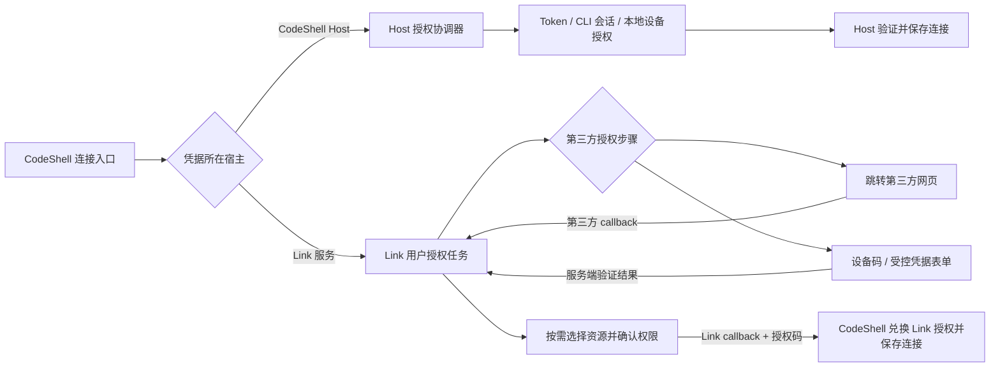

# Link 授权 UI 通用化方案

状态：设计提案，尚未迁移产品代码。核验基线：CodeShell `26fa5880`、独立
Link 服务 `bfd2be5`（2026-10-08）。

目标是让所有连接器共用连接入口、进度、结果和管理界面，同时按实际授权方式展示必要步骤。
用户点击“连接”后直接进入当前可用的首选方式；只有确实需要选择时，才显示方式选择。
已经证明身份的会话可以跳过登录；不要求用户注册 Link，也不进入管理员后台。

## 两段授权和两个宿主

远端连接包含两段授权，它们的 callback 分别归不同系统处理。



- **CodeShell → 远端 Link**：保留现有 authorization code + S256 PKCE。最终 callback
  回到发起的 Host／项目，CodeShell 持有 Link 授权，不接收第三方原始凭据。
- **Link → 第三方**：由连接器适配器选择 redirect/callback、device-code 或其他已实现方式。
  设备授权通过后台轮询得到结果，不要求第三方回调 CodeShell。
- **Host 本地连接**：Token、CLI 会话和设备授权由当前 CodeShell Host 管理。这里的 Host
  可以是 Desktop 本机，也可以是远程 Hub 服务器；Web 浏览器不能据此操作浏览器设备的 CLI。
  UI 可复用，但 Host 凭据不因复用 UI 而上传独立 Link；Link 网页不能调用 Host 的 CLI。

`executionRuntime`、`secretLocation` 和授权步骤是三个独立维度。例如网页授权既可以获得
Host 保管的凭据，也可以获得 Link 保管的凭据，不能由“服务器连接”标签推断具体登录方式。
现有清单的 `secretLocation:"device"` 指执行 Host 的保管域，不必然是浏览器所在设备。
两段任务复用视图模型，但各自的 attempt、会话、cookie、owner 和 callback 独立；第三方
身份验证结果只能推进 Link 任务，不能直接完成 Host 连接。

## 现有代码的可复用基础

| 位置                                                              | 现状                                                                                   | 通用化处理                                                                |
| ----------------------------------------------------------------- | -------------------------------------------------------------------------------------- | ------------------------------------------------------------------------- |
| `packages/link/src/types.ts`                                      | 已有展示清单、运行位置、凭据位置、browserAuth、quickAuth、Token 引导                   | 继续使用公共包；增加可用授权方式的稳定标识，避免另建 Provider 清单        |
| `packages/link/src/management-types.ts`                           | `LinkAuthorization` 已统一 pending/connected/failed/cancelled，另有 prompt 和 redirect | 兼容增加互斥的 `step`，旧字段在过渡期保留                                 |
| `packages/server/src/links/service.ts`                            | 已共用验证、脱敏、revision/CAS 保存、owner 取消和撤销                                  | 保留公共连接生命周期；增加统一授权入口适配现有实现                        |
| `packages/desktop/src/renderer/credentials/LinkTab.tsx`           | Token／CLI／设备授权在本地弹窗；旧 MCP OAuth 另走入口                                  | 抽取公共连接 controller 与按 step 渲染的组件                              |
| `packages/desktop/src/renderer/credentials/RemoteLinkSection.tsx` | 远端管理单独实现，卡片和启动参数写死 GitHub                                            | 消费受信任 Host 返回的实际连接器与方法能力                                |
| `packages/desktop/src/main/remote-link-manager.ts`                | Native remoteStart 直到终态才返回；HTTP／设备授权可先返回 pending                      | 适配初始等待状态、requestId 与 attemptId 的对应及取消，不能仅包装 Promise |
| `packages/web/app/HubLinks.tsx`                                   | 已有授权查询、设备码、跳转和取消；临时拼 remote-link 方法与 GitHub Actions             | 使用同一公共契约，保留原项目和原登录绑定                                  |
| `packages/core/src/links/remote.ts`                               | 固定 GitHub 的三个 scopes／Actions                                                     | 将远程 Provider 授权与 Actions 映射交给可信适配器                         |
| `packages/desktop/src/main/remote-link-navigation.ts`             | 固定 GitHub HTTPS 入口及上游 callback                                                  | 提取可信导航策略注册；保持现有 GitHub 策略为第一个实例                    |

独立服务的耦合点在 `apps/link-server/http.mjs`（单 Provider 和固定路由）、`views.mjs`
（GitHub 账号／权限／仓库文案）、`store.mjs`（GitHub scope 和仓库校验）、`github.mjs`
（执行协调器与 GitHub 规则混合）。这些需一起迁移，单改前端标题不能接入其他远程服务。
目前独立 Link 的生产实现仍只支持 GitHub；其他 catalog 中的远端 OAuth 预留项不计为可用。

## 一个连接任务，有限的下一步交互

复用 `LinkAuthorization`，让每次响应只描述当前下一步。以下为拟议类型，并非已发布 API。

```ts
type LinkAuthorizationStep = {
  id: string; // 每次进入新的交互生成；提交必须匹配当前 task + step。
  expiresAt: string;
} & (
  | { kind: "redirect"; authorizationUrl: string }
  | {
      kind: "device-code";
      userCode: string;
      verificationUri: string;
      verificationUriComplete?: string;
    }
  | { kind: "credential-input"; fields: CredentialFieldView[] }
  | { kind: "local-session"; session: LocalSessionView }
  | {
      kind: "consent";
      account: AccountView;
      permissions: PermissionView[];
      resourceGroups: ResourceGroupView[];
    }
  | { kind: "processing" }
);

interface LinkAuthorization {
  id: string;
  providerId: string;
  methodId?: string; // v1 兼容期可选；新版任务响应必填，由可信启动输入绑定。
  state: "pending" | "connected" | "failed" | "cancelled";
  step?: LinkAuthorizationStep;
  connection?: MaskedLinkConnection;
  errorCode?: LinkErrorCode;
  // 过渡期仍兼容现有 prompt、redirect 和撤销提示字段。
}
```

保留现有终态约定：过期为 `failed + authorization_expired`，不同时引入第二套状态枚举。
redirect 和 device-code 继续有强制有效期；抽取公共 step 不降低现有期限要求。
`connected` 必须代表可信宿主已完成验证和保存；打开网页、收到前端 callback 都只是中间事件。
终态不再携带可提交的 step；UI 丢弃旧任务的延迟返回，避免关闭后又自动重开或保存。

| 当前 step        | 共用 UI                                        | 谁完成协议                                   |
| ---------------- | ---------------------------------------------- | -------------------------------------------- |
| redirect         | 自动打开授权页、等待提示、重新打开、取消       | Host／Link 处理 callback、state、PKCE 和换码 |
| device-code      | 验证码、复制、打开服务商页面、有效期、取消     | 凭据所属 Host／Link 按服务商规则轮询         |
| credential-input | 固定字段组件、凭据获取帮助、验证和错误         | 凭据所属 Host／Link 验证并保管秘密           |
| local-session    | 检测到的账号、使用该账号、宿主允许时登录／安装 | 当前 Host 的受控 CLI 执行器                  |
| consent          | 当前账号、权限摘要、可选资源、确认／取消       | 可信宿主绑定本次实际展示的资源并校验提交     |
| processing       | 正在验证／保存，防止重复提交                   | 授权协调器推进任务                           |

`CredentialFieldView` 仅允许预定义的文本／秘密字段、标签、必填性和长度限制；服务端适配器
负责真实校验。UI 不回显已保存秘密，查询结果不含 Token、device_code、PKCE verifier 或客户端密钥。
`LocalSessionView` 只包含账号、检测状态和允许的操作标识，不向 UI 下发可执行命令字符串。
登录／安装按钮由当前 Host 的实际能力决定；远程 Web 只能绑定服务器已有会话时，就只提供
检测和绑定，不展示本机安装入口。

`ResourceGroupView` 表达仓库、项目、工作区等：稳定 group/item ID、标签、可选说明、
必选性、最少／最多选择数和截断提示。没有资源选择需求时省略该步骤，或直接展示权限确认。
GitHub 的“仓库”与“最多 100 个”属于 GitHub 适配器；公共页面不固定写成“只读仓库”。
权限是否只读、哪些操作会写入，由实际授权的权限描述决定。

## 公共生命周期与平台能力

公共 controller 提供四个逻辑操作，先通过现有 IPC／HTTP 方法适配，不立即替换全部路由：

1. `begin(input: LinkConnectionInput, authModeId)`：保留 label、Provider／method、connection ID
   和 expectedRevision，启动实际可用方式。可信宿主绑定原项目、cwd、scope 和发起身份。
2. `status(attemptId)`／订阅：读取当前状态和下一步；UI 只查询自己的任务。
3. `respond(attemptId, stepId, operation, input)`：提交当前 step 允许的固定操作。
4. `cancel(attemptId)`：幂等取消；关闭弹窗、发起的 Host 会话／窗口失效、项目访问撤销都走
   同一生命周期。这里的 owner 是发起授权的宿主上下文，与独立服务管理员无关。

取消、拒绝、过期后的“重试”创建新 attempt。一次性 callback 换码结果不明时只查询结果，
无法确认则重新授权，controller 不自动重放换码请求。

`authModeId` 用来区分同一连接方法下的 Token／设备授权／CLI；当前一个 `authKind:"token"`
方法可能同时包含三种入口，不能只根据 authKind 切 UI。操作必须由服务端确定允许列表，
不能接受任意 action、URL、命令或自定义 HTML。业务连接器不注入脚本组件。

Desktop 平台适配器负责打开隔离窗口或系统浏览器、复制验证码和回调交接；Web 适配器负责
保存最小返回上下文、页面跳转、查询任务和返回原项目。共用 controller 不直接依赖 Electron。
现有 `packages/web/app/remote-link-authorization.ts` 的原登录／原项目／state 绑定继续保留。

需要注意：浏览器跳走后，页面里的轮询会停止。远端设备授权应由服务端任务持续轮询，用户
回到 Link 页面时查询结果；Host 设备授权则由当前 Host 继续执行。二维码将来可以作为
device-code 的展示增强；确实出现新交互时再增加受控 step 类型。

## 展示数据与可信适配器的职责

Provider 清单继续由版本化 `@cjhyy/code-shell-link` 持有展示内容。Host 在将清单交给 UI 前，
与受信任执行器和部署配置合并，返回真实可用的方式、默认方式及未配置原因。
UI 不因为清单里存在 `browserAuth` 就推断已经有 client ID 或可用 OAuth。

适配器负责身份验证、授权协议、scope／Action 对应关系、资源发现与校验、凭据刷新、撤销
和执行。公共协调器负责会话、任务期限、并发限制、一次性 step、公共错误和连接保存。
服务端迁移为可信 Provider registry，GitHub 保留现有 callback 路由作为兼容入口；Provider ID
从任务绑定中取得，不信任 callback 查询参数选择适配器。旧连接 ID、method ID、grant、
revision 和授权范围继续有效，不由 UI 重命名或扩权。
独立服务 `/api/v1/data/authorization` 的 `version: 1`、`repositories` 及 GitHub scope／Action
保持兼容；通用 resources 通过附加字段或协商后的新版响应引入，不能直接替换旧字段。

导航策略与展示数据分开：当前 GitHub 同域登录／2FA 策略保留。其他连接器所需的准确入口、
回调路径及跨域链由可信适配器定义并经 Host 校验，不能简单放开任意第三方域名。
使用系统浏览器时也必须验证回调与原任务绑定，普通网页不能宣告本机连接已完成。

Token 表单发往凭据所属宿主；若未来实现远端 Token 连接，就在 Link 同源页面提交到 Link。
CLI 会话能力只在提供它的 Host 可用。服务管理员后台独立存在，普通用户的连接任务没有管理员步骤。

## 渐进落地与验收

1. **公共契约**：在现有包增加可选 step 和视图类型；为旧 prompt/redirect 提供宿主侧适配。
   methodId 在过渡期由可信启动输入补齐，新版响应再设为必填。通过能力版本协商后才发送
   新 step；旧客户端保留现有流程，未知交互明确显示不可用。
2. **共用 UI/controller**：用已有 Token、CLI、设备授权和 GitHub 远端流程验证上述组件；
   桌面和 Web 共用状态语义，平台分别处理窗口、跳转与剪贴板。Native remoteStart 的终态
   Promise 需要新增 pending／事件适配与请求映射，再接入公共 controller。
3. **独立 Link 通用化**：将现有 GitHub 迁到 registry、通用 consent 视图及资源模型，
   同步 Host 的远程 scope／Actions／导航策略；保留已经测试过的 URL 和 grant 行为。
4. **新增连接器**：按真实配置接入第二个适配器后验证差异。只展示实际可用方式，不把预留
   OAuth 或示例适配器标记成生产可用。独立服务依赖已发布的公共包，禁止引用兄弟仓库源码。

验收覆盖：跳转和设备授权都能完成；Token／CLI 保持原保管位置；有效会话跳过登录；取消、
拒绝、过期和重试一致；旧 step／重复提交拒绝；切换账号不复用旧证明；项目切换和 owner
撤销后不能保存；权限及资源不可扩大；账号和连接相互隔离；第三方原始秘密不进入 UI 快照。
UI 验收包括 Desktop 原生、云端窗口、Web 和配对 Web，以及多资源列表和移动端布局。

参考：设备流程及轮询语义见 [RFC 8628](https://www.rfc-editor.org/rfc/rfc8628.html)；
OAuth 重定向、PKCE 与授权响应的安全约束见
[RFC 9700](https://www.rfc-editor.org/rfc/rfc9700.html)。
