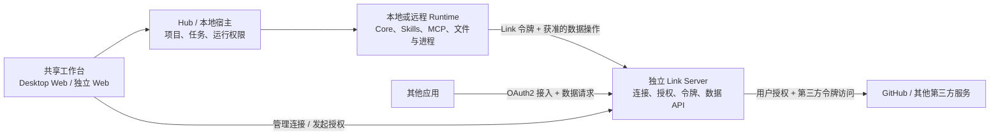

# 独立 Link Server：第三方连接与外部应用 OAuth2 接入

状态：2026-09-09，需求已确认，实施设计；**独立服务尚未实现或部署**。
现有宿主 Link 能力见 [现状说明](link-headless-server-feasibility.md)。

## 1. 产品边界

Link Server 独立于 Hub、Electron 和 Core Worker，可单独用 Node.js 启动，随后用 Docker 部署。
用户确认同时需要两种授权关系：

- **向上游连接第三方服务**：用户在 Link 中授权 GitHub 等服务；Link 是第三方的 OAuth 客户端，保管上游 access token / refresh token，并读取数据。
- **向下游授权应用使用连接**：CodeShell 和其他应用是 Link 的 OAuth 客户端；用户选择具体连接、数据范围及操作权限，Link 签发自己的访问令牌。

外部应用获得 Link 令牌和授权范围内的数据。第三方原始令牌留在 Link，不下发给浏览器、面板、CodeShell Worker 或外部应用。建立第三方连接不代表同意任何下游应用使用它。

Hub 与 Runtime 可以在个人部署中组合。Link 保持独立进程、数据目录和服务地址；它停机不应阻止 CodeShell 的本地文件和普通任务功能。

## 2. 账号与权限

| 对象           | 归属和职责                                               |
| -------------- | -------------------------------------------------------- |
| Hub 用户       | 使用被允许的主机、项目、任务和面板                       |
| Link 用户      | 拥有第三方连接，决定哪些应用可以使用它们                 |
| 第三方账号     | provider 返回的稳定账号标识，绑定到具体连接              |
| 下游应用       | 独立 client ID、回调地址、应用类型和可申请范围           |
| 应用授权 grant | 绑定 Link 用户、client ID、connection ID、操作和数据范围 |

首版沿用个人部署目标：**一个 Link owner、多个下游应用、多个明确选择的连接**。存储从第一版使用稳定 owner ID，单 owner 不宣称多用户隔离完成。Hub 与 Link 用户名相同不构成身份映射，以用户完成的授权建立关联。以后若需要统一登录，可共同接入 OIDC 身份服务；数据授权本身不等于 SSO。

有效权限为：应用允许申请范围 ∩ 用户同意范围 ∩ 连接实际能力。应用只获准读某连接的 Issues 时，不能枚举其他连接或调用写接口。追加连接、换第三方账号、扩大范围都需要重新同意。

## 3. 两层授权流程

### 上游：连接第三方

1. Link 登录用户选服务商；服务端创建短期事务，绑定 owner、浏览器会话、provider、预登记回调地址、随机 state 和 PKCE 材料。
2. 用户在服务商授权后回调；Link 验证事务归属、有效期、一次性 state 和浏览器绑定，兑换 code、核验账号，再保存连接。
3. 第三方凭据加密落盘；页面只显示账号摘要、实际 scope、有效期和版本。
4. 按 provider 能力自动刷新；超时、限流和临时故障按有界策略重试，不误删授权。明确失效或不可恢复的授权错误才要求重新连接，不能使用已失效凭据。

首条真实链路建议 GitHub OAuth App，采用 Authorization Code + S256 PKCE。GitHub 当前支持按应用配置或 `offline_access` 请求过期令牌及刷新令牌，也明确要求兼容未返回 refresh token 的情形。参考：[GitHub OAuth App 授权与刷新](https://docs.github.com/en/apps/oauth-apps/building-oauth-apps/authorizing-oauth-apps)。

第三方 scope 与 Link action scope 分别保存、如实展示。上游权限粒度可能比只读 API 更粗，Link 执行层仍须限制只读，不能将宽权限原样传给下游。

### 下游：应用连接 Link

1. 管理员登记应用名称、精确回调地址、public/confidential 类型和可申请的 action scopes；首版不做匿名动态注册。
2. 应用发起授权码 + S256 PKCE 请求；Link 用户登录、选择连接和数据范围，同意页展示应用名、第三方账号、可读内容和是否允许离线续期。
3. 同意后生成短期一次性 code；拒绝不建立 grant。应用凭 code、原回调地址和 verifier 换取 Link access token；confidential client 还需客户端认证。
4. 数据 API 每次检查 client、owner、grant、connection、操作及资源范围，然后由 Link 调用固定 provider adapter，只返回获准的数据。

Link access token 仅面向 Link 数据 API，不能登录 Hub 或直接调用第三方。协议基线采用精确回调匹配、PKCE、短期访问令牌及刷新令牌轮换，不开放密码模式或 implicit flow，参考 [RFC 9700](https://www.rfc-editor.org/rfc/rfc9700)。这不是现有 Hub 登录接口已经具备的能力。

## 4. 拟定接口与持久化

下列是**待实现契约**，不是目前 8790 已开放的路由。

| 接口                                                   | 用途                                              |
| ------------------------------------------------------ | ------------------------------------------------- |
| `/.well-known/oauth-authorization-server`              | 发现 Link issuer、授权端点和支持能力              |
| `/oauth/authorize`、`/oauth/token`、`/oauth/revoke`    | 下游同意、code 兑换/刷新、撤销自己拥有的令牌/授权 |
| `/api/v1/links/providers`、`/api/v1/links/connections` | owner 查看已配置服务商、管理自己的脱敏连接        |
| `/api/v1/links/providers/:providerId/authorize`        | owner 发起上游授权，端点由服务端固定配置          |
| `/oauth/upstream/:providerId/callback`                 | 与下游分开的上游兑换入口                          |
| `/api/v1/links/clients`、`/api/v1/links/grants`        | owner 管理接入应用和已授予权限                    |
| `/api/v1/data/connections`                             | 应用只列出当前 grant 可见的连接/action 摘要       |
| `/api/v1/data/connections/:id/actions/:action`         | 调用固定、经过权限检查的数据读取操作              |

不提供接受任意 URL、HTTP header、CLI 参数或第三方 token 的通用代理。只开放经过审查的读操作；资源范围必须贯穿分页、详情与响应过滤，不能只在 UI 中隐藏资源。

持久化区分 `Owner`、`Client`、`UpstreamConnection`、`Grant`、`TokenFamily` 和审计事件，上游事务与下游 code 另设短期存储。连接区分用于刷新并发的 `credentialRevision` 与用于换账号、重新授权、断开的 `authorizationEpoch`。grant 绑定明确 connection ID 及授权 epoch，正常刷新不会令 grant 失效，也不自动挑同 provider 最近使用的账号。

第一版限单服务实例，可用 SQLite 事务存储授权元数据；实施时验证 Node.js 构建和 Docker 依赖。code 单次消费、刷新轮换、撤销必须原子化。上游凭据加密保存，主密钥由部署环境注入并单独备份；下游不透明令牌只存摘要，并保留刷新 family 关系。OAuth 协议引擎优先评估维护中的标准实现，通过适配器接入 owner/client/grant 存储，业务权限判断仍归 Link。

## 5. 刷新、撤销与部署边界

- 上游刷新按 owner + connection 串行，用 `credentialRevision` CAS 保存并复查 `authorizationEpoch`；断开、换账号或撤销后到达的旧响应不能恢复凭据。
- 下游刷新只能保留或缩小原 grant；刷新令牌重用时撤销该 family。上下游刷新是独立生命周期，不能混用 token 或 client secret。
- 撤销某应用只关闭它的下游 grant；断开连接先原子禁止本地使用并使依赖的全部 grant 失效，再在 provider 支持时尝试撤销上游授权。远端撤销失败不能恢复本地连接，也不能宣称已在第三方撤销。在途请求应取消，返回前复查撤销状态；已经交给应用的数据无法追回。
- Link 使用独立 Cookie 名与 Host 作用域，不能照搬 Hub 的 `cs_hub_session`。上游跨站回调不能假设 `SameSite=Strict` Cookie 一定到达，须有专用事务绑定；管理写入保留 Origin/CSRF 检查。
- issuer、公网地址、上游端点与回调由可信部署配置确定，不从不可信 Host/转发头拼接。生产入口使用 HTTPS，本地仅显式允许 loopback HTTP。
- 数据 API 保持有界请求/响应、超时、按 client 限流和脱敏错误。审计记录调用归属、action 与结果，不写 token、code 或完整私有响应。

## 6. 现有代码复用与 CodeShell 接入

| 模块                                     | 复用内容                                      | 需要新增或调整                                                                   |
| ---------------------------------------- | --------------------------------------------- | -------------------------------------------------------------------------------- |
| `packages/link/src/`                     | manifest、授权说明、浏览器安全类型            | managed 连接/client/grant 契约；不把 Node 服务放进元数据包                       |
| `packages/core/src/links/providers.ts`   | 固定 provider 验证、action executor、取消信号 | token 类型适配；GitLab/Figma/Linear 现有私有 token header 不能直接宣称兼容 OAuth |
| `packages/core/src/credentials/store.ts` | cipher、独立目录注入、CAS                     | 按 Link owner 隔离并使用独立密钥，不改变进程 HOME 或读取宿主既有凭据             |
| `packages/core/src/services/oauth.ts`    | PKCE、受限请求和刷新底层辅助                  | 现有 `authorize()` 是 loopback 回调，部署后的 HTTPS 回调应由 Link 管理           |
| `packages/server/src/links/service.ts`   | 脱敏、版本冲突、取消和身份复查模式            | 当前固定 local runtime；新增 managed 授权与下游 OAuth 层                         |
| `packages/web/app/HubLinks.tsx`          | 连接卡片、provider 信息和工作台入口           | Link 服务地址、连接来源、已授权应用与统一授权交互                                |

建议在 `packages/server/src/link-server/` 新增独立组合入口 `code-shell-link-serve`；这是拟定落点，目前不存在。Link 管理与同意页面复用 Web 组件/样式，不另建一套任务工作台。

Core 的 `LinkAction` 当前自动选择本地连接并包含 Agent 审批，不直接作为外部 API 入口。数据 API 复用下层 executor，显式传入已验证的连接与权限。CodeShell 后续由宿主注入 local/remote Link 执行适配器，Core 不写死 Link 地址。

grant 由 Link Server 权威保存；相应宿主安全保存获发的 Link access/refresh token 及必要连接引用，面板经宿主受限接口调用。各远程主机默认分别授权，不能按共享项目名或浏览器账号自动继承旧主机凭据。Skills、MCP 程序、模型连接、文件和进程仍属于执行主机；托管第三方数据访问交由独立 Link。

## 7. 分阶段交付

以下均未实施，任务入口见根 [TODO](../../TODO.md)。

1. **独立服务基础**：Node 入口、独立 owner 登录、隔离存储/加密、GitHub 上游授权及刷新、连接管理；隔离假 provider 验证回调、失败与重启恢复。
2. **外部应用闭环**：client 管理、选连接同意页、code/PKCE/token/refresh/revoke、只读 API；验证跨连接越权、错误 verifier、code 重放、刷新重用、撤销中在途请求及旧响应落盘。**阶段 1 + 2 才构成双向 OAuth 最小可部署版。**
3. **CodeShell 共用接入**：Desktop Web/Hub 共用 Link 管理体验，宿主注入 remote 适配器；验证同一连接对不同应用的权限隔离，以及远程项目不会隐式继承凭据。
4. **部署与扩展**：独立 Docker/Compose、持久卷、密钥/恢复说明；真实 GitHub 授权取数后，再逐个验证其他 provider 的 header、scope、分页、刷新和撤销。

真实外部验收需要注册的 provider client ID/secret、回调地址和用户授权账号。提供前可完成代码及隔离端到端测试，不能据此声称真实账号已经连接。开放注册、多租户、写操作及 webhook/后台同步后续另定范围。
