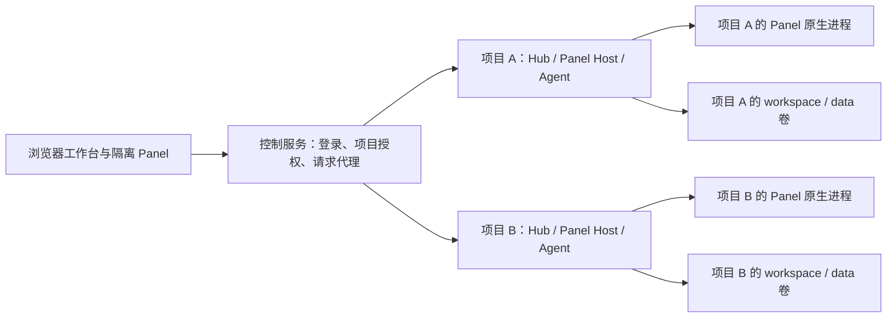
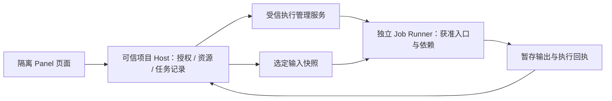

# Panel Host 整合与服务端隔离技术方案

状态：实施中；Web 原生后台任务已在 `codex/panel-host-0920` 实现并通过局部测试，其他阶段仍未完成或部署。
核查日期：2026-09-18。源码基线：`f8da34b208a9c4391b80f057310847edcb495dae`（v0.9.19）。
范围：CodeShell Host、独立 Panel 包、Web/服务端执行环境。用户已确认第一阶段面向个人或可信小团队自托管；公开多用户服务仅作为后续扩展说明。

范围补充：用户进一步明确要求每个现有 Panel 都能在服务端真正使用。首期包括全部业务 Panel 的工作流对齐，不能只完成 Host 重构或 Web `tasks.*`。逐面板基线、差距与验收见 [服务端 Panel 完整可用性矩阵](panel-server-workflow-parity-2026-09-18.md)。

## 1. 建议结论

1. 把 Panel Host 整理为一个逻辑子系统，统一契约、授权上下文和服务装配；第一阶段保留现有包与发布关系，不把所有代码搬进一个大文件，也不立即新增 npm 包。
2. Desktop 与 Web 复用纯 Node Host 服务，各自只保留页面容器、身份来源、通信、系统交互适配。Panel 自身的业务实现和共享客户端库留在独立 Panel 仓库。
3. 服务端优先复用已经实现的 `--runtime docker` 项目模式：控制服务管理项目，每个项目运行独立 Hub、Agent 和 Panel 进程。不能把它误写成尚待建设的能力。
4. 单纯展示页面、调用受控 API 不要求额外原生任务沙箱；执行可信原生工具可使用项目容器。运行不可信第三方代码时，应增加独立执行器，隔离它与项目 Host 的数据及凭据。
5. 当前项目模式是单管理员多项目，不能直接宣称为公开多租户平台。账号授权、网络、配额、凭据和任务隔离须一起补齐。
6. 首期验收以各 Panel 的用户操作与结果为单位：同版本、同配置下，桌面端可完成的功能在 Web 提供可完成同一目标的流程。页面加载、隐藏不可用按钮或“部分支持”提示均不能替代完整可用性验收。

## 2. 已有实现与缺口

| 范围 | 已有实现 | 本方案要处理的缺口 |
| --- | --- | --- |
| 安装与绑定 | Core 校验 manifest、包内容、native entry 摘要、安装版本，支持项目绑定 | 保留格式和存储；通过 Host 门面统一调用，避免两端重复装配 |
| 页面隔离 | Desktop 隔离 webview；Web 使用 `sandbox="allow-scripts"` 的 iframe | 统一 guest 接口与错误、事件语义；保留各端独立的隔离机制 |
| 共享服务 | Server `/panels` 已导出资源、进程、Agent 任务、原生后台任务等服务 | Desktop Bridge 仍混合大量授权、文件操作和平台业务；按职责拆分 |
| 存储和工作区 | 已有共用底层存储；Desktop 和 Web 另有上层处理逻辑 | 收敛调用编排、授权、路径/版本校验与错误语义，不能直接假设行为一致 |
| 能力发现 | API 14、`availableMethods`、`capabilities.bridge`、`limitations` | 方法列表和权限映射仍有多处维护；独立 Panel 中也有按版本判断能力的调用 |
| 后台原生任务 | Desktop `tasks.start/list/get/cancel/retry` 与持久任务服务 | Web Runtime 尚未开放 `tasks.*`；不能与已有 `agent.task.*` 混为一谈 |
| 服务端项目隔离 | 每项目 Docker 容器、独立 `/workspace` 和 `/data`、运行代次与代理 | 当前不是每 Panel/每任务隔离，没有完整多租户与出站网络政策 |

主要代码依据：

- [Core Panel 安装与运行相关代码](../../packages/core/src/panel-apps/)；其中 `runtime.ts` 是可信代码模块的生命周期协调器，不能用来在 Host 中导入第三方 Panel 页面模块。
- [Desktop Bridge](../../packages/desktop/src/main/panel-app-bridge.ts)、[Preload API](../../packages/desktop/src/preload/panel-app.ts)、[Web PanelHost](../../packages/web/app/PanelHost.tsx)。
- [共享服务出口](../../packages/server/src/index.panels.ts)、[Web Runtime](../../packages/server/src/panels/runtime.ts)、[Runtime Services](../../packages/server/src/panels/runtime-services.ts)。
- [原生工具 API 14 约定](../panel-native-tools.md)、[项目沙箱部署](../project-sandboxes.md)。

## 3. Host 整合边界

按七项职责组织，而不是按某个界面组件来定义 Host：

| 逻辑模块 | 负责 | 不放入该模块 |
| --- | --- | --- |
| Contracts | 方法、参数和结果 schema、事件、权限规则、错误、能力声明 | Electron/Node 服务装配、业务模型 |
| Management | 安装审阅、更新、启用、项目绑定、版本与撤销 | Panel 业务依赖安装策略 |
| Runtime / Authority | 实例、上下文、归属、授权、限流、生命周期 | 通用身份数据之外的平台登录实现 |
| Data / Resources | 键值存储、受控工作区读写、上传、资源托管与交接 | 视频时间线、文档业务 schema、资产业务目录 |
| Execution / Tasks | 进程、隔离执行适配、回执、持久任务、取消与中断 | FFmpeg 参数规划、进度计算、自动重试业务决策 |
| Agent Integration | Panel 发起 Agent 任务、Agent 调用 Panel 工具 | Panel 的提示词模板与领域工作流 |
| Platform Adapters | IPC/HTTP、页面容器、文件选择、通知、音频、系统授权 | 再实现一套资源与任务状态机 |

第一阶段建议目录归属如下。它是目标映射，不要求一次性重命名现有文件：

```text
packages/core/src/panel-apps/         安装、清单、绑定；保留现有职责
packages/server/src/panels/
  contracts/                         独立浏览器安全入口
  host.ts                            createPanelHost 装配门面
  authority/                         实例、作用域、撤销与调用门禁
  services/                          存储、工作区、资源、Agent 任务
  execution/                         进程后端与后台任务执行接缝
  transports/http/                   现有 Web Runtime 的传输部分
packages/desktop/src/main/panel-app-*
                                     Electron 适配与兼容委托入口
packages/web/app/PanelHost.tsx        iframe、可信确认界面与桥连接
codeshell-panel-apps/<共享客户端目录>  Panel SDK、调用队列、事件解码、能力适配
```

保留现有 `@cjhyy/code-shell-server/panels` 导出，迁移期使用重导出兼容。浏览器契约提供单独入口；不能让客户端通过混合 HTTP/Node 服务的桶导出来取运行时代码。独立 Panel 客户端可使用版本化契约产物，不依赖 CodeShell 源码内部目录。

`createPanelHost` 只组合服务与注入依赖，不重新成为数千行的调度中心。它接收认证适配、存储根、Agent 入口、执行后端、平台可用能力、时钟/事件等，向传输适配提供 `prepare / bind / invoke / revoke / close` 等内部接缝；这些名字是设计草案，不是已经发布的新 API。

### 3.1 统一调用契约

建立一份声明式方法注册表，每个方法包含：参数/结果校验、所需权限及复合条件、支持的平台依赖、请求预算、事件和生命周期归属。两端都由它派生能力列表与调度规则，但保留实际平台支持子集。

实际可用能力取以下条件的交集：

```text
Host 已实现能力 ∩ 安装清单权限 ∩ 项目/账号授权
             ∩ 当前执行环境能力 ∩ 当前实例有效状态
```

`apiVersion` 只用于契约兼容范围判断，不能替代 `availableMethods`。限流、上传大小、任务并发等仍使用服务端返回值，不能强行把 Desktop 与 Web 的预算设成相同。

API 14 迁移要求：保留现有 `call`、`callResult`、事件格式、资源 ID、项目资源归属和持久化路径。新增隔离信息可通过可选能力字段表达；字段未返回时代表未知，不能推断为已经隔离。删除或改变方法语义才进入明确的契约升级。

### 3.2 统一授权上下文

内部上下文建议覆盖 `principalId / authSessionId / projectId / appId / installRevision / instanceId / runtimeGeneration / permissions`。持久任务另有 `jobId`，不依赖页面实例续命。

这些字段必须由可信传输与安装注册表产生，不能接受 Panel 自报身份。Desktop 使用本地身份适配；现有单管理员 Hub 映射当前管理员，不能为未来多租户简单信任请求中的 tenant 字段。临时句柄绑定实例和版本；资源、任务历史保留稳定项目归属，不因为 worktree 或页面重开改变归属。

保留独立登录会话身份：现有 Web 实例 owner 实际绑定登录 `session.id`，相同管理员的另一设备不能直接接管该实例。整合后实例、调用与撤销仍绑定 `authSessionId` 或等价授权句柄；稳定 `principalId` 不能替代会话授权。资源及持久任务历史使用稳定主体/项目归属，读取时重新检查当前会话权限。

撤销在开始执行前及异步等待返回后复查；授权版本变化使排队的启动、上传、输入输出交接失效。保持现有解绑、卸载、更新、退出登录和运行代次变更的语义。

## 4. 服务端执行在哪里

现有三种方式需要在文档和 UI 中区分：

| 方式 | Panel 原生程序执行位置 | 隔离边界 |
| --- | --- | --- |
| Node 单工作区 | 服务器上的 Hub 子进程 | Hub 系统用户权限；应用级授权不限制原生程序全部系统调用 |
| 单工作区 Compose | 整个 Hub 所在的一个容器内 | 整个实例与宿主机之间；实例内部仍共享文件与身份 |
| `--runtime docker` 项目模式 | 对应项目容器内的 Hub 子进程 | 项目之间的容器、进程与数据卷边界 |

已核实的项目模式链路：`serve/cli.ts` → `project-runtime/control-server.ts` → `proxy.ts` → 容器 `managed-entry.ts` → `serve/headless-server.ts` → `panels/runtime.ts` → `process-service.ts` 的原生 `spawn`。Panel API 和静态资源请求均经过项目路由，不只是 Agent Worker 进入容器。



每个项目节点、对应进程和卷属于同一项目运行环境。控制面持有容器管理权限，Panel 不得得到 Docker socket、任意镜像/挂载参数或控制面凭据。服务器执行文件不是浏览器所在电脑的文件；本地导入通过上传，结果通过鉴权下载。

当前项目容器已有非 root UID、只读根目录、移除 capabilities、禁止新增权限、CPU/内存/PID 限额、独立数据卷与 loopback 端口。默认限额为 2 CPU、2 GiB 内存、256 PID；当前单管理员最多 32 项目、同时运行 4 个。这些是现实现状，不是本方案针对视频或模型处理给出的容量承诺。

## 5. 是否必须有沙箱

### 5.1 按实际执行能力判断

| 使用场景 | 必要边界 | 推荐处理 |
| --- | --- | --- |
| Panel 只显示界面、通过受控 API 读写数据 | 页面隔离 + Host 身份/权限校验 | 可直接使用；无需为了每个页面启动任务容器 |
| 可信 Panel 在个人电脑运行 Node/Python/ffmpeg 等 | 安装审阅 + 权限和进程生命周期 | 保留 Desktop 路径；能力信息明确执行位置 |
| 自托管服务器运行管理员信任的 Panel 原生工具 | 上述机制 + 项目运行环境隔离 | 第一阶段复用现有项目 Docker 模式 |
| 同一项目安装不可信第三方原生 Panel | Panel 执行代码与 Host 数据/凭据隔离 | 引入独立任务执行器，仅交接获准输入、输出和短期授权 |
| 对外提供多用户、不可信代码执行 | 租户授权 + 独立执行环境 + 网络/凭据/配额/审计 | 完成专项建设后开放；沙箱不可用时拒绝执行 |

UI 沙箱、Host 授权和 OS 隔离解决不同问题，必须叠加。包摘要证明“执行的是审阅过的内容”，不证明代码没有恶意。`cwd` 和目录句柄约束 Host API，不能阻止原生程序另行读取同一系统用户可读的文件。

当前 Docker 项目内，Host 与 Panel 原生进程使用同一 UID，并共享 `/data`、`/workspace`；项目运行身份文件也是该 UID 可读的只读挂载。因此项目容器保护的是项目之间的边界，不能承诺保护项目 Host 的凭据免遭项目内恶意原生代码读取。

Core 已有面向 shell 工具的 seatbelt/bwrap 后端，但 Panel `process.spawn` 当前未通过该路径。不能因为 Agent 有 sandbox 配置，就把 Panel 标记为受其保护；后续复用也需要覆盖原生 argv、文件映射、网络、进程树和失败行为。

### 5.2 两档服务端方案

**第一档：可信自托管。** 保留现有控制面和项目容器；先完成 Host 整合与 Web 后台任务。管理员审阅并信任项目内执行的 Panel、Skills、MCP 和工具。只读页面仍按权限受限；原生工具明确拥有项目运行用户的系统权限。部署失败不回退到控制服务直接执行。网络与磁盘配额缺项须如实展示，不能宣传为恶意代码托管平台。

本期复用单管理员、多设备登录模式。“可信小团队”不意味着系统已有独立成员账号、角色或成员间数据隔离；如果需要这些能力，应另行实施成员权限模型，不把共享管理员身份当作多账号方案。

**第二档：不可信代码执行。** 在项目 Host 之外增加 Job Runner，使用独立容器或更强隔离运行每个任务；任务运行环境不挂载项目 `/data`、Host HOME 或身份文件。输入以资源快照交接，输出由 Host 验证后入库。需要项目编辑时只授予明确工作区子集或基于版本的文件补丁回写，不能默认挂载完整工作区。



此图是第二档目标。执行管理服务由控制面管理，验证项目身份、任务授权和镜像/资源政策后创建 Runner。项目 Host 只能请求预定义执行配置，不能取得通用 Docker 控制权；项目容器也不安装特权 Docker-in-Docker。

隔离实现优先维持 OCI 兼容接缝。现有 Docker 基础便于第一阶段落地；公开不可信执行可优先评估 gVisor，必要时评估 Firecracker 类 microVM。gVisor 能接入 Docker/OCI，但系统调用兼容性与性能仍需用真实 Panel 工作负载验证；microVM 有独立客体内核，同时带来镜像、网络和虚拟化运维成本。它们都是候选，仓库目前没有实现这些后端。[gVisor 架构](https://gvisor.dev/docs/)、[兼容说明](https://gvisor.dev/docs/user_guide/compatibility/)、[Firecracker 设计](https://github.com/firecracker-microvm/firecracker/blob/main/docs/design.md)。

## 6. 执行器、后台任务与数据设计

### 6.1 保留两级执行抽象

已有 `ProjectRuntimeProvider` 管理整个项目 Hub 的启停与连接，继续保留。新增内部 `PanelExecutionBackend` 管理具体工具执行；二者分别服务项目生命周期和任务生命周期，不能混成同一个接口。

执行后端输入应是 Host 产生的密封执行计划：安装版本及入口摘要、选定输入、获准目录映射、运行配置、资源限制、网络政策、选定连接授权。不得接受 Panel 传来的宿主绝对路径、任意容器挂载或 shell 启动命令来拼接部署参数。

后端提供启动、事件、stdin、取消、等待退出和清理；`process.*` 与 `tasks.*` 都通过同一接缝执行。`LocalProcessBackend` 保留现有直接子进程实现用于可信环境；`IsolatedJobBackend` 用于独立执行环境。不可信模式优先开放已审阅 `nativeEntries`；无法兑现隔离政策的方法不列入 `availableMethods`，不能因兼容旧 Panel 而静默直跑。

### 6.2 Web 后台任务补齐

复用 `PanelToolJobService` 与 `createPanelToolExecutor`，将 Desktop 中的服务装配、持久作用域和事件交付抽出，然后接入 Web Runtime。暂不新引入 Redis、分布式队列或第二套任务状态机。

保持现有含义：普通 `process.spawn` 归页面实例所有，关闭实例时终止；`tasks.*` 属于持久任务，关闭页面继续执行；`agent.task.*` 是另一个 AI 任务接口。Web 页面的续租不作为持久任务的存活条件。

Web 新接入后台任务时，需单独记录发起登录会话的执行授权。本方案默认显式退出登录或撤销设备会停止该会话授权的任务；只关闭页面则继续。任务历史保留，重新登录后可在重新授权下查看与显式重试。这样不会为了后台运行而削弱已有登录撤销边界，也不改变 Desktop 的本地身份语义。

任务以项目、app、安装版本、入口摘要和 request key 约束归属与幂等性；request key 的作用域内输入变化应拒绝。沿用 queued/running/cancelling/终态与事件序号；重连按游标补取，事件不足时读取权威任务快照。更新/卸载撤销执行权，保留可读历史；旧版本历史不能直接以新版本执行。

项目停止或崩溃使任务记录 interrupted。恢复只能按现有显式重试语义重新申请授权，不能自动重放可能已产生外部副作用的操作。取消必须等待后端确认进程树或 Runner 停止，再发布终态。生产需覆盖取消超时、强制终止、孤儿环境回收和 Host 退出后的对账；现有直接进程组终止不是防恶意进程逃逸的完整保证。

先保证单项目只有一个任务调度所有者；未来多个 Host 副本共享任务存储时，再引入租约与 fencing token，不能直接依赖当前进程内队列实现分布式调度。

### 6.3 安装、依赖、资源和凭据

- 安装器继续固定提交与包内容，不在控制服务执行 Panel 的构建/install 脚本。原生入口在 Host 进程之外执行。依赖版本、模型下载和缓存规则属于 Panel；隔离运行使用获准基础镜像和该 app/项目的独立缓存。
- 第二档运行时使用不可变安装快照或受控复制，并在执行处重新验证摘要；不把可被同项目程序修改的安装目录当作可信只读代码源。镜像固定 digest，升级走可回滚的版本记录。
- 资源继续保持稳定项目归属、ID 与存储格式；任务输入只读，输出落到任务专属暂存区。验收输出的相对路径、文件类型/身份、字节上限、摘要后，再原子归入资源库。
- 连接列表只暴露公共元数据。第二档优先通过凭据代理按任务、连接和目标端点授权；必须交给程序的凭据使用短期最小权限材料，不能把全局配置或完整模型密钥集放入环境和卷。被合法交给不可信代码的明文密钥无法再靠日志脱敏防止窃取，这类连接必须限制或禁用。
- 输入、结果、日志、任务清单、快照和审计记录均不得持久化原始密钥。清理临时凭据与输入，永久输出在任务目录回收前进入资源托管。

### 6.4 全部 Panel 的服务端体验对齐（首期必做）

整合工作扩展为三个实施面：浏览器设备与交互适配、服务端 Host 能力补齐、各独立 Panel 的调用与业务流程适配。Docker 提供执行环境；它不能自动补齐这些接口或浏览器能力。

- 浏览器侧：本机文件选择/上传、鉴权下载、录音/摄像/录屏、必要的剪贴板操作由可信工作台提供有权限、有生命周期的代理。保持 Panel 隔离，不能简单给全部 iframe 放开同源或设备访问。
- 渲染与资源：补齐受控 HTML 预览/布局测量、当前内容的 PDF 导出、支持 Range 的鉴权音视频流和导出交付。使用与桌面相同的文档、CSS、字体和数据快照；不能只打开另一份初始页面代替导出当前编辑结果。
- 服务端侧：接通持久任务、自动化、服务器目录及书签、登录会话和 Cookie 授权、转写等实际被 Panel 使用的通用能力。继续复用现有资源/任务/Core 自动化机制；处理器与模型业务仍在 Panel 中。
- Panel 侧：使用真实方法探测、Host 存储、平台目录接口和资源/任务机制；检查直接调用 iframe、媒体设备、下载和 localStorage 的代码是否走了正确环境分支。面板业务与平台适配必须同时改，不能只修改 CodeShell。新版已安装 Video Studio 已含 SDK 与任务适配，应核对其源码后提取复用；新版 Download 主队列已走 Host 存储，不重复迁移。
- 版本与部署：先核对当前已安装包、独立仓库工作区、Host 构建与项目镜像。本次发现本机安装的业务 Panel 均比独立仓库对应源码清单新；不得把旧源码缺陷当成新版运行结论，或直接用旧源码覆盖已安装包。

全部 5 个业务 Panel 与 Starter 均进入验收。对浏览器和服务器文件位置的必要差异提供等效流程；设备授权或外部服务尚未配置时明确等待条件。关键流程未实现、未运行或依赖真实授权尚未验证，均不能标成通过。

## 7. 公开多用户服务的追加门槛

以下是第二档上线条件，不是当前已经具备的能力：

| 范围 | 要求 |
| --- | --- |
| 身份与路由 | 用户/租户、项目成员关系与角色；HTTP、WS、资源、下载、任务和管理操作逐项校验；客户端 projectId 只作选择器 |
| 隔离作用域 | 调度、凭据、资源与存储至少以租户/项目分区；不同不可信任务不共用可写目录或原生进程身份 |
| 网络 | 默认限制出站，在 Runner 外强制执行；按业务授权外网，禁止宿主、控制面、内网和云 metadata 访问，处理 DNS/重定向绕过；单设代理变量不足以落实规则 |
| 资源 | CPU、内存、PID、时长、并发、输出、磁盘/缓存配额；限额在运行环境外执行，记录用量与排队原因 |
| 权限 | Runner 非 root、只读根、最小可写挂载、seccomp/LSM、无新增权限；无 Docker socket、宿主 HOME 和设备访问 |
| 全执行路径 | Panel 原生工具、Agent 工具、MCP、Hooks、依赖安装都遵守对应政策；不能通过 `agent.task.*` 转调未隔离工具绕过 Runner |
| 审计 | 记录操作者、项目/app/版本、任务、输入输出摘要、策略版本、隔离后端、取消与退出原因；日志脱敏 |
| 故障 | 后端不可用拒绝执行；重启撤销旧授权并回收孤儿；不以未知运行状态标记成功 |

现有独立 Docker bridge 和 `enable_icc=false` 不等于上述网络规则，现有内存/CPU/PID 限额也没有涵盖磁盘与租户配额。公开平台必须另做账号模型与安全验收。

容器管理是高权限控制能力，应由受信管理服务持有。Docker 官方也强调 daemon 控制权限及挂载配置的风险；Rootless 可进一步减小 daemon 权限，但不替代任务、网络或租户隔离。[Docker 安全说明](https://docs.docker.com/engine/security/)、[Rootless](https://docs.docker.com/engine/security/rootless/)、[seccomp](https://docs.docker.com/engine/security/seccomp/)。

## 8. 分阶段落地与验收

| 阶段 | 交付内容 | 验收标准 |
| --- | --- | --- |
| P0 基线、契约与边界 | 锁定全部 Panel/安装包/Host/镜像版本；功能清单、权限/事件/能力矩阵、浏览器安全契约入口 | 六个唯一 Panel ID 均有桌面基线与 Web 用例；可用方法全部有处理器和权限规则；旧 API 14 调用兼容 |
| P1 Host 整合 | 门面、Authority、存储/工作区服务；Desktop Bridge 逐步委托；独立 Panel 共享客户端 | 两端共用契约用例；按对象作用域拒绝越权：临时句柄禁止跨实例/版本使用，同 app/项目资源及历史允许授权新实例读取，旧版本任务禁止直接重执行；存储路径不迁移 |
| P2a 服务端后台任务 | 复用任务服务接入 Web，执行后端接缝，项目 Docker 场景验证 | 浏览器关闭继续、重连补状态、取消确认退出、更新撤销、重启中断和显式重试均通过 |
| P2b 浏览器交互与输出 | 设备采集、文件选择/上传下载、目录、受控 HTML 渲染、媒体流和 PDF | HTML 导入/预览、录制上传、视频拖动预览、当前文档 PDF 和浏览器实际保存文件通过 |
| P2c 服务与 Panel 适配 | 自动化、转写、服务器浏览器/Cookie、持久目录、Panel SDK 与调用迁移、Linux 依赖 | 每项桌面基线功能都有 Web 等效入口；真实所需连接、程序和权限完成验证 |
| P2d 全量发布验收 | 五个业务 Panel + Starter，全流程、持久化、视觉交互和部署版本核对 | 每个 Panel 的完整验收记录通过；不能用页面打开或少数代表性 Panel 通过代替 |
| P3 不可信执行 | 独立 Runner、输入输出交接、网络与凭据政策、运行限额 | 不能读取 Host 配置/其他任务数据，不能访问控制面/metadata，恶意子进程和超额资源受控；隔离失效拒绝执行 |
| P4 多用户开放 | 租户/成员权限、全路径授权、配额、审计、备份与升级 | 跨租户负向测试、并发和故障恢复、安全审查、真实目标环境验收完成后开放 |

P0 → P1 → P2a–P2d 为可信自托管主线；P2b/P2c 中与契约解耦的工作可并行。P3 可以在契约稳定后单独开发验证；需要公开多用户使用时，P3 与 P4 都是上线前置条件。只完成 P2a 不能宣布首期完成；全部 P2 也不代表完成第二档。

关键测试必须验证边界，而不是只比较重构前后函数名：

1. 两个项目与两个 Panel 的资源、存储、句柄、任务事件交叉访问；旧安装版本、旧运行代次、失效实例继续请求。
2. 异步授权等待期间更新/解绑；目录替换、符号链接、输入/输出替换及恶意大文件。
3. 同一 request key 重试、重复启动、关闭页面、断线补事件、停止项目、任务进程逃逸尝试与强制回收。
4. 真 Docker 中验证 Panel 进程、Agent 任务和文件确实在目标项目执行；P3 再验证不可信任务与项目 Host 分离。
5. 全部 Panel 的桌面对照流程、关键界面和持久化：导入→编辑/执行→结果预览→导出/下载→重开继续；涉及 GPU、浏览器或特殊 syscall 的工作负载另列能力与性能矩阵，不能以代表性抽样取代全量验收。

实施时按改动运行相关 Bun 测试、根 typecheck/lint 和必要构建；包导出变化再运行 package-release 检查。真实 Docker 冒烟使用已有 `scripts/smoke-project-sandboxes.mjs`，扩展其任务与隔离验收。本轮仅静态核查源码并整理方案，未重跑这些运行测试。

每阶段独立提交并可回滚；旧导出与旧调用入口保留委托直到消费者迁移。第一阶段不改资源布局，不合并 Panel App 与 Agent Plugin 的格式或注册表。若今后提取独立 Host npm 包，再单独审查依赖环、构建顺序、发布与兼容矩阵。

## 9. 已确定范围与后续产品选择

- 已确定：首发面向个人或可信小团队自托管，实施范围为 P0–P2d，包含所有现有 Panel 的服务端完整可用性；P3–P4 不作为本期交付。
- 是否允许普通用户安装任意原生 Panel；只展示页面与允许执行原生代码应为不同授权。
- 是否必须支持 GPU、浏览器、持续下载和直接工作区编辑；这些决定 Runner 镜像、目录授权和网络政策。
- 资源预算与外部连接范围：按实际负载设定，不能直接把当前容器默认值当作产品 SLA。

本期完成 P0–P2d，交付一致的 Panel Host，并使全部现有 Panel 的桌面可用功能在服务端形成完整等效流程。未来若开放不可信第三方代码与多用户服务，须完成 P3–P4，并将隔离失败时拒绝执行作为发布门禁。
