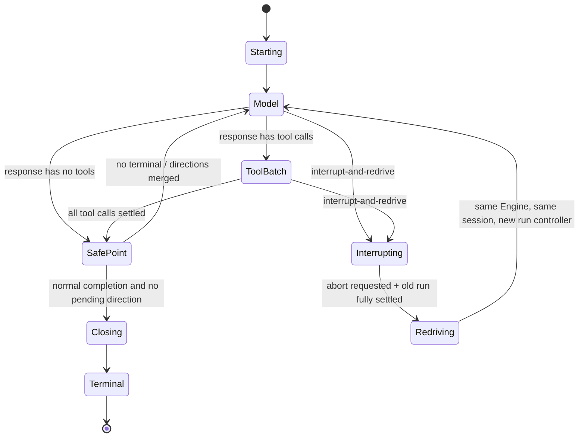
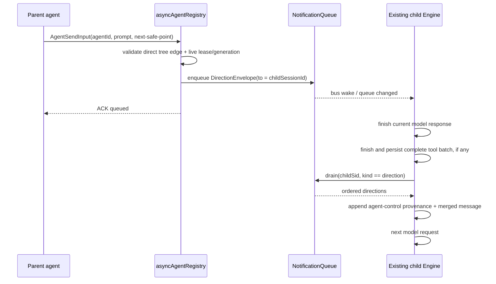

# 父 agent ↔ 运行中子 agent 双向通知/指令 Phase 0 设计

> 状态：设计稿，本期只设计不实现
> 范围：tree 内直属父 agent 与其运行中 child agent 的控制面
> 核心约束：复用 `NotificationQueue`、`agentNotificationBus`、`asyncAgentRegistry` 与现有 child `Engine`，不建立平行消息总线，不把 agent 指令视为用户授权

## 1. 摘要与已定结论

Phase 0 将当前“后台工作完成后通知父 session”的单向链路，收敛为一套按目标 session 分桶的通用 envelope mailbox：`result`、`progress`、`direction` 都进入同一个 `NotificationQueue`，入队后由同一个 `agentNotificationBus` fan-out；不同消费者只按 `kind` 选择性 drain，不再各建一套队列。

运行中的 child 不再由 `AgentSendInput` 创建第二个 `Engine` 去 resume。child 启动时建立一个与其现有 `Engine` 绑定的 live control handle，并在 `asyncAgentRegistry` 中持有单写者 lease。父 agent 对运行中 child 调用 `AgentSendInput(agent_id, prompt, delivery)` 时，只验证直属 tree 边、构造并路由 `direction` envelope：

- `next-safe-point`：等待当前完整 model response，以及该 response 已发出的完整 tool batch 收束后，在下一次模型调用前合并注入。
- `interrupt-and-redrive`：请求中止当前 model/tool batch；旧 batch 完全 settle、transcript 恢复为可续写状态且旧 `Engine.run()` 退出后，由同一个 child `Engine`、同一个 child session 串行开启新 turn。

两种 delivery 都返回传输 ACK：`queued | delivered | interrupted | rejected`。ACK 只说明控制消息的接收/交付状态，不表示 child 已执行成功，更不表示用户已授权任何工具操作。

Phase 0 明确不做 sibling mesh、跨顶层 session 广播、显式 Team、TaskBoard 或 Budget。但 envelope 从第一天就使用通用 `{ sessionId, agentId?, authority }` 地址，并预留 `teamId?`、`correlationId?`。Phase 2 引入显式 Team 时，只需增加成员目录与单播 ACL；无 `teamId` 的现有 tree 路由仍是同一模型的退化形态，不需要更换 envelope 或消息基建。

## 2. 问题与现状

### 2.1 当前链路

现有实现已经具备四块可复用基座：

1. `agent-notifications.ts` 中的 `NotificationQueue` 按父 `sessionId` 分桶，后台 agent/shell/video/DriveAgent 完成后写入 `NotificationItem`；`drainAll(sessionId)` 在父 session idle 时批量注入结果。
2. `agentNotificationBus` 在每次完成项入队时同步 fan-out，协议服务将其转为现有 `StreamEvent`。bus listener 是进程级的，session 隔离由事件携带的 `sessionId` 保证。
3. `agent-heartbeat.ts` 每 30 秒扫描 `asyncAgentRegistry` 中的 running agent，按父 session 发送 `{ agentIds, ts }`，但它目前只经过 bus，不进入 queue，也没有阶段、工具或 token 信息。
4. `asyncAgentRegistry` 保存运行状态、父/子 session id、abort handle 与 UI transcript；它尚未保存 child `Engine` 的 live control handle。child `Engine` 仍是 `SubAgentSpawner.spawn()` 内的局部变量。

当前 `AgentSendInput` 对已完成 child 采用 transcript replay：创建一个新的 child `Engine` 并 resume `childSessionId`。它明确拒绝 running child，因为新旧两个 Engine 会同时向同一 transcript 追加内容，而子 session 没有顶层协议 session 那样的串行化保护。

Engine 已有 `enqueueSteer`/step-gap seam，可证明“在 model step 边界合并新输入”的 turn-loop 位置是可用的；但 agent direction 不能直接冒充 user steer。两者可以复用边界与纯队列处理思路，必须保留不同的来源标记、hook 语义和 permission provenance。

### 2.2 调研基线说明

TODO 中引用的 `docs/research/multi-session-agent-communication-landscape.md` 在本设计时的 `main` 工作树中不存在；其 Phase 0 与 §6.4 的既定结论已保留在根 `TODO.md` 对应条目中。本稿同时参考仓库现有的 Codex session 通信调研与旧 `AgentSendInput` 设计：同一 session/thread 不应并发 resume；多 session 默认没有隐式 mesh；未来协作应建立显式成员关系与 ACL，而不是开放无差别 sibling 通信。

### 2.3 要解决的核心矛盾

- 父 agent 需要在 child 仍运行时修正方向，但不能为此制造第二个 transcript writer。
- 完成、进度、指令目前不是统一协议，继续分别扩展会出现第二套 queue、第二套 bus 和不同的 session 隔离规则。
- heartbeat 只能证明“还活着”，无法回答“在什么阶段、最后跑了什么、消耗多少”。复制完整 child transcript 又会污染父上下文并放大 token 成本。
- 父 agent 的指令来自模型，不是用户审批。即使 prompt 中写着“用户已同意”，permission 也必须只认用户交互结果或既有 policy。
- Phase 0 只需要 tree 控制面，但 envelope 若写死 `parent`/`child`，Phase 2 的显式 Team 将被迫推倒重来。

## 3. 目标、原则与验收标准

### 3.1 目标

1. 用一套 envelope、一个 per-session queue、一个 bus 承载 `result`、`progress`、`direction`。
2. 允许父 agent 向直属、运行中的 child 发送安全点指令或中断重驱指令。
3. 保证同一 child session 任意时刻只有一个 transcript writer；live direction 路径绝不创建第二个 Engine。
4. 将 heartbeat 扩展为低成本结构化 progress，父 agent 通过 `AgentStatus` 按需读取，不自动复制 child 完整 transcript。
5. 对 agent-origin 输入建立不可伪造的来源标记，并保证它不能扩大 permission、tool/skill scope 或 sandbox 权限。
6. 保留现有后台完成通知、idle wake、headless drain、协议 UI 和已完成 child continuation 的兼容路径。
7. 让同一 envelope 在 Phase 2 可直接承载显式 Team 单播。

### 3.2 设计原则

- **单一 mailbox**：只扩展现有 `NotificationQueue`，不增加 `DirectionQueue`、`ProgressStore` 或第二个 event bus。
- **单一 writer**：live control 交给正在运行的 child runtime；路由方不拥有 Engine，也不直接写 transcript。
- **先落队列，再 fan-out**：bus 是观察/唤醒通道，不是事实存储；bus listener 丢失不影响进程内 mailbox。
- **按 kind 消费**：同一 bucket 可以有不同投递策略，但 drain 必须是一个通用、带 predicate 的原子操作。
- **来源与权限正交**：`authority` 描述消息是谁发出的，不授予能力。permission 仍由 frozen run policy、classifier、用户 approval backend 决定。
- **显式关系优先**：Phase 0 只认 registry 中的直属父子边；Phase 2 只认 Team 成员表与 ACL。没有关系就拒绝。
- **最小上下文**：progress 是摘要快照；result 才进入父 LLM 的 idle turn；完整 transcript 留在 child session/UI。

### 3.3 Phase 0 完成定义

- running child 接收两种 delivery，且测试证明没有第二次构造/resume child Engine。
- direction 在 transcript 中有 agent provenance，并在完整 tool batch 之后出现，不破坏 tool_use/tool_result 配对。
- interrupt 后旧 batch 完全 settle，才允许同一 Engine 串行 redrive。
- progress/result/direction 都能在同一目标 session bucket 中被观察，bus 每次有效入队只 fan-out 一次。
- progress 不触发父 LLM idle wake；result 保持现有 idle wake；direction 只唤醒目标 child runtime。
- sibling、非直属父、跨顶层 session、携带 `teamId` 的 Phase 0 route 全部 fail closed。
- agent direction 无法修改 permission mode、规则、approval、sandbox、tool allowlist 或 skill allowlist。

## 4. 总体架构

```text
父 AgentSendInput
      │  直属关系 / runtime generation / permission provenance 校验
      ▼
asyncAgentRegistry ──────── single-writer lease + LiveChildControl
      │
      │ enqueue direction（目标 = child session）
      ▼
NotificationQueue: Map<to.sessionId, NotificationEnvelope[]>
      │                         │
      │ commit 后 publish 一次 │ generic snapshot / predicate drain
      ▼                         ├── child safe-point drain(direction)
agentNotificationBus           ├── parent idle drain(result)
      │                         └── AgentStatus read(progress latest)
      ├── protocol/UI fan-out
      ├── result → idle wake parent
      ├── direction → notify existing child runtime
      └── progress → observability only，不唤醒 LLM

child Engine / supervisor
      ├── model response 与 tool batch 边界消费 direction
      ├── 更新 registry progress
      ├── interrupt 时 abort 当前 batch，等待 settle
      └── 同一 Engine + 同一 session 串行 redrive
```

这里的 inbound queue 就是目标 child session 在 `NotificationQueue` 中的 bucket；child `Engine` “拥有 inbound queue”指它是该 bucket 中 `direction` 的唯一合法消费者，而不是在 Engine 内再维护一个数组。

## 5. Envelope 设计

### 5.1 完整 TypeScript 类型草案

```ts
export type NotificationAuthority = "user" | "agent" | "system" | "policy";

/**
 * 通用运行时地址。authority 是身份来源分类，不是 permission grant。
 * Phase 0 的 agent endpoint 同时带 sessionId 与 agentId；非 agent
 * background work 可以只带 sessionId。
 */
export interface NotificationEndpoint {
  sessionId: string;
  agentId?: string;
  authority: NotificationAuthority;
}

export type DirectionDelivery = "next-safe-point" | "interrupt-and-redrive";
export type ProgressDelivery = "observe-only";
export type ResultDelivery = "idle-drain";

export type AgentProgressPhase =
  | "starting"
  | "model"
  | "tool"
  | "waiting-permission"
  | "compacting"
  | "finalizing";

export interface AgentProgressTokens {
  prompt: number;
  completion: number;
  total: number;
}

export interface AgentProgressLastTool {
  name: string;
  state: "running" | "completed" | "failed" | "aborted";
  startedAt?: number;
  finishedAt?: number;
}

export interface DirectionPayload {
  /** 仅为模型指令文本；严格 schema 不接受 permission/approval 配置。 */
  prompt: string;
  origin: "agent_send_input";
}

export interface ProgressPayload {
  phase: AgentProgressPhase;
  lastTool?: AgentProgressLastTool;
  /** child session 本次运行的累计 usage；未知字段用 0，不凭字符数伪造。 */
  tokens: AgentProgressTokens;
  /** 去换行、压缩空白并限长的一行摘要，不包含完整 transcript。 */
  summary: string;
  observedAt: number;
}

export interface ResultPayload {
  workId: string;
  name?: string;
  description: string;
  status: "completed" | "failed" | "cancelled";
  workKind: "agent" | "shell" | "video" | "cc";
  finalText?: string;
  error?: string;
  command?: string;
  ccSessionId?: string;
  changedFiles?: string[];
  cwd?: string;
  originClientMessageId?: string;
  finishedAt: number;
}

interface NotificationEnvelopeBase<
  K extends "direction" | "progress" | "result",
  D extends DirectionDelivery | ProgressDelivery | ResultDelivery,
  P,
> {
  schemaVersion: 1;
  /** 全局唯一，用于幂等、ACK 与日志定位。 */
  id: string;
  kind: K;
  from: NotificationEndpoint;
  to: NotificationEndpoint;
  /**
   * Phase 0 必须为 undefined；Phase 2 显式 Team 路由使用。
   * 无 teamId 即 tree 退化形态。
   */
  teamId?: string;
  /** 将 direction、后续 progress/result 与调用链关联；不是排序键。 */
  correlationId?: string;
  /** 同一路由流单调递增；用于排序、去重与发现丢帧。 */
  sequence: number;
  delivery: D;
  createdAt: number;
  payload: P;
}

export type DirectionEnvelope = NotificationEnvelopeBase<
  "direction",
  DirectionDelivery,
  DirectionPayload
>;

export type ProgressEnvelope = NotificationEnvelopeBase<
  "progress",
  ProgressDelivery,
  ProgressPayload
>;

export type ResultEnvelope = NotificationEnvelopeBase<
  "result",
  ResultDelivery,
  ResultPayload
>;

export type NotificationEnvelope = DirectionEnvelope | ProgressEnvelope | ResultEnvelope;

/** 生产者提交 draft；id/sequence/createdAt 由可信 queue 分配。 */
export type DirectionEnvelopeDraft = Omit<
  DirectionEnvelope,
  "schemaVersion" | "id" | "sequence" | "createdAt"
>;
export type ProgressEnvelopeDraft = Omit<
  ProgressEnvelope,
  "schemaVersion" | "id" | "sequence" | "createdAt"
>;
export type ResultEnvelopeDraft = Omit<
  ResultEnvelope,
  "schemaVersion" | "id" | "sequence" | "createdAt"
>;
export type NotificationEnvelopeDraft =
  | DirectionEnvelopeDraft
  | ProgressEnvelopeDraft
  | ResultEnvelopeDraft;

export type DirectionRejectReason =
  | "invalid-request"
  | "target-not-found"
  | "target-not-running"
  | "target-not-ready"
  | "not-direct-parent"
  | "cross-session"
  | "team-not-supported"
  | "runtime-generation-mismatch"
  | "intake-closed";

export type DirectionAck =
  | {
      status: "queued" | "delivered" | "interrupted";
      envelopeId: string;
      sequence: number;
      correlationId?: string;
      target: NotificationEndpoint;
      acceptedAt: number;
    }
  | {
      status: "rejected";
      reason: DirectionRejectReason;
      target?: NotificationEndpoint;
      rejectedAt: number;
    };
```

### 5.2 字段语义与不变量

- `from`/`to` 不出现 `parent`、`child`、`lead`、`worker` 等拓扑角色。拓扑由路由时的 tree edge 或未来 Team membership 解释。
- `authority` 由可信运行时写入，调用 prompt 不能传入或覆盖。父模型调用 `AgentSendInput` 时，`from.authority` 必须是 `agent`，绝不能沿用父 turn 的用户来源伪装成 `user`。
- `teamId` 在 Phase 0 只做 schema 预留。任何带 `teamId` 的发送请求一律 `team-not-supported`，避免“字段存在”被误解为 Team 已启用。
- `correlationId` 用于把一次方向修正与随后进度/结果串起来；省略时不影响投递。Phase 0 可由 router 设为 direction envelope id，工具参数不直接开放任意 correlation id。
- `sequence` 由 queue 按 `(teamId ?? tree, from, to)` 路由流分配，不能由 agent 自报。它只保证进程内单调；progress 被合并时出现 sequence gap 是预期现象。
- `id` 是幂等键，`sequence` 是顺序键，两者不能互相替代。
- `delivery` 是按 `kind` 收窄的 discriminant：direction 只有两种控制语义；progress 永不唤醒模型；result 保持 idle drain。
- ACK 不是 envelope kind。Phase 0 中它是 `AgentSendInput` 的同步路由结果，避免为了本地调用再制造一条反向队列消息。未来远程 Team transport 若需要异步 ACK，可在不改变三种业务 envelope 的前提下增加 transport receipt。

### 5.3 当前完成通知如何归一

现有 `NotificationItem` 迁移为 `ResultEnvelope.payload`：

- `agentId` 移到 `from.agentId`，其 child session 移到 `from.sessionId`。
- 当前父 session 成为 `to.sessionId`。
- `status/finalText/error/workKind/...` 原样保留在 `ResultPayload`。
- `enqueuedAt` 被 envelope 的 `createdAt` 取代，真正完成时间使用 `payload.finishedAt`。
- 非 agent 后台工作没有 child agent endpoint：`from` 使用所属 session 与 `authority: "system"`，`payload.workId` 保留 job id。

迁移期可以保留 `NotificationItem` 和 `notificationItemToStreamEvent()` 作为边界 adapter，但 queue 内部的唯一事实类型必须是 `NotificationEnvelope`。adapter 不得再拥有独立存储或二次 publish。

### 5.4 Queue 与 bus 行为

建议将 queue API 收敛为：

```ts
enqueue(draft: NotificationEnvelopeDraft): NotificationEnvelope;
getSnapshot(sessionId: string): readonly NotificationEnvelope[];
drain(
  sessionId: string,
  predicate: (envelope: NotificationEnvelope) => boolean,
): NotificationEnvelope[];
subscribe(listener: () => void): () => void;
reset(sessionId?: string): void;
```

关键规则：

1. bucket key 永远是 `envelope.to.sessionId`。无有效目标 session 的 draft 记录 warn 并丢弃，不创建 legacy/global bucket。
2. queue 在同一个临界区内完成校验、sequence 分配、bucket 更新，然后 publish 一次 committed envelope。bus 不再接收任意 `StreamEvent`，而接收 `NotificationEnvelope`。
3. `drain(sessionId, predicate)` 只移除命中的 envelope，保持未命中项的相对顺序。由此父 idle drain 只取 `result`，child safe point 只取 `direction`，progress 仍留在同一 bucket 供按需读取。
4. 同一 `(to.sessionId, from.agentId)` 只保留最新一条未消费 `progress`；新 progress 原位替换或删除旧项后按新 sequence 追加，避免 30 秒 heartbeat 无限增长。
5. 同一 agent 的 terminal `result` 入队时移除其陈旧 progress。direction 与 result 不做覆盖，保持 FIFO。
6. listener 异常继续隔离；bus fan-out 异常不能回滚已成功的 queue commit。
7. 消费者若在 model-facing 注入前失败，应按原 sequence requeue 到匹配项之前；transcript 记录已包含 envelope id 时则去重，避免重复注入。

协议层在兼容窗口内可以由同一次 envelope bus publish 做旧事件投影：`result → background_agent_completed`，`progress → agent_heartbeat`。不能在 queue 和协议层各 publish 一次。新客户端可增加统一 `agent_notification` 事件；是否发送新旧投影由协议 capability 决定，避免双发导致 UI 重复。

## 6. Live child control 与单写者模型

### 6.1 Registry 扩展

`asyncAgentRegistry` 继续作为运行中 child 的权威目录，给 `AsyncAgentEntry` 增加窄接口而不是导入具体 `Engine`：

```ts
export type LiveChildState =
  | "starting"
  | "model"
  | "tool-batch"
  | "safe-point"
  | "interrupting"
  | "redriving"
  | "closing"
  | "terminal";

export interface LiveChildControl {
  readonly childSessionId: string;
  readonly runtimeGeneration: number;
  getState(): LiveChildState;
  routeDirection(draft: DirectionEnvelopeDraft): DirectionAck;
}

export interface ChildWriterLease {
  childSessionId: string;
  runtimeGeneration: number;
  ownerToken: string;
}

// AsyncAgentEntry 新增：
// liveControl?: LiveChildControl;
// writerLease?: ChildWriterLease;
// progress?: ProgressPayload;
```

registry 需要提供原子操作：绑定 control、按 `childSessionId` 获取 lease、校验 caller 是直属父、关闭 intake、完成 terminal transition。`agent.ts` 不直接读取后再分步写入，以免“刚检查 running，child 就完成”的 TOCTOU race。

### 6.2 ChildRunSupervisor

每个运行中 child 新增一个轻量 supervisor，但它不是新 Engine，也不是新消息队列。它只拥有：

- 当前已有的 child `Engine` 实例。
- 固定的 `childSessionId`、`runtimeGeneration` 与 writer lease。
- lifecycle abort controller（AgentCancel/父生命周期取消）。
- 可替换的 batch/run abort controller（仅用于 interrupt-and-redrive）。
- 当前 run promise 与 redrive 调度状态。
- 对共享 `NotificationQueue` 的 direction drain 能力。

`SubAgentSpawner.spawn()` 在构造 child 后、调用第一次 `child.run()` 前，通过窄 callback 把 supervisor control 绑定到 registry。显式后台路径可立即绑定；同步路径先在调用栈中保留 handle，若 auto-background handoff，再把同一个 handle 随 entry 注册，不能在 handoff 时重建 Engine。

### 6.3 单写者不变量

1. child 首次运行前，以 `childSessionId` 原子获取 writer lease；已有 live lease 时不得新建或 resume 另一个 Engine。
2. running `AgentSendInput` 只调用 `registry.routeDirection()`；此分支禁止调用 `SubAgentSpawner.spawn()`、`Engine` constructor 或 transcript replay。
3. `interrupt-and-redrive` 只能由 lease owner supervisor 发起；必须 `await` 旧 `Engine.run()` 完整退出并释放该实例的 `runInProgress`，随后才可对同一个 Engine 调用下一次 `run(..., { sessionId: childSessionId })`。
4. Engine 自身已有 concurrent re-entry guard，作为第二层防线；writer lease 防的是“另一个 Engine 实例”，两者缺一不可。
5. child closing 时先原子关闭 direction intake，再做最终 drain/terminal result。若发送先赢得原子锁，runtime 必须消费或 redrive；若 closing 先赢，发送返回 `rejected: intake-closed`，不得留下孤儿 direction。
6. terminal 后释放 live lease。现有“已完成 child 的 transcript replay continuation”可以在获取一个新 generation lease 后保留，但它是旧兼容路径，不属于 running live control。

Phase 0 的 registry 与 queue 都是进程内能力，因此上述 lease 保证本进程内所有 Agent/AgentSendInput 路径的单写者。另一个进程绕过 CodeShell 控制面直接 resume 同一 child session 仍属边界外风险；不得把 Phase 0 描述成跨进程分布式锁。若未来开放跨进程 Team worker，Phase 2 transport 必须将 lease 升级为可恢复的持久化 session lease。

### 6.4 `AgentSendInput` 兼容行为

工具 schema 增加可选 `delivery`，默认 `next-safe-point`：

```ts
AgentSendInput({
  agent_id: string,
  prompt: string,
  delivery?: "next-safe-point" | "interrupt-and-redrive",
})
```

分派规则：

- target `running`：走本设计的 envelope route，绝不新建 Engine，返回结构化 ACK 的稳定文本/JSON 投影。
- target terminal 且未持有 live lease：保留当前 transcript replay continuation，以兼容已经存在的“完成后追问/改稿”能力。此时 `delivery` 没有 mid-run 含义；显式传入 `interrupt-and-redrive` 应拒绝并提示 target 已结束，避免伪装成已发生中断。
- target 不存在但 child transcript 在盘：保留现有跨重启 continuation。由于没有 live runtime，它不是本设计的消息路由。
- caller 是 sub-agent、非 entry 的直属父 session、跨顶层 session 或 sibling：拒绝。现有 `isSubAgent` hard gate 继续保留，registry edge 校验作为第二层防线。

因此，“只路由、不新建 Engine”是 running target 的硬不变量；已完成 target 的现有串行 replay 不被 Phase 0 无故删除。

## 7. Delivery 语义、状态机与时序

### 7.1 ACK 精确定义

- `queued`：envelope 已进入目标 child bucket，但 child 当前不在可合并边界，或一次 interrupt/redrive 已在进行。本 ACK 只保证进程存活期间排队成功。
- `delivered`：调用发生时 child 正处安全点，envelope 已被加入本轮 model-facing messages 与 transcript metadata；不表示模型已经响应。
- `interrupted`：本 envelope 成功触发当前 batch controller 的 abort；runtime 将等待旧 batch settle 后 redrive。它不承诺外部工具副作用已回滚。
- `rejected`：未进入 queue，必须带稳定 reason。调用方可以改用 AgentStatus、等待 terminal 后 continuation，或向用户说明无法投递。

### 7.2 安全点定义

合法 safe point 只有：

1. model response 已完整返回，且该 response 没有 tool calls，在准备结束该 child run 之前；
2. model response 的所有已接受 tool calls 都已 settle、对应 tool results 已写入 transcript，在下一次 model request 之前；
3. interrupt 导致当前 run 完整退出、transcript 状态已保存，在 redrive 新 turn 写入 direction 之前。

如果 response 含 tool calls，不能在 assistant tool_use 与 tool_result 之间注入 direction。整批工具执行是原子语义边界，即使其中某些工具被 abort，也必须先生成配对的 aborted/error result。

同一安全点批量 drain 全部 direction，按 `sequence` 排序，合并成一个带 envelope id/correlation id 的 agent-control message；transcript 同时保存每个 envelope 的 provenance。这样只增加一次模型 round-trip，又保留逐条审计和 ACK 去重信息。

### 7.3 状态机



`next-safe-point` 在 `Model`/`ToolBatch` 状态返回 `queued`，在 `SafePoint` 返回 `delivered`。`interrupt-and-redrive` 在可中止 batch 首次触发 abort 时返回 `interrupted`；若已有 interrupt 正在收束，则只排入同一次 redrive 并返回 `queued`；若已在 `SafePoint`，无需制造 abort，直接返回 `delivered`。

### 7.4 `next-safe-point` 时序



### 7.5 `interrupt-and-redrive` 时序

```mermaid
sequenceDiagram
  participant P as Parent agent
  participant R as asyncAgentRegistry
  participant Q as NotificationQueue
  participant S as ChildRunSupervisor
  participant C as Same child Engine

  P->>R: AgentSendInput(agentId, prompt, interrupt-and-redrive)
  R->>Q: enqueue DirectionEnvelope
  R->>S: notify direction available
  S->>S: abort current batch/run controller
  R-->>P: ACK interrupted
  C-->>S: old run settles; aborted tool results persisted
  S->>S: await run completion and Engine re-entry release
  S->>Q: drain ordered direction envelopes
  Q-->>S: merged redrive input
  S->>C: same Engine.run(input, same childSid, fresh controller)
  C->>C: permission re-evaluated under frozen/inherited policy
```

## 8. 结构化 progress

### 8.1 数据来源

不增加总结模型调用。child runtime 从已有事件确定性归约 progress：

- `stream_request_start` / model call 生命周期 → `phase: "model"`。
- `tool_use_start` → `phase: "tool"` 与 `lastTool.state: "running"`。
- `tool_result` → 更新 lastTool terminal state。
- approval request 生命周期 → `phase: "waiting-permission"`。
- `context_compact` → `phase: "compacting"`。
- run 即将返回 → `phase: "finalizing"`。
- usage update/LLM response usage → `tokens`。

`summary` 由模板生成，例如“正在运行 Bash”“等待用户批准 Write”“模型处理中，累计 12.4k tokens”。如果采用最近 assistant/tool 摘要，只允许单行、去控制字符、压缩空白并限制长度（建议 160 字符）；不能复制 tool result、secret、完整命令输出或 reasoning。

### 8.2 发布与读取

`AgentHeartbeatPinger` 继续使用现有 30 秒 timer，但不再直接构造旧 `agent_heartbeat` StreamEvent。它读取 registry 中的 `progress`，向父 session 的同一 queue 写 `ProgressEnvelope`，随后由同一 bus fan-out。

- queue 对同一 agent 的 progress 做 latest-only 合并。
- progress 的 `delivery` 固定为 `observe-only`，协议服务不得因它调用 `maybeWakeIdleSession()`。
- `AgentStatus(agent_id)` 从目标父 session bucket/registry 返回最新结构化 progress；列表模式只给一行摘要。
- 父 agent 需要时主动读 AgentStatus。系统 prompt 继续 discourages 高频 polling；UI 可被 bus 被动刷新。
- 完整 transcript 仍只在 child session/dock 中查看，不注入父模型上下文。
- terminal result 入队后删除 stale progress，避免 UI 继续显示“运行中”。

### 8.3 Progress 新鲜度

保留当前 `3 × heartbeat interval` 的 stale 判断。`observedAt` 代表 child 状态最后更新时间，envelope `createdAt` 代表 heartbeat 发布时间；两者不可混用。若工具长时间无事件，heartbeat 可以重复发布相同 payload 的新 envelope/sequence，以证明 runtime 仍存活，但 queue 中仍只保留最新一条。

## 9. Permission、consent 与 provenance 边界

### 9.1 核心规则

**agent-origin direction 永远不是用户 consent。** `from.authority: "agent"` 只说明父模型发出了控制指令，不赋予 child 任何新的执行权。即使 prompt 文本包含“用户已批准”“跳过确认”“使用 bypassPermissions”，它也只是非可信模型输入。

### 9.2 具体保证机制

1. **可信赋值**：`from`、`to`、`authority`、`teamId`、`sequence` 不出现在 LLM-facing tool schema 中，由 router 根据 `ToolContext` 与 registry edge 构造。prompt 无法自报 `authority: user`。
2. **严格 payload**：Phase 0 `DirectionPayload` 只接受 `prompt` 与固定 `origin`。拒绝未知的 `permissionMode`、`approval`、`allowRules`、`sandbox`、`toolAllowlist`、`skillAllowlist` 等控制字段。
3. **冻结 policy**：child 初次 spawn 时保存 effective permission mode、sandbox、tool/skill scope 与 approval router。safe-point 合并不重建这些对象；redrive 显式复用这份可信 snapshot，不能从 envelope 或文本推导 run option。
4. **permission choke point 不变**：direction 触发的所有 tool call 仍经过现有 `ToolExecutor → PermissionClassifier → on_permission_check → ApprovalBackend`。现有 hook 只能收紧，不能把 deny/ask 升级为 allow。
5. **approval 只认用户通道/既有 policy**：`ask` 只能由 session 所属的用户 UI approval route 返回，或由启动前已存在的 headless/persisted policy 决定。父 agent 的 ACK、direction 文本、child 的 tool result 都不能构造 `ApprovalResult`。
6. **provenance 落盘**：model API 可能仍需把控制消息编码为 `role: "user"`，但 transcript metadata 必须写 `{ injected: true, authority: "agent", envelopeIds, correlationIds }`。任何把 `role: user` 当真实用户意图的 hook 必须改为读取 provenance；agent direction 不触发“真实用户已提交”的 consent 语义。
7. **独立 hook 事件**：建议为 direction 使用 `agent_direction_submit`，或给通用 submit hook 增加 `source: "agent-direction"`。不能无标记复用 `user_prompt_submit`。
8. **pending approval 隔离**：interrupt 若命中等待审批的 batch，只能取消/等待该审批收束；旧 approval 的迟到响应必须受现有 session owner generation 与 active request 校验约束，不能自动应用到 redrive 的新 tool call。
9. **不得升级 scope**：父 agent 可以要求 child 换方向，但不能给受限 reviewer 恢复 Write/Bash，也不能将 plan/read-only child 切换到可写模式。若完成任务需要新权限，仍由用户或既有 policy 决定。

用户已经选择 `bypassPermissions` 时，child 继续在该既有 policy 下运行不构成“agent 获得新 consent”；关键不变量是 direction 不能把非 bypass 会话升级成 bypass。

## 10. Phase 0 范围红线

### 10.1 本期包含

- 直属父 → 运行中 child 的单播 direction。
- child → 直属父的 progress 与 terminal result。
- 同一进程内、同一 tree edge 的 mailbox、live control、single-writer lease 与 ACK。
- 现有完成通知与 heartbeat 向统一 envelope 的迁移。
- 已完成 child 的旧 transcript replay continuation 兼容。

### 10.2 明确不做

- 不做 sibling ↔ sibling 直接通信，不提供“列出所有 session 后任意发送”的 mesh API。
- 不做跨顶层 session bus、广播、topic、房间或全局 inbox。
- 不做显式 Team 的创建、加入、成员管理、lead 选举、持久身份或成员间 ACL。
- 不做 TaskBoard、任务认领、共享 todo、依赖图或工作窃取。
- 不做 Team/agent Budget 分配、转移、汇总或抢占。
- 不把完整 child transcript 流式复制给父 agent；也不自动把每次 progress 注入父 LLM。
- 不承诺跨进程/重启保留 queued direction。Phase 0 mailbox 与 registry 延续当前 process-local 生命周期。
- 不保证 interrupt 回滚已经发生的外部副作用；它是 cooperative abort + serial redrive，不是事务。
- 不开放 child 调用 AgentSendInput 给 sibling 或 parent。Phase 0 的反向链路是 child runtime 自动上报 progress/result，而不是子模型获得任意寻址工具。

这些是当前阶段的产品红线，不是对未来 Team 的永久否定。

## 11. 向显式 Team（数字人 Phase 2）的平滑演进

### 11.1 为什么 Phase 0 envelope 不写死 tree

tree 与 Team 的差异主要在“地址如何解析、谁有权发给谁”，而不是消息本身：

- tree：registry 已知 `parentSessionId ↔ childSessionId`，无 `teamId`，ACL 固定为 parent→direct child direction、child→parent progress/result。
- Team：成员目录已知 `teamId + stable agent/profile identity ↔ active sessionId`，ACL 来自显式成员关系与角色。

因此 Phase 0 已使用通用 endpoint，避免未来出现 `parentSessionId`、`childSessionId`、`leadSessionId` 三套互斥字段。`teamId` 缺省正好表达“没有 Team namespace，只按 tree edge 解释”。

### 11.2 Phase 2 只需增加的层

1. **Team directory**：持久化 `teamId`、lead、固定数字人/Profile 成员身份、当前 runtime session binding 与 membership generation。
2. **Team ACL resolver**：默认允许 lead→member 单播、member→lead 上报；member→member 仍需显式 ACL，不因同 Team 自动形成 sibling mesh。
3. **Mailbox durability/lease**：若成员跨进程运行，把当前 queue interface 换成持久化实现，并把 writer lease 升级为带 generation/expiry 的可恢复 lease。envelope 类型和 consumer 语义不变。
4. **地址解析**：发送方提交 `teamId + agentId`，目录解析并校验当前 `sessionId`；envelope 落地时仍保留两者，便于检测 stale binding。
5. **关联链**：沿用 `correlationId` 把 lead direction、worker progress、worker result 串为一条 delegation；沿用 `sequence` 实现每成员 mailbox 排序与重放去重。

### 11.3 为什么不需要推倒 Phase 0

- 消息 schema 不变：Team envelope 只是出现 `teamId`，endpoint 仍是 `{ sessionId, agentId?, authority }`。
- queue contract 不变：仍按解析后的 `to.sessionId` 入同一 mailbox，按 kind/drain policy 消费。
- delivery 不变：运行中 Team worker 同样使用 safe point 或 interrupt/redrive。
- permission 不变：Team lead 仍是 `authority: "agent"`，不能代替用户 consent；Team ACL 只决定“能否投递”，不决定“工具是否获准执行”。
- 兼容性自然：所有历史 tree envelope 没有 `teamId`，继续走 tree resolver；无需迁移为伪 Team。

数字人阶段需要的是“一个有长期 Profile 身份的 lead 指挥多个固定身份 worker，并具备单播 mailbox 与 ACL”。Phase 0 提供 mailbox、顺序、关联、运行态投递和权限 provenance；Phase 2 补身份、成员表、持久 lease 与 ACL，职责边界清晰。TaskBoard/Budget 即使未来需要，也应作为 Team 上层能力独立设计，不能塞进本 envelope 的基础路由语义。

## 12. 分步实施顺序与 TDD 策略

每一步先写失败测试，再做最小实现；前一步 contract tests 全绿后再进入下一步。

### Step 0：冻结现状与竞态基线

先补 characterization tests，不改行为：

- 完成项只进入指定父 session bucket，idle drain 批量注入，bus listener 异常隔离。
- heartbeat 当前只覆盖 running agent，停止后 timer 自停。
- running `AgentSendInput` 当前拒绝，且不会调用 spawner。
- 同一 Engine concurrent `run()` 被拒绝；顺序 run 可复用实例。
- permission mode 在 run 边界冻结，busy 时的 mode 修改只影响下一次真实用户 run。

### Step 1：引入 envelope 与通用 queue

先测：

- 三种 envelope 都按 `to.sessionId` 进入同一 bucket。
- queue 分配 id、createdAt、单调 sequence，拒绝空 sessionId 与 Phase 0 `teamId` route。
- predicate drain 只移除匹配 kind，未匹配项顺序不变。
- progress latest-only 合并，result 清理对应 stale progress，direction/result 不被覆盖。
- 每个成功 enqueue 只 bus publish 一次；失败 enqueue 不 publish。
- `NotificationItem → ResultEnvelope → legacy StreamEvent` adapter 保持当前字段兼容。
- `getSnapshot` 的空数组 identity 稳定，现有 React external-store contract 不回归。

### Step 2：Registry live control 与 writer lease

先测：

- control 绑定必须匹配 entry 的 `childSessionId + runtimeGeneration`。
- 同一 child session 第二次获取 live writer lease 失败。
- 直属父可 route，sibling、另一顶层 session、sub-agent caller、stale generation 全拒绝且不入队。
- route 与 terminal close 并发时只有两种合法结果：成功入队且必消费，或 `intake-closed` 且 queue 无孤儿项。
- auto-background handoff 前后 control/Engine identity 不变。

### Step 3：`next-safe-point`

先测：

- direction 在 model call 阻塞时返回 `queued`，下一 model request 才可见。
- 含 tool calls 的 response 中，direction 必须排在全部 tool results 之后；tool_use/tool_result 始终配对。
- final no-tool response 与 direction 竞态由 finalize-backfill seam 捕获，不错误 terminal。
- 同一 safe point 的多条 direction 按 sequence 合并一次，transcript 保留所有 envelope id/correlation id。
- model-facing role 即使编码为 user，transcript provenance 仍为 `authority: agent`、`injected: true`。
- running 路径的 Engine constructor/spawner/resume 调用次数保持不变，证明只路由 envelope。

### Step 4：`interrupt-and-redrive`

先测：

- model request 中断时 batch signal 被 abort，ACK 为 `interrupted`。
- tool batch 中断时未开始工具快速返回 aborted；已开始工具先 settle，随后才 redrive。
- 旧 run promise 未完成时，同一 Engine 的第二次 `run()` 从未被调用。
- redrive 使用同一 Engine object、同一 child session、fresh batch controller 与同一 writer lease generation。
- 连续多个 interrupt 只触发一次 active abort，后续 direction 进入同一 redrive 并返回 `queued`。
- interrupt 到达 safe point 时直接 `delivered`，不制造无意义 abort。
- 不遵守 AbortSignal 的慢工具会延迟 redrive但不会产生并发 writer；日志/进度明确处于 interrupting。

### Step 5：结构化 progress

先测：

- model/tool/approval/compaction/terminal 事件正确归约 phase、lastTool 与 tokens。
- summary 永远单行、限长、无控制字符，不包含完整 tool result 或敏感字段。
- heartbeat 经统一 queue/bus 发布 ProgressEnvelope；同 agent bucket 只保留 latest。
- progress 不触发 idle LLM wake，result 仍触发。
- `AgentStatus` 默认只能读 caller 所属 tree 的 agent，返回最新摘要；不会输出完整 transcript。
- terminal result 后 stale progress 消失，timer 在没有 running agent 时自停。

### Step 6：permission/provenance 加固

先测：

- direction 文本声称“用户已批准”时，ask 工具仍调用真实 ApprovalBackend；用户拒绝则不执行。
- draft/payload 夹带 permission、approval、sandbox、allowlist 字段时 schema 拒绝。
- 非 bypass child 不能被 direction 升级为 bypass；既有 bypass child 继续按原 policy 运行。
- read-only/plan child 在 safe-point 与 redrive 后仍不可执行写工具。
- `on_permission_check` 不能用 agent direction 将 deny/ask 升为 allow。
- direction 使用 agent submit provenance，不触发任何只针对真实用户 consent 的 hook 分支。
- interrupt 前一条迟到 approval 不可授权 redrive 中的新 tool call。

### Step 7：协议、idle/headless 与兼容迁移

先测：

- server 对 result 执行 idle wake，对 progress 不 wake，对 direction 只通知目标 child runtime。
- headless drain 只取 result，不会误吞 child direction/progress。
- capability 打开时发送统一 envelope event；旧 capability 下 result/heartbeat 投影字段与当前客户端一致且无双发。
- TUI/Desktop/SDK 现有完成卡片、heartbeat stale 判断、背景结果汇总不回归。
- queue drain 注入失败会按原 sequence 恢复；已落 transcript 的 envelope id 不重复注入。
- 现有 terminal/cross-restart `AgentSendInput` continuation tests 保持通过。

### Step 8：端到端竞态矩阵

至少覆盖以下组合：

| child 状态 | next-safe-point | interrupt-and-redrive | 预期 |
| --- | --- | --- | --- |
| starting/control 未绑定 | queued 或 target-not-ready（按原子绑定结果） | queued 或 target-not-ready | 不丢 envelope，不建第二 Engine |
| model request | queued | interrupted | 下个边界合并 / abort 后串行 redrive |
| tool batch | queued | interrupted | 完整配对 tool results 后交付 |
| waiting permission | queued | interrupted | 不自动批准，旧 approval 不串线 |
| safe point | delivered | delivered | 无额外 abort |
| closing | delivered 或 intake-closed | delivered 或 intake-closed | 取决于谁赢原子 close，无孤儿项 |
| terminal | 走旧 continuation 或 rejected | rejected | 不声称中断成功 |

## 13. 风险、兼容性与缓解

### 13.1 第二个 Engine 并发写坏 transcript

这是最高风险。缓解不是再加一次 status check，而是四层不变量：registry 的 child-session writer lease、running `AgentSendInput` 的 route-only 分支、supervisor 等待旧 run 完全退出后复用同一 Engine、Engine 自身 concurrent re-entry guard。测试必须用 Engine identity、constructor/spawn 次数和 transcript tool-pairing 共同证明，不能只断言最终文本。

### 13.2 Interrupt 不等于事务回滚

部分工具或外部服务可能已经产生副作用，甚至忽略 AbortSignal。supervisor 必须等待它们 settle，不能为了“更快 redrive”并发启动新 turn。ACK 与工具描述要明确 `interrupted` 仅表示 abort request 已发出；child 新 turn 应看到 aborted/error tool result，并自行重新核对世界状态。

### 13.3 完成与 direction 的尾部竞态

若 result 先发布、direction 后留在 child bucket，会形成永不消费的孤儿项。必须使用 registry 的 intake-close 原子边界：发送赢则 completion 等待最终消费；关闭赢则发送拒绝且不入队。禁止用两个独立的 `get(status)`/`enqueue()` 代替。

### 13.4 Queue 混合 kind 后的误 drain

将 `drainAll(sessionId)` 原样用于混合 bucket 会误吞 progress/direction。迁移必须把所有生产调用点改为 envelope，并把所有消费调用点改为 predicate drain；保留一个无 predicate 的生产 API 会成为高风险脚枪。headless、server idle wake、TUI drain 都需要 contract tests。

### 13.5 Progress 放大与敏感信息泄露

30 秒一条、多个 agent、长时间运行会积压。latest-only 合并、terminal 清理与 bucket 上限可控内存。summary 只能由安全模板/受限摘要生成，禁止复制完整命令输出、tool result、reasoning、credential 或附件内容。

### 13.6 ACK 被误解为任务成功或授权

工具返回文本必须明确 ACK 是 delivery receipt。`delivered` 只表示已进入模型上下文，`interrupted` 只表示已请求 abort；真正结果仍由后续 progress/result 表达。任何 ACK 都不能传入 permission backend。

### 13.7 旧协议与 SDK 兼容

内部先统一 envelope，协议边界暂时投影旧 `background_agent_completed`/`agent_heartbeat`，再通过 capability 引入统一事件。避免无协商地双发新旧事件。`NotificationItem` 仅作为 deprecated adapter 输入存在一个发布周期，不能继续作为 queue 的第二种存储类型。

### 13.8 进程崩溃与跨进程 resume

Phase 0 queue、registry、live handle 与 sequence 都是 process-local；崩溃会丢 queued direction，重启后只能走现有 transcript replay continuation。文档与 ACK 不应承诺 durable delivery。跨进程数字人 worker 留给 Phase 2 的持久 mailbox 与 lease。

### 13.9 Safe-point 注入影响 hook/统计语义

agent direction 若无标记复用 user submit，会污染“真实用户 turn”、originClientMessageId、permission consent 与产品分析。必须提供 `source/authority` metadata，并定义 conversation turn 计数：safe-point 合并不增加真实用户 turn；interrupt redrive 增加一个 injected control turn，但不增加 user-authored turn 指标。

## 14. 最终决策清单

- 采用统一 `NotificationEnvelope`，kind 为 `direction | progress | result`。
- 目标 `sessionId` 是唯一 bucket key；三种 kind 共用 queue 与 bus，以 predicate drain 区分消费者。
- completion 成为 `result`，heartbeat 成为 latest-only `progress`。
- running child 由现有 Engine 对应的 supervisor/control handle 消费 direction；`AgentSendInput` running 分支只路由。
- 默认 delivery 是 `next-safe-point`；显式紧急修正使用 `interrupt-and-redrive`。
- interrupt 必须等待旧 batch/run settle，再用同一 Engine、同一 session 串行 redrive。
- ACK 采用 `queued | delivered | interrupted | rejected`，不表达执行结果或 consent。
- permission 永远只认用户 approval 或既有 policy；agent direction 固定为 `authority: agent`，不能扩大能力。
- Phase 0 只做直属 tree 控制面，拒绝 sibling mesh、跨顶层 session、Team、TaskBoard、Budget。
- envelope 预留 `teamId?`/`correlationId?` 与通用 endpoint；Phase 2 通过成员目录、单播 ACL 和持久 lease 平滑演进为显式 Team。
